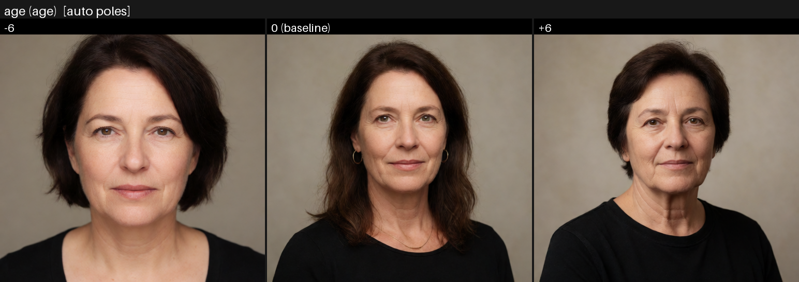

# ComfyUI Krea Reference

Give each reference image a job, and every attribute a dial.

Krea Reference is a small ComfyUI custom-node package for directing Krea 2.
It ships two instruments that work alone or together:

- **Reference conditioning** (the guide cards, V9 and V10): instead of one
  source image vaguely influencing the whole result, each reference image
  gets a clear role - preserve the subject, borrow a visual style, copy
  lighting, suggest a material, follow a layout, or avoid copying text and
  logos.
- **Concept Sliders** (V1): training-free attribute dials. Name anything you
  can describe - `brightness`, `age`, `fog density`, photoreal-vs-cartoon -
  and drag a `-6..+6` value; the axis is derived from Krea 2's own text
  encoder at encode time. No LoRAs, no downloads, no extra weights.


The demo images above were generated with the included workflows. Each
individual PNG in [docs/assets/krea-v9/demos](docs/assets/krea-v9/demos/) has
ComfyUI workflow metadata embedded, so you can drag a demo PNG into ComfyUI to
inspect the exact setup.

## What It Helps You Do

| Goal | How to set it up |
| --- | --- |
| Put image 2's style onto image 1 | Image 1: `keep the same subject` at `0.80` to `0.90`. Image 2: `suggest the visual style` at `0.55` (its cap is `0.65`). |
| Keep a product or character recognizable | Use `keep the same subject` for the identity image, then add lower-strength style, lighting, or material cards. |
| Borrow lighting without copying the subject | Use `copy lighting and mood` around `0.65`; push toward `0.90` for full drama. |
| Borrow a surface or finish | Use `suggest material or texture` at `0.55` (raise toward its `0.65` cap only when the object's exact form matters less). |
| Follow a pose, crop, or composition | Use `copy pose and layout` around `0.90`, or `copy big shapes only` around `0.90` for silhouette-only steering. |
| Use a reference that contains text or logos | Add `avoid copying text/logos` at very low strength, usually around `0.03`. |
| Make one attribute adjustable - brighter, older, foggier, more detailed | Add a `Concept Slider Card` named for the attribute to a `Concept Slider Stack` and drag `-6..+6`; `0` changes nothing at all. |

## How The Workflow Thinks


Each guide card answers two questions:

1. What should Krea borrow from this image?
2. How strongly should this image guide the result?

The stack encoder combines the written prompt and all connected guide cards:

```text
Load Image -> KG Krea 2 Image Guide Card V9 -> KG Krea 2 Reference Stack Encoder V9 -> KSampler positive input
```

That makes multi-reference workflows easier to reason about. A product image can
be responsible for the subject, an abstract image can be responsible for style,
a third image can be responsible for lighting, and a fourth can protect against
text/logo copying.

Concept sliders follow the same pattern with named attributes instead of
images - a slider card answers "what should this dial change?" and "how far
is it turned?":

```text
KG Krea 2 Concept Slider Card V1 -> KG Krea 2 Concept Slider Stack V1 -> KSampler positive input
```

## Included Nodes

| Node | Purpose |
| --- | --- |
| `KG Krea 2 Image Guide Card V9` | Describes one reference image. Choose a recipe or use manual tuning. |
| `KG Krea 2 Reference Stack Encoder V9` | Combines the final prompt and up to 12 guide cards into Krea conditioning. |
| `KG Krea 2 Image Guide Card V10` | The V9 card plus four more recipes, guide direction, per-card timing, and layer dials. |
| `KG Krea 2 Reference Stack Encoder V10` | The V9 stack plus balance, study reuse, a stack report, and a prepared-reference preview. |
| `KG Krea 2 Concept Slider Card V1` | Describes one user-defined attribute slider: a description plus a -6..+6 value. |
| `KG Krea 2 Concept Slider Stack V1` | Turns slider cards into Krea conditioning - training-free sliders for any attribute you can name. |

The guide cards and stack encoders expose plain-language controls for prompt
strength, image strength feel, image detail level, framing, timing, and
text/logo guard behavior; the slider pair works the same way for named
attributes.

## What V10 Adds

V10 extends the same architecture without touching V9; the two versions
cross-connect, and saved V9 workflows keep working unchanged.

| V10 control | What it does |
| --- | --- |
| Four more quick recipes | `suggest the color palette`, `use the background/setting`, `copy the camera framing`, and `mood board only` - jobs that previously required manual tuning. |
| Your own recipes | Drop schema-validated YAML/JSON files into [custom_recipes/](custom_recipes/README.md) and they appear in `Use image for` as first-class choices. |
| Aspect-focus recipes | A recipe's `focus` field names **which aspect** of its image to study - "the clothing and garment style, not the person" - so recipes can target clothing, props, or other object-bound aspects. |
| Twenty bundled recipes | Ready-made custom recipes load out of the box: the five-recipe starter pack (weather, clothing, drawing medium, photo finish, cinematic color grade), a ten-recipe designer artwork pack (poster style, soft media, pattern energy, era print look, paper and canvas, metallic accents, ornament borders, stained glass, and two style-timing presets), and a five-recipe edit-and-composite pack (scene light, monochrome look, atmosphere, background only, carry the subject over) - every one render-validated on Krea 2. |
| Recipe Builder | `web/recipe-builder.html` (also served at `/extensions/<pack folder>/recipe-builder.html`): three plain-language questions become a validated recipe file - no schema knowledge needed. |
| `Guide direction` | A card can steer *away* from its image: a counter-example for a palette, composition, subject, or style you do not want. |
| `When this card guides` | Per-card timing: whole image, early layout only, or final details only. |
| `Structure/Finish layers pull` | Manual-mode dials over the structure-vs-finish conditioning layers. |
| `Balance strong cards` | Keeps several simultaneously hot cards from fighting by budgeting their total departure. |
| `Reuse image studies` | Caches image studies by content, so strength and timing tweaks re-run without any encoder passes. |
| `stack_report` output | A plain-language account of what every card requested, what it got, and why. |
| `prepared_references` output | A contact sheet of exactly what the vision encoder studied after treatments. |


The V10 demo images above were generated with the V10 recipes and have the
matching V10 workflow embedded - drag one into ComfyUI to inspect the exact
setup. Each demo's full journey (input images, settings, prompt, result) is
documented in the [V10 user guide](docs/krea-v10-user-guide.md).

Per-node details: [V10 guide card](docs/nodes/kg-krea-2-image-guide-card-v10.md)
and [V10 stack encoder](docs/nodes/kg-krea-2-reference-stack-encoder-v10.md).
Try [krea-v10-full-showcase-workflow.json](example_workflows/krea-v10-full-showcase-workflow.json)
for all of it in one graph.

## What Concept Sliders Add

Slider LoRAs without the LoRA. A `Concept Slider Card` names an attribute
(`height`, `brightness`, `age` - a noun works best); the
`Concept Slider Stack` replaces your CLIP Text Encode node and derives the
more-vs-less axis from Krea 2's own text encoder at encode time.

| Slider control | What it does |
| --- | --- |
| `Slider value` | The dial: `-6..+6`. Negative pushes toward less/the opposite, positive toward more. `+/-3..4` is the reliable working band. |
| `0` position | Exactly your prompt - a zero slider is excluded from the encode entirely (render-proven pixel-identical to a plain encode) and costs nothing. |
| Custom poles | Optional "what -6 looks like" / "what +6 looks like" sentences turn any describable contrast into an axis - including style axes like photoreal-vs-cartoon. |
| Up to 8 sliders | Sliders stack, each with its own dial. |
| `Overall slider reach` | One multiplier over every slider's push - tame or amplify the whole stack at once. |
| `slider_report` output | Each slider's exact pole sentences, computed push, what was skipped and why, and encoder-pass vs cache counts. |



The sheet above is from the ten-slider render audit (fixed seed, one render
per dial position): eight of ten user-defined sliders worked as desired and
two worked after pole rewording, with no image degradation at full
deflection. Results, all ten sheets, and a slider-writing cookbook - what
makes a strong axis, how to fix a weak direction - are in the
[Concept Slider guide](docs/concept-slider-v1.md).
Try [krea-slider-v1-showcase-workflow.json](example_workflows/krea-slider-v1-showcase-workflow.json)
for six sliders, the report, and a same-seed with-vs-without branch in one
graph.

## Install

Clone this repo into your ComfyUI `custom_nodes` directory and restart ComfyUI:

```bash
cd /path/to/ComfyUI/custom_nodes
git clone https://github.com/kgilper/krea-reference.git
```

This repo does not include model weights. Use your own Krea-compatible model,
CLIP, and VAE files in ComfyUI.

## Try It In Five Minutes

1. Copy [example_assets/krea-reference-examples](example_assets/krea-reference-examples/) into your ComfyUI `input/` folder.
2. Load [example_workflows/krea-v9-full-showcase-workflow.json](example_workflows/krea-v9-full-showcase-workflow.json).
3. Queue it once with the included synthetic reference images.
4. Replace the Load Image nodes with your own test images.
5. On each guide card, choose `Use image for` and adjust `How strongly this image guides`.

The full showcase demonstrates five roles:

| Slot | Recipe | Starting Strength |
| --- | --- | --- |
| Content anchor | `keep the same subject` | `0.80` |
| Visual style | `suggest the visual style` | `0.65` |
| Material/texture | `suggest material or texture` | `0.55` |
| Lighting/mood | `manual tuning` with lighting controls | `0.45` |
| Text/logo guard | `avoid copying text/logos` | `0.03` |

## Recipe Examples

These examples show the effect of common guide-card recipes. Open the linked PNG
or drag it into ComfyUI to load the embedded workflow.

| Recipe | Example | Use it when |
| --- | --- | --- |
| `balanced` |  | One image should be a broad, general reference. |
| `keep the same subject` |  | The object, product, person, or character must stay recognizable. |
| `suggest the visual style` |  | You want palette, medium, finish, and art direction without copying the style image's subject. |
| `copy lighting and mood` |  | You want light direction, contrast, haze, glow, or atmosphere. |
| `suggest material or texture` |  | You want a surface quality such as fabric, stone, ceramic, paper, metal, or paint. |
| `avoid copying text/logos` |  | A reference contains words, labels, UI, signs, symbols, or brand marks. |

## Example Workflows

| Workflow | Best for |
| --- | --- |
| [krea-slider-v1-showcase-workflow.json](example_workflows/krea-slider-v1-showcase-workflow.json) | First Concept Slider run. Six user-made sliders (auto and custom poles, active and parked), the slider report, and a same-seed WITH vs WITHOUT comparison branch. |
| [krea-v10-full-showcase-workflow.json](example_workflows/krea-v10-full-showcase-workflow.json) | First V10 run. Six cards including the new palette, environment, and framing recipes, per-card timing, gentle balance, and both feedback outputs. |
| [krea-v10-counter-example-workflow.json](example_workflows/krea-v10-counter-example-workflow.json) | The V10 `away from this image` direction: keep the subject, push a style out. |
| [krea-v10-reference-stack-workflow.json](example_workflows/krea-v10-reference-stack-workflow.json) | Compact V10 starter graph with the report and prepared-references previews wired. |
| [krea-v10-starter-recipe-workflow.json](example_workflows/krea-v10-starter-recipe-workflow.json) | A shipped custom recipe in action: `cinematic color grade` (from the auto-loaded starter pack) grading the scene from a style reference. |
| [krea-v9-full-showcase-workflow.json](example_workflows/krea-v9-full-showcase-workflow.json) | First V9 run. Shows content, style, material, lighting, and text/logo guard cards together. |
| [krea-v9-no-prompt-style-transfer-workflow.json](example_workflows/krea-v9-no-prompt-style-transfer-workflow.json) | Applying image 2's style to image 1 with no written prompt. |
| [krea-v9-reference-stack-workflow.json](example_workflows/krea-v9-reference-stack-workflow.json) | Compact starter graph for building your own multi-reference workflow. |

The examples intentionally avoid LoRA, model-enhancer, and switch-node plumbing
so the Krea reference nodes are easy to inspect.

## Good Starting Values

| Strength | Meaning | Good uses |
| --- | --- | --- |
| `0.00` | Off | Keep a card connected but inactive. |
| `0.03` to `0.08` | Tiny nudge | Text/logo guard, shape hints, stubborn prompts. |
| `0.20` to `0.50` | Gentle whisper | A hint of palette, mood, or material - deliberately subtle. |
| `0.55` to `0.90` | The working band | Style, palette, lighting, material, and mood land clearly here (many cap themselves at `0.65`-`0.9`). |
| `0.90` to `1.20` | Structure and identity | Content anchors, pose/layout, and big shapes. Watch for over-copying. |

Tips:

- Start strengths low and raise slowly; appearance recipes whisper by design
  below about `0.5`.
- Use `0.80`-`0.90` on `keep the same subject` when the main subject must
  stay stable.
- Lower `Image detail level` if a style image starts copying the wrong subject.
- Raise `Written prompt strength` when the text prompt should win over references.
- Use text/logo guard whenever a reference includes readable marks.

## Documentation

| Start here | What it contains |
| --- | --- |
| [V10 visual HTML guide](docs/krea-v10-user-guide.html) | Visual walkthrough of everything V10 adds: new recipes, direction, timing, balance, reuse, and the feedback outputs. |
| [V10 Markdown user guide](docs/krea-v10-user-guide.md) | Same V10 guide in Markdown form for GitHub reading. |
| [Concept Slider guide](docs/concept-slider-v1.md) | The complete slider manual: quick start, the dial, the ten-slider render audit with images, and the slider-writing cookbook. |
| [Recipe visual guide](docs/recipe-visual-guide.md) | One before/after figure for every recipe - all twelve built-ins and all twenty bundled pack recipes on real references. |
| [V9 visual HTML guide](docs/krea-v9-user-guide.html) | Full visual walkthrough of the core recipes with embedded-workflow demo PNGs. |
| [V9 Markdown user guide](docs/krea-v9-user-guide.md) | Same guide in Markdown form for GitHub reading. |
| [Documentation landing page](docs/README.md) | Short navigation by task. |
| [Node documentation index](docs/nodes/README.md) | Per-node input and output details. |
| [V9 technical paper](docs/krea-v9-technical-paper.md) | How and why the nodes work: architecture, math, verification, extension and porting guides. |
| [V10 technical companion](docs/krea-v10-technical-paper.md) | The V10 mechanics on top of that architecture: direction math, balance, the study cache, verification, limitations. |
| [Example workflows](example_workflows/README.md) | What each bundled workflow is for. |
| [Testing guide](docs/testing.md) | Maintainer checks for contract tests and workflow validation. |

## Repository Structure

Three product packages, side by side, plus the shared material around them:

| Path | What it is |
| --- | --- |
| [kg_krea_v9/](kg_krea_v9) | The V9 product: guide card + stack encoder, recipes, treatments, the text/logo guard. Frozen surface - saved V9 workflows keep working unchanged. |
| [kg_krea_v10/](kg_krea_v10) | The V10 product: everything V9 plus more recipes, custom-recipe loading, direction, timing, balance, caching, and the feedback outputs. |
| [kg_krea_slider/](kg_krea_slider) | The Concept Slider product: slider card + slider stack, pole derivation, the slider report, and its study cache. |
| [custom_recipes/](custom_recipes/README.md) | The Recipe Kit: schema, starter/designer/edit packs, and where your own recipe files go. |
| [web/](web) | Browser-side pieces: the Recipe Builder and the node UI script. |
| [example_workflows/](example_workflows/README.md) | Ready-made graphs for all three products. |
| [example_assets/](example_assets/krea-reference-examples) | Synthetic reference images for first runs. |
| [docs/](docs/README.md) | User guides, node pages, technical papers, and demo galleries for V9, V10, and the sliders. |
| [tests/](tests) | Contract tests pinning the frozen widget/packet surfaces of all three products. |

## Development Checks

The contract tests run without launching ComfyUI:

```bash
python -m unittest discover -s tests -p "test_*.py" -v
python -m compileall -q kg_krea_v9 kg_krea_v10 kg_krea_slider __init__.py
```

## License

MIT. See [LICENSE](LICENSE).
