# Concept Slider V1 - the complete guide

Make your own sliders for Krea 2 - no LoRA training, no downloads, no
extra model weights. Name an attribute, drag a -6..+6 dial:

- `height` at **+6** pushes toward taller, **-6** toward shorter, and
  **0 changes nothing at all**.
- `brightness` at **-6** moves the scene toward darkness, **+6** toward
  blazing light.
- Anything you can describe works the same way: `age`, `clutter`,
  `fog density`, `color saturation`, `crowd size`, `fine detail`, or a
  fully custom axis like photoreal-vs-cartoon.

> **Render-audited 2026-07-06** on Krea 2 (turbo, 8-step) with ten
> user-defined sliders at fixed seed: **8 of 10 worked as desired, 2
> worked partially** (details and images below), no image degradation at
> full deflection, and the 0 position proved **pixel-identical** to a
> plain prompt encode. The default push strength shipped today is the
> audited value.

## Quick start

Fastest path: drag
[krea-slider-v1-showcase-workflow.json](../example_workflows/krea-slider-v1-showcase-workflow.json)
into ComfyUI - six sliders wired up (three active, three parked), the
slider report, and a same-seed WITH-vs-WITHOUT comparison branch, with a
walkthrough note on the canvas.

Or build it yourself:

1. Add a **KG Krea 2 Concept Slider Card V1** and type what the slider
   changes (a noun works best: `brightness`, not `bright`).
2. Add a **KG Krea 2 Concept Slider Stack V1**, connect your Krea CLIP,
   write your prompt, and plug the card into `Slider 1`.
3. Route the stack's `conditioning` output to your sampler's positive
   input - the stack replaces your CLIP Text Encode node. (For the
   negative prompt, a second slider stack with no cards behaves exactly
   like CLIP Text Encode.)
4. Drag `Slider value`. Up to 8 sliders stack; a slider at 0 costs
   nothing.

Read the stack's `slider_report` output when anything surprises you: it
lists each slider's exact pole sentences, its computed push, everything
that was skipped and why, and how many encoder passes ran vs. came from
cache.

## The dial

| Value | What to expect (from the audit) |
| --- | --- |
| `0` | Exactly your prompt. Render-proven: pixel-identical to a plain encode in the same server session. |
| `+/-1 .. +/-2` | Subtle, composition-preserving nudges. |
| `+/-3 .. +/-4` | The reliable working band - clearly visible, scene mostly held. |
| `+/-5 .. +/-6` | Maximum push. Always audible in the audit, never degraded - but expect side effects: composition can reframe, people can change identity, and the axis can saturate (one audit arm was *brighter* at +3 than at +6 once the scene hit its ceiling). |

`Overall slider reach` on the stack multiplies every slider's push
(0..3, default 1.0). Raise it for a stubborn prompt before maxing
individual sliders; drop it to tame a whole stack at once.

## The ten-slider audit

Method: fixed seed (424242), 512x512, 8-step turbo, one render per arm
in a single server session, each sheet's 0 column rendered through the
slider stack with the slider at 0 (the skip path). Judged from the
images; the metrics (luma, saturation, edge energy) only corroborated.

| # | Slider | Poles | Verdict | Notes |
| --- | --- | --- | --- | --- |
| 1 | `brightness` | auto | **works** | Dim shade at -6; blazing high-key at +3/+6. Positive side much louder; axis saturates near the top (+3 measured brighter than +6). |
| 2 | `height` | custom ("a very tall person" / "a very short person") | **partial -> fixed** | +6 is unmistakably taller (full-body lanky figure). -6 barely read shorter with these poles; reworded poles fix it - see [the worked examples](#fixing-a-weak-slider). |
| 3 | `muscularity` | custom ("a very muscular bodybuilder physique" / "a very slim frail physique") | **works** | Slim at -6, full bodybuilder at +6. At +6 the pole concept imported wholesale (shirt came off) - see [overshoot](#pole-overshoot). |
| 4 | `age` | auto | **works** ★ | The showcase: same-looking woman reads ~40 / ~50 / ~65 across -6/0/+6. Graded, bidirectional, identity held. |
| 5 | `realism` | custom ("a photorealistic photograph..." / "a flat 2D cartoon illustration with bold outlines") | **works** ★ | -6 turns the same portrait into a bold-outline cartoon; +6 sharpens toward studio photorealism. Custom poles = style sliders. |
| 6 | `fog density` | auto | **works** ★ | Crystal alpine air at -6; a fog bank fills the valley at +6. Multi-word descriptions work. |
| 7 | `color saturation` | auto | **works** | Muted earth tones at -6, candy-vivid at +6 (small headroom upward - the market was already colorful). |
| 8 | `clutter` | auto | **works** ★ | Near-empty minimalist desk at -6; papers, speakers, sticky-note wall at +6. |
| 9 | `crowd size` | auto | **partial -> fixed** | +6 packs the plaza with a dense crowd. -6 hit a floor (the baseline plaza was already empty) and drifted into an oil-painting look; a mid-crowd prompt plus presence-worded poles fix it - see [the worked examples](#fixing-a-weak-slider). |
| 10 | `fine detail` | auto | **works** | Plain matte vase at -6; intricate painted porcelain at +6 (the object was re-imagined upward in craft, not just textured). |

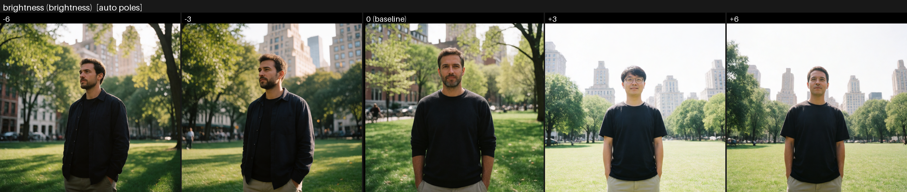
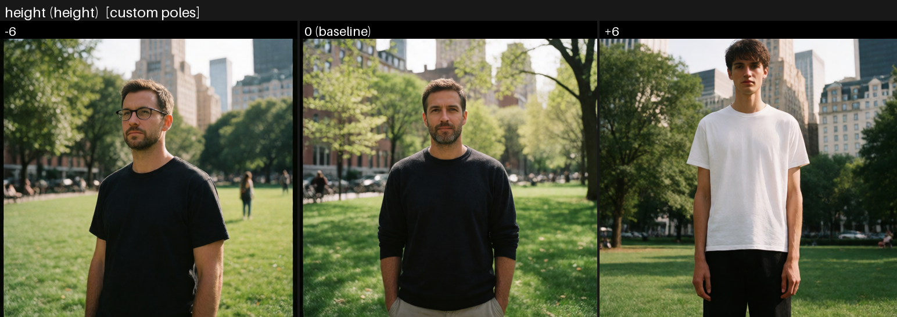
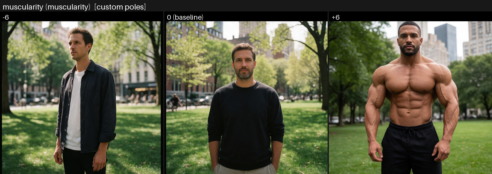

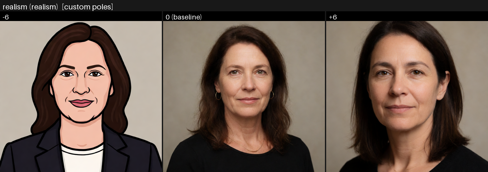
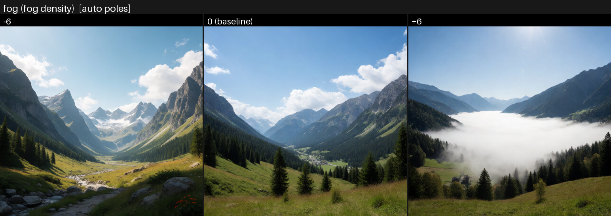
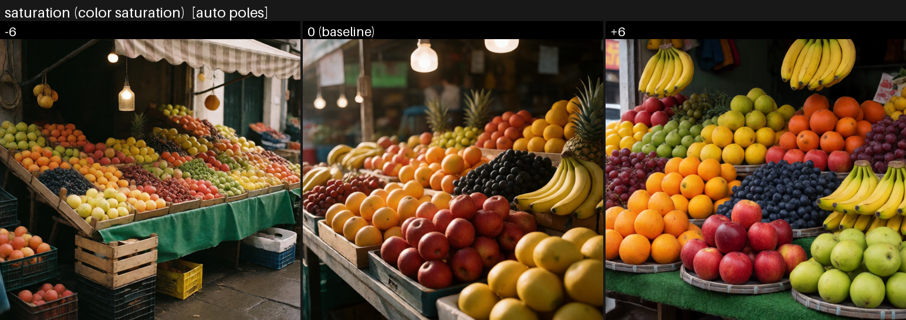
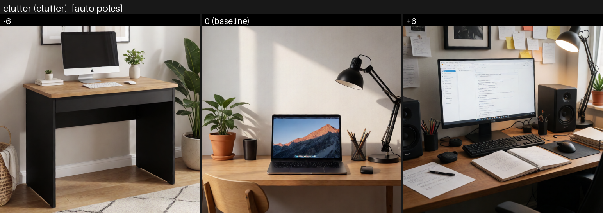
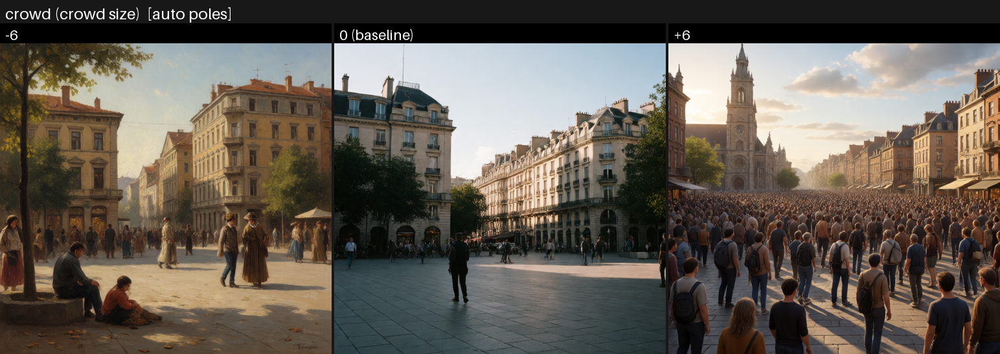
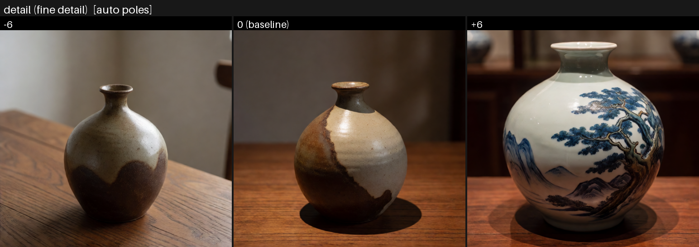

## Fixing a weak slider: two worked examples
<a name="fixing-a-weak-slider"></a>

The audit's two partial sliders were re-tested with fix candidates at
the same seed, one hypothesis per arm. Both were fixed **without any
node changes** - and the failed candidate is as instructive as the
fixes.

**Height's weak -6 was a wording problem, not a strength problem.**
With a full-body prompt, the original decrease pole ("a very short
person") still rendered an average-height man - and *raising the push
by 1.5x changed nothing*. Rewording the pole to concrete stature
language fixed it at normal strength:

> `What -6 looks like`: `a very short man with a small compact stature,
> much shorter than average`

The rule: if a direction is weak, do not reach for `Overall slider
reach` - amplifying a vague axis amplifies nothing. Rewrite the pole so
it names what the camera would actually see.

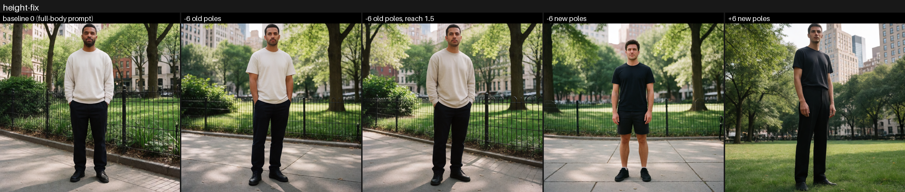

**Crowd's dead -6 needed room plus presence wording.** Changing the
prompt from "a city plaza in the afternoon" to "a city plaza **with
people walking through** in the afternoon" gave the slider something to
remove - and the oil-painting drift vanished with it (the axis no
longer had to reach for "sparse plaza" imagery, which skews classical
in training data). The presence-worded pole then made -6 clearly
audible where the auto pole stayed timid:

> `What -6 looks like`: `an empty deserted plaza with bare pavement and
> no people`

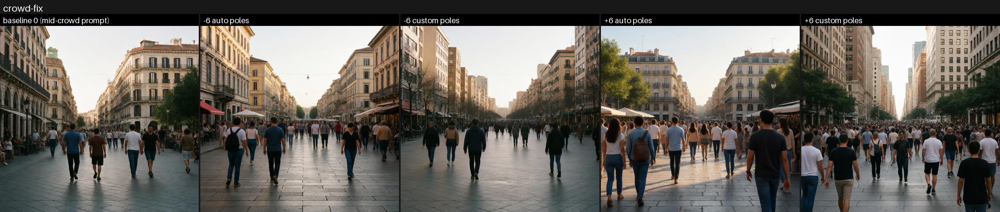

## Writing good sliders

**Use a noun for the description.** The auto poles are built as
`Extremely high <description>, maximum <description>.` and the matching
`low/minimum` sentence - `brightness`, `age`, `fog density`, `crowd
size` all read naturally. Adjectives (`bright`) read badly; use the
noun or write custom poles.

**Write custom poles when the ends have better names than the middle.**
`height` is technically fine, but "a very tall person" / "a very short
person" says exactly what each end looks like. Custom poles are also how
you build axes that are not more-vs-less of one word - the audit's
photoreal-vs-cartoon slider is two *looks*, not two amounts.

**Keep custom poles parallel.** The axis is the *difference* between the
two pole sentences, so phrase them alike and let only the meaningful
words differ ("a very tall person" / "a very short person"). If one pole
is a long vivid paragraph and the other is two words, the axis carries
the phrasing difference too.

**Scope the pole to the change you want.** At high values the model can
import the pole's whole concept, not just its axis - the audit's
muscularity +6 didn't just add muscle, it produced a shirtless
bodybuilder because that is what "bodybuilder physique" looks like in
training data. "a very muscular build under his clothes" scopes it.
<a name="pole-overshoot"></a>

**Give the slider room on both sides.** A slider can only lower an
attribute the prompt actually exhibits. The audit's crowd slider had
nothing to remove from an already-empty plaza, so -6 just drifted style;
brightness -6 moved less than +6 because the baseline was already a
shaded park. If you care about the negative side, start from a prompt
that sits mid-attribute. <a name="floor-effects"></a>

**Expect the positive side to be louder.** Across the audit,
"more of X" consistently outpulled "less of X" - text encoders describe
presence better than absence. Compensate with asymmetric values (e.g.
-5 / +3) or a custom negative pole that names a *presence* ("an empty
plaza, bare pavement" rather than "minimum crowd") - both negative-side
fixes in [the worked examples](#fixing-a-weak-slider) are exactly this
move, render-proven.

**One attribute per slider; stack for combinations.** "dark moody
brightness and heavy fog" as one description muddies the axis. Two
sliders compose cleanly and can be tuned independently.

**Protect people at extremes.** Identity drift is real at |5|-|6| on
human subjects (the audit's brightness +3 changed the man's face).
Keep person-sliders in the +/-2..4 band, put identity anchors in the
prompt, or accept the recast.

## Controls reference

KG Krea 2 Concept Slider Card V1:

| Control | Meaning |
| --- | --- |
| `What this slider changes` | The attribute, ideally a noun: `brightness`, `height`, `age`. |
| `Slider value` | -6..+6. 0 = no change (exact); negative = less / the opposite; positive = more. |
| `What +6 looks like (optional)` | Custom increase pole, e.g. `a very tall person`. Overrides the auto sentence. |
| `What -6 looks like (optional)` | Custom decrease pole, e.g. `a very short person`. |

KG Krea 2 Concept Slider Stack V1:

| Control | Meaning |
| --- | --- |
| `Krea CLIP` | The Krea 2 text encoder (the same CLIP you feed the reference stacks). |
| `Final image prompt` | Your prompt; encoded exactly as written when every slider sits at 0. |
| `Overall slider reach` | Multiplies every slider's push (default 1.0, up to 3). |
| `Reuse slider studies` | Content-keyed cache: dragging values re-runs with zero encoder passes. |
| `Slider 1..8` | Up to eight slider cards. |

Outputs: `conditioning` (to the sampler) and `slider_report` (plain
language: live sliders, exact pole sentences, pushes, skips, encode
counts).

## How it works

The reference stacks (V9/V10) proved a delta architecture on Krea 2:
encode once, isolate an ingredient's contribution by re-encoding with
that ingredient muted (token embeddings and attention zeroed), then
re-add the contribution at any weight - including negative (V10's
"away" cards). The slider stack applies that machinery to text:

1. Your prompt plus every active slider's two pole sentences are
   tokenized as **one sequence**, so every contribution lives in the
   same per-token frame. (Two separately encoded prompts cannot be
   subtracted - their token shapes differ. Same-sequence muting is what
   makes the axis well-defined.)
2. The base encode mutes every pole span - that is exactly your prompt,
   which is why 0 means no change *by construction*, not by
   calibration. The audit verified it to the pixel.
3. Each pole is encoded solo (all other pole spans muted). The slider's
   axis is `encode(increase solo) - encode(decrease solo)`.
4. The output re-adds each axis at compose time:

   ```
   conditioning = base + sum( value/6 x 2.0 x reach x axis )
   ```

   Everything rides the token path: Krea 2's Qwen3-VL encoder emits no
   pooled vector, so a pooled-path slider would be silent - a lesson
   inherited from the reference stacks.

Cost: `1 + 2 x (active sliders)` text-encoder passes per content
change; a slider at 0 and duplicate sliders over the same poles cost
nothing. With study reuse on, value drags are compose-only (no encoder
passes), so dragging feels free. Sampling cost is identical to a plain
prompt - nothing runs per step.

## Current limitations

- The slider stack is **text-only**: it replaces the prompt encoder and
  cannot yet be combined with V9/V10 reference guide cards in one
  conditioning chain.
- Negative directions are systematically weaker than positive ones, and
  hit floors when the prompt already sits at the low end (see the
  audit's crowd and height rows). Both are fixable with pole wording and
  prompt placement - [worked examples](#fixing-a-weak-slider) - but the
  asymmetry itself is a property of text conditioning, not a bug.
- At extreme values expect concept import from the pole phrase,
  possible composition reframing, and identity drift on people.
- An axis can saturate before +6: past the model's ceiling for the
  concept, extra push reshuffles the scene instead of intensifying it.
- Axes come from wording. A vague description gives a vague axis; the
  fix is always better pole text, and the `slider_report` shows you the
  exact sentences in play.

## Credits and prior work

The mechanism is original to this package (training-free axes via
same-sequence span muting in Krea 2's text conditioning, on the V9/V10
delta architecture), but its design borrows directly from published
work on slider control of diffusion models:

- **[Concept Sliders](https://sliders.baulab.info/)** - Gandikota,
  Materzynska, Zhou, Fisher, Torralba, Bau (ECCV 2024): established
  low-rank slider adapters trained between **paired opposite prompts**
  with a bipolar scale at generation time. The paired-opposite-poles
  idea and the slider-scale convention come from here, as does this
  node line's name.
- **[FreeSliders](https://arxiv.org/html/2511.00103)** (2025):
  training-free sliders via the inference-time contrast
  `base + eta x (positive - negative)`, computed per denoising step in
  noise space. Validated that the contrast needs no training; this
  package moves the same contrast to encode time in conditioning space
  so it costs nothing during sampling.
- **[Prompt Sliders](https://deepaksridhar.github.io/promptsliders.github.io/)** -
  Sridhar, Vasconcelos (ECCV Workshops 2024): showed slider control can
  live entirely in the **text-embedding space** (a learned token
  embedding scaled by a weight) rather than in model weights -
  precedent for a weights-free slider.
- **[Ostris's slider LoRAs](https://huggingface.co/ostris/muscle-slider-lora)**
  (e.g. the muscle slider, usable at roughly -3..+5): the community
  convention of one bipolar strength dial per attribute that this
  node's -6..+6 surface mirrors, and the inspiration for the audit's
  muscularity test case.

The audit methodology (fixed-seed same-session A/B arms, judged from
images with metrics as corroboration only) follows this repo's
recipe-lab practice.
