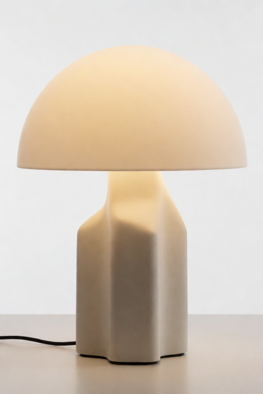
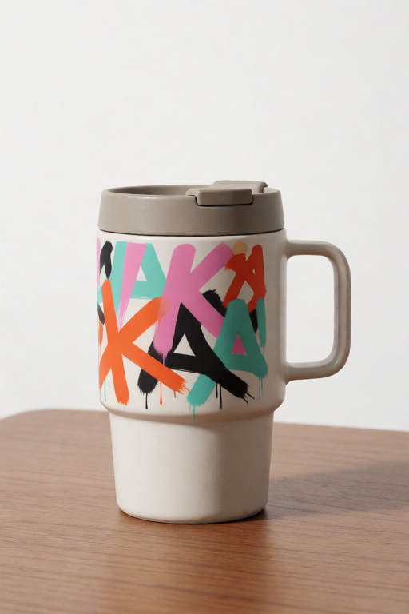

# Krea Reference V10 User Guide

Krea Reference lets every source image have a clear job before it reaches Krea.
V10 keeps everything from V9 and adds four more jobs, a direction (a card can
now be a counter-example), per-card timing, an auto-balance for hot stacks, a
study cache for fast tuning, and two feedback outputs that show you what the
stack actually did.

If you are new to Krea Reference, read the [V9 guide](krea-v9-user-guide.md)
first for the core mental model; this guide focuses on what V10 adds - and it
now demonstrates **every built-in recipe**, not just the new ones. Every demo
below is a complete journey - input images, recipe and settings, the exact
prompt, and the result - and every result PNG has the matching V10 workflow
embedded, so you can drag it into ComfyUI and inspect the setup.

All twelve recipes, one job each (details in
[The Recipe Gallery](#the-recipe-gallery)):


The synthetic source images used throughout ship with the repo:


## Contents

- [Fast Start](#fast-start)
- [What V10 Adds](#what-v10-adds)
- [How The Demos Were Made](#how-the-demos-were-made)
- [The Recipe Gallery](#the-recipe-gallery)
- [New Quick Recipes](#new-quick-recipes)
- [Create Your Own Recipes](#create-your-own-recipes)
- [Guide Direction: Counter-Examples](#guide-direction-counter-examples)
- [Per-Card Timing](#per-card-timing)
- [Manual Layer Dials](#manual-layer-dials)
- [Balance Strong Cards](#balance-strong-cards)
- [Reuse Image Studies](#reuse-image-studies)
- [Reading The Stack Report](#reading-the-stack-report)
- [The Prepared-References Preview](#the-prepared-references-preview)
- [Multi-Reference Recipes](#multi-reference-recipes)
- [Embedded Demo Workflows](#embedded-demo-workflows)
- [Troubleshooting](#troubleshooting)

## Fast Start

Use one guide card per image, exactly as in V9:

```text
Load Image -> KG Krea 2 Image Guide Card V10 -> KG Krea 2 Reference Stack Encoder V10 -> KSampler positive input
```

Then wire the two new stack outputs:

```text
Reference Stack Encoder V10 (stack_report) -> Preview Any
Reference Stack Encoder V10 (prepared_references) -> Preview Image
```

Try the bundled examples first:

| File | Purpose |
| --- | --- |
| [krea-v10-full-showcase-workflow.json](../example_workflows/krea-v10-full-showcase-workflow.json) | Best first run. Six cards including the new palette, environment, and framing recipes, per-card timing, gentle balance, and both feedback outputs. |
| [krea-v10-counter-example-workflow.json](../example_workflows/krea-v10-counter-example-workflow.json) | The new `away from this image` direction: keep the subject, push a style out. |
| [krea-v10-reference-stack-workflow.json](../example_workflows/krea-v10-reference-stack-workflow.json) | Compact starter graph for building your own V10 stack. |

Copy [example_assets/krea-reference-examples](../example_assets/krea-reference-examples/)
into your ComfyUI `input/` folder so the bundled workflows can find their
example images.

V9 and V10 cross-connect: a V9 card plugs into the V10 stack (the V10 controls
use their defaults) and a V10 card plugs into a V9 stack (which ignores the
V10 controls). Saved V9 workflows keep working unchanged.

## What V10 Adds

| Control | Where | What it does |
| --- | --- | --- |
| `suggest the color palette` | card | Palette-only quick recipe (was manual-only in V9). |
| `use the background/setting` | card | Environment quick recipe (was manual-only in V9). |
| `copy the camera framing` | card | Framing-only quick recipe (was manual-only in V9). |
| `mood board only` | card | Loose-inspiration quick recipe (was manual-only in V9). |
| Custom recipes | card | Your own YAML/JSON recipe files appear in `Use image for` as first-class choices. |
| `focus` recipe field | recipe file | A recipe can study **one named aspect** of its image - clothing, props, a setting - and skip the rest. |
| Starter recipes | shipped | `borrow the weather`, `borrow the clothing style`, and `cinematic color grade` load out of the box from [starter-pack.yaml](../custom_recipes/starter-pack.yaml). |
| Recipe Builder | `web/` | A single HTML page that turns three plain-language questions into a validated recipe file. |
| `Guide direction` | card | `toward this image` (V9 behavior) or `away from this image` (counter-example). |
| `When this card guides` | card | Per-card timing: recipe decides, whole image, early layout only, or final details only. |
| `Structure layers pull` / `Finish layers pull` | card | Manual-mode dials over the structure-vs-finish conditioning layers. |
| `Balance strong cards` | stack | Budgets the total pull of hot stacks so cards degrade gracefully instead of fighting. |
| `Reuse image studies` | stack | Content-keyed cache; strength/timing tweaks re-run with zero encoder passes. |
| `stack_report` | stack output | Plain-language account of what every card requested, got, and why. |
| `prepared_references` | stack output | Contact sheet of exactly what the vision encoder studied. |

The text/logo guard's full-guard prompt rewriter also understands common
marking words in Spanish, French, German, Portuguese, and Italian.

## How The Demos Were Made

Every journey in this guide shares the same house setup, so the settings
tables list only what changes per demo:

| House setting | Value |
| --- | --- |
| Model / CLIP / VAE | `krea2_turbo_nvfp4` / `qwen3vl_4b_fp8_scaled` / `qwen_image_vae` |
| Sampler | 8 steps, cfg `1.0`, `euler` / `simple`, AuraFlow shift `3.14`, 512x768, fixed seed per demo |
| Stack | `artist friendly` feel, `medium (384)` detail, `keep full image shape`, `smart per-card timing`, handoff `0.40`, written prompt strength `1.25` |
| Negative prompt | `boring, dull, blurry, low-quality, fake letters, readable text, logo, watermark, oversaturated colours` |

Drag any result PNG into ComfyUI to load its embedded V10 workflow, or open
the `.workflow.json` beside it in [assets/krea-v10/demos](assets/krea-v10/demos/).
Every demo was rendered by ComfyUI through the real V10 nodes with the current
recipe tuning - the embedded workflow values are exactly what rendered - using
the maintainer script
[docs/recipe-lab/generate_guide_demos.py](recipe-lab/generate_guide_demos.py).

## The Recipe Gallery

One demo per built-in recipe, all on the bundled example assets so you can
reproduce any row. The four appearance journeys marked with the same prompt
and seed are directly comparable - the only change between them is the card.

| Recipe | Reference | Strength | Seed | Result | What arrives |
| --- | --- | --- | --- | --- | --- |
| `balanced` | slot1 content anchor | `0.60` | `972110` | [PNG](assets/krea-v10/demos/recipe-balanced.png) | A little of everything; the prompt still leads. |
| `keep the same subject` | slot1 content anchor | `1.00` | `972111` | [PNG](assets/krea-v10/demos/recipe-keep-same-subject.png) | The reference's subject travels into the prompt's new scene - markings included (pair with the guard if you don't want them). Fires from ~`0.9` up. |
| `copy pose and layout` | slot6 pose/layout | `0.90` | `972112` | [PNG](assets/krea-v10/demos/recipe-copy-pose-layout.png) | The arrangement, studied as a grayscale blur - placement arrives, color stays the prompt's. |
| `copy big shapes only` | slot7 shape only | `0.90` | `972115` | [PNG](assets/krea-v10/demos/recipe-copy-big-shapes.png) | Silhouette guidance only - the big masses steer the composition. |
| `copy the camera framing` | slot6 pose/layout | `0.30` | `972103` | [PNG](assets/krea-v10/demos/copy-camera-framing.png) | Camera distance, crop, and viewpoint - subject and palette stay the prompt's. |
| `avoid copying text/logos` | slot5 text/logo guard | `0.50` (clamps to `0.03`) | `972116` | [PNG](assets/krea-v10/demos/recipe-avoid-text-logos.png) | Nothing readable: the guard clamps the card and rewrites the prompt toward blank surfaces. |
| `suggest the color palette` | slot2 style reference | `0.65` | `972101` | [PNG](assets/krea-v10/demos/suggest-color-palette.png) | The reference's color relationships, as soft color fields - composition identical to the no-card baseline. |
| `suggest the visual style` | slot2 style reference | `0.65` | `972101` | [PNG](assets/krea-v10/demos/recipe-suggest-visual-style.png) | Same inputs and seed as the palette row: a broader, softer overall grade - the look, not the source's shapes. |
| `copy lighting and mood` | slot4 lighting/mood | `0.65` | `972113` | [PNG](assets/krea-v10/demos/recipe-copy-lighting-mood.png) | The reference's light color and tonal mood as a scene-wide cast. |
| `suggest material or texture` | slot3 material/texture | `0.55` | `972114` | [PNG](assets/krea-v10/demos/recipe-suggest-material-texture.png) | The material's surface finish and pattern energy, with source structure kept quiet. |
| `use the background/setting` | slot8 background/environment | `0.65` | `972102` | [PNG](assets/krea-v10/demos/use-background-setting.png) | The setting's palette and room mood; the model builds a coherent place around the prompt's subject. |
| `mood board only` | slot2 style reference | `0.50` | `972104` | [PNG](assets/krea-v10/demos/mood-board-only.png) | A gentle borrowed palette and feeling under a hard cap - never a dictated composition. |

Two honest notes on the appearance family (palette, style, lighting,
material, environment, mood board), tuned and render-verified on Krea 2:

- **They respond to the strength slider in a controllable band.** Low
  strengths whisper, the borrow lands clearly from about `0.6`, and each
  recipe caps itself before "too much". If an appearance card seems silent,
  raise its strength toward `0.65` first.
- **They borrow palette and mood, not paint.** With their structure-safe
  preparation the reference's colors arrive as color fields over the scene
  and subject; they do not repaint the reference's brushwork onto your
  subject's surface or composite its scene behind it. Where the color lands
  follows the prompt: sparse neutral scenes let it settle on the subject
  itself (as in the sphere demos).

## New Quick Recipes

The four V10 recipes cover the jobs that previously required `manual tuning`.
Each journey below shows the input, the card settings, the exact prompt, and
the result.

### Suggest The Color Palette

| Input | Result |
| --- | --- |
|  |  |

| Setting | Value |
| --- | --- |
| Recipe | `suggest the color palette` |
| Strength | `0.65` (whispers below ~`0.5`, clear from ~`0.6`, capped at `0.9`) |
| Seed | `972101` |
| Prompt | `a matte ceramic sphere on a small plinth, neutral gray studio backdrop, soft even light, clean unmarked design, no readable text` |
| Demo files | [result PNG](assets/krea-v10/demos/suggest-color-palette.png), [workflow JSON](assets/krea-v10/demos/suggest-color-palette.workflow.json) |

Compare the pair below - same prompt, same seed, the only change is the
card: the neutral sphere takes on the source's pastel coral-teal-lavender
relationships as soft color fields while the abstract source shapes stay out
entirely. The image is reduced to a palette wash at low study resolution
before the encoder sees it, so color relationships are all that *can*
arrive - which is also why the composition is pixel-comparable to the
baseline.

| Prompt only (no cards) | With the palette card |
| --- | --- |
|  |  |

### Use The Background/Setting

| Input | Result |
| --- | --- |
|  |  |

| Setting | Value |
| --- | --- |
| Recipe | `use the background/setting` |
| Strength | `0.65` |
| Seed | `972102` |
| Prompt | `a sculptural table lamp on a small side table, editorial product photo, cohesive interior scene, no readable text` |
| Demo files | [result PNG](assets/krea-v10/demos/use-background-setting.png), [workflow JSON](assets/krea-v10/demos/use-background-setting.workflow.json) |

The environment recipe borrows the *feeling of the place*: the reference's
warm plaster palette and room mood arrive, and the model builds a coherent
interior around the prompt's lamp. It deliberately does not lift the
reference's literal room - the reference is studied structure-free, so it can
set the atmosphere without ever reshaping your subject into its own forms.

### Copy The Camera Framing

| Input | Result |
| --- | --- |
|  |  |

| Setting | Value |
| --- | --- |
| Recipe | `copy the camera framing` |
| Strength | `0.30` |
| Seed | `972103` |
| Prompt | `three ceramic vases in a row on a low wooden table, plain unmarked surfaces, soft daylight, refined product photography, no readable text` |
| Demo files | [result PNG](assets/krea-v10/demos/copy-camera-framing.png), [workflow JSON](assets/krea-v10/demos/copy-camera-framing.workflow.json) |

Framing borrows camera distance, crop, and viewpoint only - the diagonal
row arrangement echoes the reference while subject, palette, and surface
come from the prompt. The recipe studies the reference in grayscale at its
own aspect ratio, because the frame *is* the information. It pairs well with
`When this card guides` set to `early layout only`.

### Mood Board Only

| Input | Result |
| --- | --- |
|  |  |

| Setting | Value |
| --- | --- |
| Recipe | `mood board only` |
| Strength | `0.50` (hard cap `0.9`) |
| Seed | `972104` |
| Prompt | `a calm desk scene with a small ceramic lamp and a closed notebook, editorial photo, no readable text` |
| Demo files | [result PNG](assets/krea-v10/demos/mood-board-only.png), [workflow JSON](assets/krea-v10/demos/mood-board-only.workflow.json) |

Mood board stays the quietest appearance recipe: a gentle borrowed palette
and feeling - the sage-and-cream calm of the source settles over the desk -
without ever dictating content or composition.

## Create Your Own Recipes

The built-in recipes are settings bundles - and in V10 you can write your
own. A custom recipe is a small YAML or JSON file; every file that passes
validation appears in `Use image for` as a first-class choice,
indistinguishable from a built-in.

> **No schema required:** the pack ships a
> [Recipe Builder](../web/recipe-builder.html) (`web/recipe-builder.html`) -
> a single HTML page you can open in any browser (or from a running ComfyUI
> at `/extensions/<pack folder>/recipe-builder.html`). Pick what the
> reference should give, pick a loudness, download the file. Every number is
> filled from the render-validated tables below, and the page tells you
> honestly what each job can and cannot do. The rest of this section is for
> when you want to understand or hand-tune what the builder produces.

### Where recipe files go

| Location | Notes |
| --- | --- |
| `custom_recipes/` inside this node pack | Ships with a README and a template. Easiest to find. |
| `<ComfyUI user dir>/krea_reference/recipes/` | Survives reinstalling or updating the node pack. Create the folder if it does not exist. |

Files named with a leading `_` or `.` are ignored - that is how the bundled
template ([_example-vintage-postcard.yaml](../custom_recipes/_example-vintage-postcard.yaml))
ships without adding itself to your dropdown.

### Your first recipe, in three steps

1. Create `custom_recipes/soft-palette-hint.yaml` containing:

   ```yaml
   label: soft palette hint
   role: palette
   cap: 0.5
   ```

2. In ComfyUI, refresh node definitions (or restart).
3. Open a V10 guide card: `soft palette hint` is now in `Use image for`.

Only `label` (the dropdown text) and `role` (which built-in behavior family
to start from) are required. Every omitted field defaults from the role's
tuning tables, so a two-line recipe is already well-behaved.

### What each control really does (read this before tuning numbers)

Four facts, established by rendering controlled sweeps on the real model.
They are the difference between a recipe that works and one that silently
does nothing:

1. **`treatment` decides WHAT can transfer.** The reference is re-drawn by
   the treatment *before* the encoder studies it, so it is a hard filter on
   what the card can possibly deliver:

   | You want to borrow | Use treatment | Why it is safe |
   | --- | --- | --- |
   | colors / palette / mood | `palette wash` | the source's shapes are destroyed first, so its subject **cannot** leak in |
   | layout / arrangement | `grayscale blur` | color is stripped, so placement arrives without recoloring |
   | silhouette only | `shape wash` | everything but the big masses is removed |
   | the actual subject | `normal` | nothing is removed - the subject can and will copy in |
   | subject + softness | `soft blur` / `strong blur` | **caution:** the source's forms survive; at working strengths the source object tends to appear or reshape your subject |

2. **`shape` is the volume knob.** It scales the one conditioning channel
   that actually moves pixels on Krea 2:

   | `shape` | What happens at normal card strengths |
   | --- | --- |
   | `0.0`-`0.4` | effectively **off** |
   | `0.5`-`0.65` | onset - the borrow appears near the top of the strength range |
   | `0.7`-`1.0` | the appearance recipes' working range - clear borrow by strength ~`0.65`, subject preserved (with a structure-destroying treatment) |
   | `1.0`-`1.3` | structural jobs - layout and subject transfer |

3. **`layers` fine-tunes WHICH bands are emphasized - it is second-order.**
   The 12 gains reshape the signal `shape` lets through; they cannot rescue
   a `shape` that is too low. Omit `layers` unless you are deliberately
   fine-tuning.

4. **`global` has no effect on Krea 2.** It scales a pooled conditioning
   channel this model's text encoder does not produce. The field stays for
   other/future models - but a weak recipe on Krea 2 is fixed by raising
   `shape` (and hardening `treatment`), never by raising `global`.

And one limit to design around: with a structure-destroying treatment the
borrowed look arrives as palette and mood over the scene - not as brushwork
painted onto your subject's surface, and not as the source's scene composited
behind it. Recipes promising those need conditioning this model does not
have.

### The full schema

A file holds one recipe, or a pack: `{"recipes": [recipe, recipe, ...]}`.

| Field | Required | Values | Default |
| --- | --- | --- | --- |
| `label` | yes | The dropdown text. Must not collide with a built-in choice or another custom label. | - |
| `role` | yes | `balanced`, `style`, `palette`, `composition`, `framing`, `identity`, `environment`, `lighting`, `material`, `loose`, `shape only`, `text/logo safe` | - |
| `description` | no | Free text for humans reading the file. | `""` |
| `treatment` | no | `normal`, `grayscale`, `soft blur`, `strong blur`, `palette wash`, `color wash`, `grayscale blur`, `shape wash` | `normal` |
| `color` | no | `0.0`-`1.0`: how much color survives preparation. | `1.0` |
| `detail` | no | `0.0`-`1.0`: how much fine detail survives. | `1.0` |
| `study` | no | `stack`, `256`, `384`, `512`, `768` | `stack` |
| `framing` | no | `stack`, `preserve aspect`, `center crop square`, `stretch square` | `stack` |
| `subject` | no | `recipe`, `avoid`, `allow`, `preserve` | `recipe` |
| `early`, `late` | no | `0.0`-`5.0`: phase multipliers for two-phase timing. | `1.0` |
| `guard` | no | `true` applies the full text/logo blank-surface clamp to this card. | `false` |
| `cap` | no | `0.0`-`3.0`: hard ceiling on effective strength. Omit for no cap. | none |
| `shape` | no | `0.0`-`3.0`: **the main transfer volume** (anchors above). | role default |
| `global` | no | `0.0`-`4.0`: pooled overall-look pull - **inert on Krea 2**, kept for other models. | role default |
| `layers` | no | Exactly 12 numbers (`0.0`-`8.0`): per-band fine-tuning gains. | role table |
| `focus` | no | Up to 300 chars: **which aspect** the encoder studies - "the clothing and garment style, not the person". Naming what to skip works remarkably well. Strongest on object-bound aspects; broad moods ride the image itself. | none |

Three ready-made recipes ship enabled in
[custom_recipes/starter-pack.yaml](../custom_recipes/starter-pack.yaml) -
`borrow the weather`, `borrow the clothing style` (a `focus` recipe), and
`cinematic color grade` - as working examples to copy from. Delete or
underscore the file to remove them from your dropdown.
[krea-v10-starter-recipe-workflow.json](../example_workflows/krea-v10-starter-recipe-workflow.json)
runs one of them out of the box.

### Focus: recipes that study one aspect

The numeric fields select visual channels (color vs structure); they cannot
separate a dress from the person wearing it. The `focus` field can: it is
free text the encoder is told to study -
`study only <your text> from this image; ignore everything else about it.`

```yaml
label: borrow the clothing style
role: balanced
treatment: normal
detail: 0.7
study: "384"
subject: avoid
cap: 1.1
shape: 0.8
focus: the clothing and garment style worn by the person, not the person's identity, face, or the background
```

What the render tests showed (same reference, same seed, only the focus text
changed):

- **Selecting works** - the clothing-focused recipe kept the reference's red
  raincoat and picked up garment details the unfocused run missed.
- **De-selecting is the power move** - focusing the same photo on "the
  background environment only, *not the person or their clothing*" removed
  the red coat entirely. Name what to skip and it stays behind.
- **Know its limits** - scene-wide moods (weather, seasons, time of day)
  mostly ride the image itself at working strengths; use treatment +
  strength for those (that is exactly what `borrow the weather` does) and
  save `focus` for object-bound aspects: clothing, props, hairstyles,
  furniture, vehicles.

Focus biases what the encoder studies; it does not replace the treatment
guarantees - keep `subject: avoid` and a job-appropriate treatment, and
render-check like everything else. The stack report prints each card's
focus so you can confirm it reached the encoder.

A complete example (the shipped template - render-validated values):

```yaml
label: vintage postcard style
description: Warm faded palette and a soft print finish, without copying the source subject.
role: style
treatment: palette wash
color: 0.9
detail: 0.0
study: "256"
framing: stack
subject: avoid
early: 0.85
late: 0.9
guard: false
cap: 0.85
shape: 0.75
global: 1.7
layers: [0.25, 0.35, 0.45, 0.6, 0.8, 1.0, 1.0, 2.5, 5.0, 1.1, 4.0, 1.2]
```

The same recipe as JSON is the same mapping with JSON syntax - both formats
are equivalent.

### Deriving the `layers` array

`layers` is the only field without an obvious hand-set value. The 12
positions are Krea 2's 12 text-encoder layer taps (position 0 shallowest,
11 deepest). The built-in tables follow a *design intent* - shallow layers
(`0`-`4`) carry structure and are turned down for look-borrowing; `5`-`6`
transition; deep layers carry appearance, spiked at `8` (strongest), `10`,
then `7`, with `9` and `11` mild. The card's manual
`Structure layers pull` / `Finish layers pull` dials scale positions `0`-`5`
and `6`-`11` of this same table - a custom array is those two dials with
per-position control.

Omit `layers` to use your role's tuned table - the right default. To derive
your own: start from the closest family table, scale the front half (`0`-`5`)
by how much structure should arrive, scale the back half (`6`-`11`) by how
strongly the finish should arrive, and keep the spike ordering
(`8` > `10` > `7`). Each entry lands as
`clamp(effective strength x shape x gain, -6, +6)` per band - so the gains
multiply against `shape`, and `shape` sets the floor: a `5.0` spike on a
`shape 0.7` card at effective strength `0.5` lands at `1.75` on that band
while the suppressed front bands stay near `0.1`; the same spike on a
`shape 0.1` card lands at a whisper-quiet `0.25`. That is why layer tuning is
the *polish* step - render sweeps on the real model showed outcome-level
changes come from `treatment` and `shape`, while sensible layer-table edits
read as flavor. (And remember: `global` does not participate at all on
Krea 2.)

The family tables, the full chunk map, the math, a copy-paste derivation
snippet, a render-validated worked example, and a two-minute render-testing
protocol live in
[custom_recipes/README.md](../custom_recipes/README.md#the-layers-array-exactly).
The full determination - what the 12 taps are (verified from the model), where
the specific numbers came from, and how the retuned values were measured -
is documented in [docs/deepstack-layers/](deepstack-layers/README.md).

### How validation behaves

- **Strict about keys.** An unknown key (say, `colour`) rejects the recipe
  with a named error, so typos cannot silently become no-ops.
- **Forgiving about omissions.** Everything except `label` and `role` has a
  sensible role-derived default.
- **The node always loads.** Invalid recipes are skipped with a warning in
  the ComfyUI log naming the file and the reason; your other recipes and the
  built-ins are unaffected.
- **First definition wins.** Files scan in sorted name order; a duplicate
  label in a later file is skipped with a collision warning.

Custom recipes compose with every other V10 control: `Guide direction`,
`When this card guides`, and the strength slider all apply on top, the stack
report names your recipe on its card line, and a `guard: true` recipe is
clamped exactly like the built-in text/logo guard.

### Recipe design tips

- Start from the closest built-in: copy its values from the
  [technical paper's recipe tables](krea-v9-technical-paper.md) or the
  shipped template, then move one number at a time.
- `role` does more than defaults: it selects the instruction language the
  encoder writes for the card and the per-layer gain table.
- Keep `subject: avoid` on style-family recipes unless you specifically want
  the source subject to survive.
- Give whisper-jobs a `cap` so a slider bump cannot blow past their intent.
- Appearance recipes land best with a coarse study (`study: "256"`) - finer
  studies raise the strength needed before anything shows.
- Test with the prepared-references preview: if the treated frame still
  shows what you meant to strip, strengthen `treatment` or lower `detail`.
- **Validate by rendering, always.** Fix a seed, render your recipe at
  strengths `0.4` / `0.65` / `0.9`, and check three things: not silent at
  `0.9`? (raise `shape`); source not leaking in? (harden `treatment`); the
  three strengths read quiet / clear / strong? (set `cap` where "too much"
  begins). Numbers that were never rendered are guesses.

### Sharing recipes and saved workflows

Saved workflows reference custom recipes **by label**. If you share a
workflow that uses one, ship the recipe file with it; without the file the
card falls back to `balanced` with a logged warning. Renaming a label
orphans existing workflows the same way - prefer adding a new recipe over
renaming an old one.

## Guide Direction: Counter-Examples

`Guide direction` is the biggest new idea in V10. Every card still gets a job;
now it also gets a direction:

- `toward this image` - exact V9 behavior: the reference pulls the result
  toward its look.
- `away from this image` - the card becomes a **counter-example**: the stack
  isolates what this image contributes and re-adds it negatively, steering the
  result away from whatever aspect the card's job selects.

The job picks *what* to repel:

| Combination | Meaning |
| --- | --- |
| `away` + `suggest the visual style` | Not this style. |
| `away` + `suggest the color palette` | Not this palette. |
| `away` + `copy pose and layout` | Not this composition. |
| `away` + `keep the same subject` | Keep this subject out entirely. |

### The direction journey

The three steps below show exactly what an away card negates. Same prompt,
same seed (`972106`); the only change is the style card and its direction:

| Step 1: prompt only | Step 2: style toward `0.65` | Step 3: style away `0.40` |
| --- | --- | --- |
|  |  |  |

| Setting | Value |
| --- | --- |
| Style source |  |
| Prompt (all steps) | `a sculptural table lamp in a clean studio product photo, no readable text` |
| Step 2 card | `suggest the visual style`, `toward this image`, strength `0.65` |
| Step 3 card | `suggest the visual style`, `away from this image`, strength `0.40` |
| Demo files | [step 1](assets/krea-v10/demos/counter-example-baseline.png), [step 2](assets/krea-v10/demos/counter-example-toward.png), [step 3](assets/krea-v10/demos/counter-example-away.png) + `.workflow.json` beside each |

Pulled toward, the source's pastel palette takes over the lamp - a rose
shade, a sage base, a rounder and softer art direction.
Pushed away, the same card scrubs the result in the opposite direction - the
lamp comes out plainer and warmer-neutral than even the prompt-only baseline,
because the stack is actively steering out of the source's palette and
manner. Away pushes harder per slider unit than toward (it extrapolates past
removal), which is why step 3 runs at `0.40` and the rules below say start
low.

Rules of thumb:

- Start low: `0.10` to `0.30`. Repulsion gets strange faster than attraction.
- Always pair an away card with a written prompt or a toward card that says
  what you *do* want; pure repulsion with no positive signal wanders.
- A counter-example card always avoids subject copying, whatever
  `Subject copying` says.
- The stack report marks away cards and prints their negative targets.

## Per-Card Timing

V9 timing was a stack-level choice plus recipe-baked early/late behavior. V10
adds `When this card guides` on every card:

| Choice | Behavior |
| --- | --- |
| `recipe decides` | Keep the recipe or manual early/late behavior (V9 default). |
| `whole image` | Guide both phases at full card strength. |
| `early layout only` | Keep the card's early behavior; remove its influence in the final phase. |
| `final details only` | Remove the card's influence early; keep its late behavior. |

Typical uses: a framing or layout card set to `early layout only` composes the
image and then gets out of the way; a material card set to
`final details only` touches only the finish. The text/logo guard still clamps
last - a guarded card never regains late-phase influence.

### The timing journey

Same style card, same seed (`972105`), same prompt - the only change is
`When this card guides`:

| `early layout only` | `final details only` |
| --- | --- |
|  |  |

| Setting | Value |
| --- | --- |
| Style source |  |
| Card | `suggest the visual style`, strength `0.75` |
| Prompt (both) | `a modern table lamp in a clean studio product photo, no readable text` |
| Demo files | [early-only PNG](assets/krea-v10/demos/timing-style-early-only.png), [final-only PNG](assets/krea-v10/demos/timing-style-final-only.png) + `.workflow.json` beside each |

Both timings deliver the borrowed palette - color commits in the first
sampling steps, so even an early-only card leaves color behind. What the
widget really moves is *how* the look lands: early-only lets the source
guide the composition and broad color fields, then the prompt's own finish
passes smooth the surfaces - the shade comes out a classic soft-graded cone.
Final-only is the mirror image: the prompt owns the early composition and
the source arrives in the detail passes, landing its rose-and-sage palette
as a crisp two-tone finish on the prompt's lamp. One widget, two clearly
different pictures.

## Manual Layer Dials

In `manual tuning` mode only, two new dials scale the per-layer conditioning
gains in plain language:

- `Structure layers pull` - the early conditioning bands that carry layout and
  subject structure.
- `Finish layers pull` - the late bands that carry palette, texture, and
  rendering finish.

Lower structure and raise finish for a style card that keeps dragging the
subject along; do the opposite for a layout card that keeps recoloring things.
Quick recipes ignore both dials (their tables are already tuned), and the web
extension greys them out outside manual mode.

## Balance Strong Cards

Several simultaneously strong cards blend less faithfully than the same cards
used separately - they fight. `Balance strong cards` puts a budget on the
stack's total pull per timing phase and softly scales every card down when the
stack exceeds it:

| Choice | Budget | Use when |
| --- | --- | --- |
| `off - use my values` | none | Exact V9 behavior. The default. |
| `gentle balance` | `2.5` | Four or more active cards, or two or three aggressive ones. Rarely intervenes otherwise. |
| `strict balance` | `1.5` | Conservative blends where fidelity beats punch. |

The written prompt is never balanced - only image cards are scaled - and the
stack report states the applied scale whenever balancing intervenes.

The six-card showcase, rendered both ways on the same seed:

| Balance `off - use my values` | `gentle balance` |
| --- | --- |
|  |  |

With six active cards the gentle budget trims the loudest pulls: the balanced
render keeps the same mug-on-desk composition while the ensemble blends a
touch more evenly (the balanced mug comes out slightly lighter, with a
simpler lid and softer shadows). With
stacks this size the difference is deliberately subtle - balance is a
graceful-degradation guard, not a look control.

## Reuse Image Studies

The expensive part of every run is the encoder passes that study each image in
context. Those studies depend only on the prompt and the prepared images -
never on strengths, direction, timing, or balance. `Reuse image studies`
caches them:

- `reuse between runs - faster tuning` (default): re-runs that change only
  strengths, direction, timing, handoff, or balance reuse every study and skip
  all encoder passes. The report's `Studies:` line shows exactly what was
  reused.
- `always re-study`: exact V9 behavior; every run pays full encode cost.

The cache keys on image and prompt *content*, so editing an image or the
prompt re-studies automatically - stale reuse cannot happen. The one caveat:
reuse assumes the connected CLIP is unchanged between runs. Pick
`always re-study` while hot-swapping CLIP patches or LoRA hooks.

The tuning ritual this enables: queue once, read the report, then tweak one
strength at a time and re-queue - each re-run is nearly free.

## Reading The Stack Report

Wire `stack_report` into a `Preview Any` node. A typical report:

```text
KG Krea 2 Reference Stack Encoder V10 - stack report
Prompt: "a ceramic travel mug on a wooden desk in a bright studio" at strength 1.15.
Timing: smart per-card timing. with early-to-final handoff at 0.40.
Balance: gentle balance - cards were within budget, nothing scaled.
Studies: 7 encoder passes this run; studies cached for faster strength tuning.

Card 1 (keep the same subject): requested 0.80 -> guiding at 0.70 after the slider feel curve. Targets: early shape 0.70x / look 0.70x, final shape 0.70x / look 0.70x.
Card 6 (avoid copying text/logos): requested 0.03 -> capped at 0.03 by the text/logo guard. ...
```

What to look for:

| Line | Tells you |
| --- | --- |
| `requested X -> guiding at Y` | The slider feel curve's effect. If a card feels dead at `0.05`, this line shows why. |
| `capped at X by ...` | A recipe cap or the text/logo guard clamped the card. Raising the slider further does nothing. |
| `Balance: ... scaled strong cards to X` | The stack intervened; your relative card ratios were kept, total pull was reduced. |
| `Studies: N encoder passes ... reused M` | The run's real cost and what the cache saved. |
| `Skipped without cost: ...` | Cards that contributed nothing (no image, or strength 0) and why. |

## The Prepared-References Preview

Wire `prepared_references` into a `Preview Image` node. It shows one frame per
active card: exactly what the vision encoder studied after framing, washes,
color reduction, and detail reduction.

This makes the invisible visible. If a style card's frame still shows a
recognizable subject, the subject can leak - lower `Small details kept`, pick
a stronger `Prepare image by` treatment, or reduce the study resolution. If a
palette card's frame is nothing but soft color blocks, it is doing its job.

## Multi-Reference Recipes

| Scenario | Setup |
| --- | --- |
| Product in a place | `keep the same subject` for the product, `use the background/setting` for the location, `suggest the color palette` for grade. Turn on `gentle balance`. |
| Composed shot, free contents | `copy the camera framing` at `early layout only`, then style/material cards for the finish. |
| "Anything but that" | Normal toward cards for what you want, plus one `away` card holding the look to avoid at `0.15` to `0.25`. |
| Fast strength search | Any stack with `reuse between runs`; queue, read the report, tweak one card, repeat. |

### The full showcase journey

Six cards, one job each - rendered as a single journey:

| Setting | Value |
| --- | --- |
| Cards | `keep the same subject` `0.80` (slot1) - `suggest the visual style` `0.55` (slot2) - `use the background/setting` `0.35` (slot8) - `suggest the color palette` `0.40` (slot4) - `copy the camera framing` `0.30`, `early layout only` (slot6) - `avoid copying text/logos` `0.03` (slot5) |
| Prompt | `a ceramic travel mug on a wooden desk in a bright studio, no readable text` (strength `1.15`) |
| Seed | `972107` |
| Demo files | [result PNG](assets/krea-v10/demos/full-showcase.png), [workflow JSON](assets/krea-v10/demos/full-showcase.workflow.json) |


The mug is the prompt's, anchored by the content card; the desk, books, and
window light read bright-studio; the style and palette cards keep the grade
quiet and warm; and no readable markings survive the guard. This render used
`off - use my values` balance (the
[gentle-balance render](assets/krea-v10/demos/full-showcase-balanced.png) of
the same seed sits in the Balance section); the shipped
[showcase workflow](../example_workflows/krea-v10-full-showcase-workflow.json)
turns `gentle balance` on as its starting point:

```text
Reference 1: keep the same subject, 0.80
Reference 2: suggest the visual style, 0.55
Reference 3: use the background/setting, 0.35
Reference 4: suggest the color palette, 0.40
Reference 5: copy the camera framing, 0.30, early layout only
Reference 6: avoid copying text/logos, 0.03
Stack: gentle balance, reuse between runs
```

## Embedded Demo Workflows

Drag any demo PNG into ComfyUI to load its V10 workflow, or open the JSON
beside it. Full per-demo settings live in
[guide-demo-manifest.json](assets/krea-v10/demos/guide-demo-manifest.json).

| Journey | PNG | JSON |
| --- | --- | --- |
| Balanced | [recipe-balanced.png](assets/krea-v10/demos/recipe-balanced.png) | [workflow](assets/krea-v10/demos/recipe-balanced.workflow.json) |
| Keep the same subject | [recipe-keep-same-subject.png](assets/krea-v10/demos/recipe-keep-same-subject.png) | [workflow](assets/krea-v10/demos/recipe-keep-same-subject.workflow.json) |
| Copy pose and layout | [recipe-copy-pose-layout.png](assets/krea-v10/demos/recipe-copy-pose-layout.png) | [workflow](assets/krea-v10/demos/recipe-copy-pose-layout.workflow.json) |
| Copy big shapes only | [recipe-copy-big-shapes.png](assets/krea-v10/demos/recipe-copy-big-shapes.png) | [workflow](assets/krea-v10/demos/recipe-copy-big-shapes.workflow.json) |
| Copy the camera framing | [copy-camera-framing.png](assets/krea-v10/demos/copy-camera-framing.png) | [workflow](assets/krea-v10/demos/copy-camera-framing.workflow.json) |
| Avoid copying text/logos | [recipe-avoid-text-logos.png](assets/krea-v10/demos/recipe-avoid-text-logos.png) | [workflow](assets/krea-v10/demos/recipe-avoid-text-logos.workflow.json) |
| Suggest the color palette | [suggest-color-palette.png](assets/krea-v10/demos/suggest-color-palette.png) | [workflow](assets/krea-v10/demos/suggest-color-palette.workflow.json) |
| Palette journey, prompt only | [suggest-color-palette-off.png](assets/krea-v10/demos/suggest-color-palette-off.png) | [workflow](assets/krea-v10/demos/suggest-color-palette-off.workflow.json) |
| Suggest the visual style | [recipe-suggest-visual-style.png](assets/krea-v10/demos/recipe-suggest-visual-style.png) | [workflow](assets/krea-v10/demos/recipe-suggest-visual-style.workflow.json) |
| Copy lighting and mood | [recipe-copy-lighting-mood.png](assets/krea-v10/demos/recipe-copy-lighting-mood.png) | [workflow](assets/krea-v10/demos/recipe-copy-lighting-mood.workflow.json) |
| Suggest material or texture | [recipe-suggest-material-texture.png](assets/krea-v10/demos/recipe-suggest-material-texture.png) | [workflow](assets/krea-v10/demos/recipe-suggest-material-texture.workflow.json) |
| Use the background/setting | [use-background-setting.png](assets/krea-v10/demos/use-background-setting.png) | [workflow](assets/krea-v10/demos/use-background-setting.workflow.json) |
| Mood board only | [mood-board-only.png](assets/krea-v10/demos/mood-board-only.png) | [workflow](assets/krea-v10/demos/mood-board-only.workflow.json) |
| Timing: early layout only | [timing-style-early-only.png](assets/krea-v10/demos/timing-style-early-only.png) | [workflow](assets/krea-v10/demos/timing-style-early-only.workflow.json) |
| Timing: final details only | [timing-style-final-only.png](assets/krea-v10/demos/timing-style-final-only.png) | [workflow](assets/krea-v10/demos/timing-style-final-only.workflow.json) |
| Direction journey: prompt only | [counter-example-baseline.png](assets/krea-v10/demos/counter-example-baseline.png) | [workflow](assets/krea-v10/demos/counter-example-baseline.workflow.json) |
| Direction journey: style toward | [counter-example-toward.png](assets/krea-v10/demos/counter-example-toward.png) | [workflow](assets/krea-v10/demos/counter-example-toward.workflow.json) |
| Direction journey: style away | [counter-example-away.png](assets/krea-v10/demos/counter-example-away.png) | [workflow](assets/krea-v10/demos/counter-example-away.workflow.json) |
| Full showcase (balance off) | [full-showcase.png](assets/krea-v10/demos/full-showcase.png) | [workflow](assets/krea-v10/demos/full-showcase.workflow.json) |
| Full showcase (gentle balance) | [full-showcase-balanced.png](assets/krea-v10/demos/full-showcase-balanced.png) | [workflow](assets/krea-v10/demos/full-showcase-balanced.workflow.json) |

If a loaded demo reports missing images, copy
`example_assets/krea-reference-examples/` into your ComfyUI `input/` folder.

## Troubleshooting

| Problem | What to try |
| --- | --- |
| A card seems to do nothing. | Read the stack report: the feel curve, a recipe cap, or the guard is usually named on that card's line. Appearance recipes (palette/style/lighting/material/environment/mood) are tuned to land from about strength `0.6` - below that they whisper by design. |
| A custom recipe seems to do nothing at any strength. | Its `shape` is too low (below ~`0.5` the card is effectively off on Krea 2) or its `study` too fine. Raise `shape` toward the built-ins' `0.7`-`1.0`; raising `global` will not help on this model. |
| A `focus` seems ignored. | Check the stack report - the card's line prints its focus. Focus is strongest on object-bound aspects (clothing, props); scene-wide moods ride the image itself. Rephrase to name what to *skip* ("..., not the person or the background") - de-selection is the reliable move. |
| Away card makes the image muddy or empty. | Lower its strength below `0.30`, and make sure something positive (prompt or toward card) says what you *do* want. |
| Many cards fight each other. | Turn on `gentle balance`, or lower the two strongest cards. The report shows the applied scale. |
| Style card drags its subject in. | Check the prepared-references preview; if the subject is visible there, lower detail or strengthen the treatment. In manual mode, lower `Structure layers pull`. |
| Re-runs are slow while tuning. | Set `Reuse image studies` to `reuse between runs` and keep the prompt fixed while you tune strengths. |
| Behaves oddly after swapping CLIP patches. | Use `always re-study` while experimenting with CLIP-side changes. |

## Companion Files

- [V10 documentation index](krea-v10-documentation-index.md)
- [V10 visual HTML guide](krea-v10-user-guide.html)
- [V10 technical companion paper](krea-v10-technical-paper.md)
- [Guide Card V10 node docs](nodes/kg-krea-2-image-guide-card-v10.md)
- [Reference Stack V10 node docs](nodes/kg-krea-2-reference-stack-encoder-v10.md)
- [V9 user guide](krea-v9-user-guide.md)
- [Example workflows](../example_workflows/README.md)
