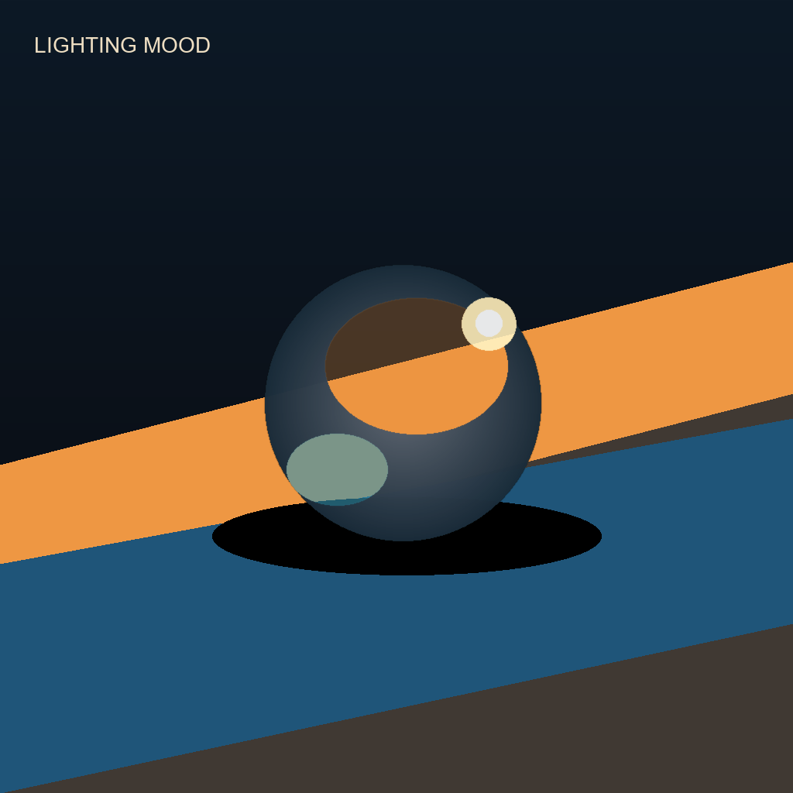
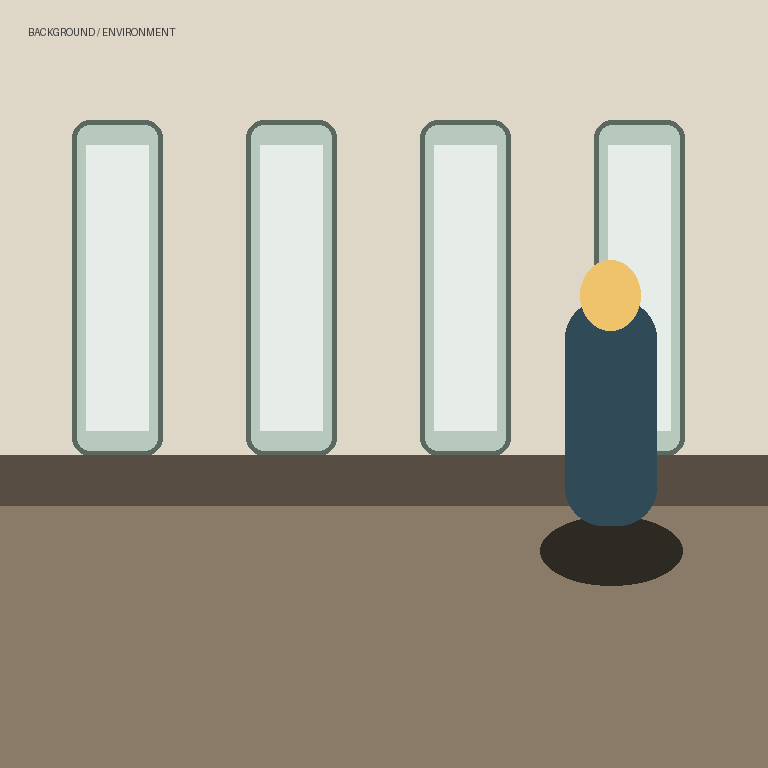
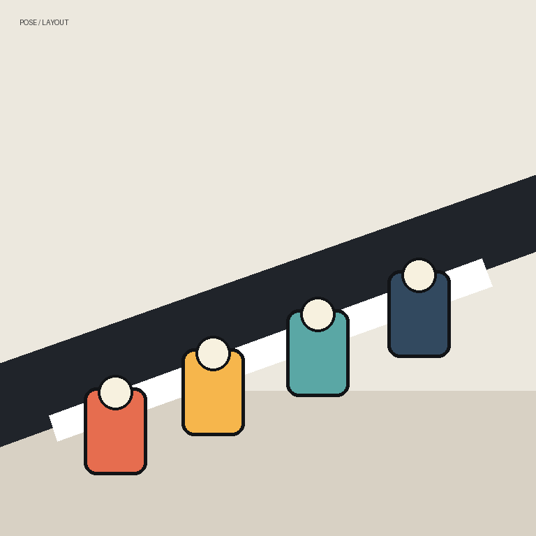
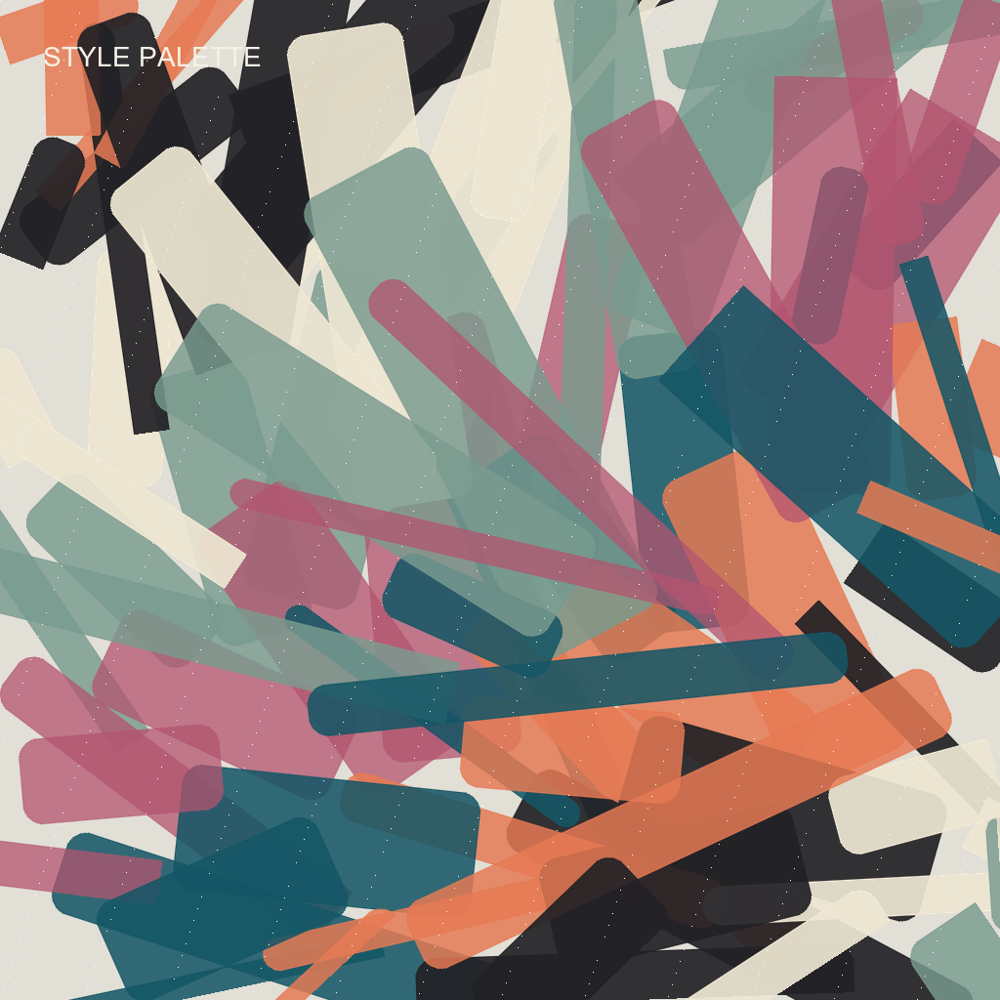

# Krea Reference V10 User Guide

Krea Reference lets every source image have a clear job before it reaches Krea.
V10 keeps everything from V9 and adds four more jobs, a direction (a card can
now be a counter-example), per-card timing, an auto-balance for hot stacks, a
study cache for fast tuning, and two feedback outputs that show you what the
stack actually did.

If you are new to Krea Reference, read the [V9 guide](krea-v9-user-guide.md)
first for the core mental model; this guide focuses on what V10 adds. Demo
renders for the V10 recipes (matching the V9 demo gallery) land with the V10
release; the bundled synthetic source images below ship today.


## Contents

- [Fast Start](#fast-start)
- [What V10 Adds](#what-v10-adds)
- [New Quick Recipes](#new-quick-recipes)
- [Guide Direction: Counter-Examples](#guide-direction-counter-examples)
- [Per-Card Timing](#per-card-timing)
- [Manual Layer Dials](#manual-layer-dials)
- [Balance Strong Cards](#balance-strong-cards)
- [Reuse Image Studies](#reuse-image-studies)
- [Reading The Stack Report](#reading-the-stack-report)
- [The Prepared-References Preview](#the-prepared-references-preview)
- [Multi-Reference Recipes](#multi-reference-recipes)
- [Troubleshooting](#troubleshooting)

## Fast Start

Use one guide card per image, exactly as in V9:

```text
Load Image -> KG Krea 2 Image Guide Card V10 -> KG Krea 2 Reference Stack Encoder V10 -> KSampler positive input
```

Then wire the two new stack outputs:

```text
Reference Stack Encoder V10 (stack_report) -> Preview Any
Reference Stack Encoder V10 (prepared_references) -> Preview Image
```

Try the bundled examples first:

| File | Purpose |
| --- | --- |
| [krea-v10-full-showcase-workflow.json](../example_workflows/krea-v10-full-showcase-workflow.json) | Best first run. Six cards including the new palette, environment, and framing recipes, per-card timing, gentle balance, and both feedback outputs. |
| [krea-v10-counter-example-workflow.json](../example_workflows/krea-v10-counter-example-workflow.json) | The new `away from this image` direction: keep the subject, push a style out. |
| [krea-v10-reference-stack-workflow.json](../example_workflows/krea-v10-reference-stack-workflow.json) | Compact starter graph for building your own V10 stack. |

Copy [example_assets/krea-reference-examples](../example_assets/krea-reference-examples/)
into your ComfyUI `input/` folder so the bundled workflows can find their
example images.

V9 and V10 cross-connect: a V9 card plugs into the V10 stack (the V10 controls
use their defaults) and a V10 card plugs into a V9 stack (which ignores the
V10 controls). Saved V9 workflows keep working unchanged.

## What V10 Adds

| Control | Where | What it does |
| --- | --- | --- |
| `suggest the color palette` | card | Palette-only quick recipe (was manual-only in V9). |
| `use the background/setting` | card | Environment quick recipe (was manual-only in V9). |
| `copy the camera framing` | card | Framing-only quick recipe (was manual-only in V9). |
| `mood board only` | card | Loose-inspiration quick recipe (was manual-only in V9). |
| `Guide direction` | card | `toward this image` (V9 behavior) or `away from this image` (counter-example). |
| `When this card guides` | card | Per-card timing: recipe decides, whole image, early layout only, or final details only. |
| `Structure layers pull` / `Finish layers pull` | card | Manual-mode dials over the structure-vs-finish conditioning layers. |
| `Balance strong cards` | stack | Budgets the total pull of hot stacks so cards degrade gracefully instead of fighting. |
| `Reuse image studies` | stack | Content-keyed cache; strength/timing tweaks re-run with zero encoder passes. |
| `stack_report` | stack output | Plain-language account of what every card requested, got, and why. |
| `prepared_references` | stack output | Contact sheet of exactly what the vision encoder studied. |

The text/logo guard's full-guard prompt rewriter also understands common
marking words in Spanish, French, German, Portuguese, and Italian.

## New Quick Recipes

The four V10 recipes cover the jobs that previously required `manual tuning`.

### Suggest The Color Palette

| Setting | Value |
| --- | --- |
| Recipe | `suggest the color palette` |
| Source example |  |
| Start near | `0.30` to `0.45` |
| Best for | Borrowing broad color palette, contrast, and tonal relationships with nothing else. |

The image is reduced to a palette wash at low study resolution, so almost
nothing but color relationships survives. Check the prepared-references
preview: seeing how little remains is the point.

### Use The Background/Setting

| Setting | Value |
| --- | --- |
| Recipe | `use the background/setting` |
| Source example |  |
| Start near | `0.25` to `0.40` |
| Best for | Location type, scene context, and spatial atmosphere without replacing the main subject. |

### Copy The Camera Framing

| Setting | Value |
| --- | --- |
| Recipe | `copy the camera framing` |
| Source example |  |
| Start near | `0.20` to `0.35` |
| Best for | Camera distance, crop, lens feel, and viewpoint only - grayscale, structure-heavy early, quiet late. |

This recipe preserves the reference's aspect ratio while studying it, because
the frame *is* the information. It pairs well with `When this card guides` set
to `early layout only`.

### Mood Board Only

| Setting | Value |
| --- | --- |
| Recipe | `mood board only` |
| Source example |  |
| Start near | `0.15` to `0.30` (capped at `0.6`) |
| Best for | Loose inspiration that should whisper, never dictate. |

## Guide Direction: Counter-Examples

`Guide direction` is the biggest new idea in V10. Every card still gets a job;
now it also gets a direction:

- `toward this image` - exact V9 behavior: the reference pulls the result
  toward its look.
- `away from this image` - the card becomes a **counter-example**: the stack
  isolates what this image contributes and re-adds it negatively, steering the
  result away from whatever aspect the card's job selects.

The job picks *what* to repel:

| Combination | Meaning |
| --- | --- |
| `away` + `suggest the visual style` | Not this style. |
| `away` + `suggest the color palette` | Not this palette. |
| `away` + `copy pose and layout` | Not this composition. |
| `away` + `keep the same subject` | Keep this subject out entirely. |

Rules of thumb:

- Start low: `0.10` to `0.30`. Repulsion gets strange faster than attraction.
- Always pair an away card with a written prompt or a toward card that says
  what you *do* want; pure repulsion with no positive signal wanders.
- A counter-example card always avoids subject copying, whatever
  `Subject copying` says.
- The stack report marks away cards and prints their negative targets.

Load [krea-v10-counter-example-workflow.json](../example_workflows/krea-v10-counter-example-workflow.json)
to see a working toward + away pair.

## Per-Card Timing

V9 timing was a stack-level choice plus recipe-baked early/late behavior. V10
adds `When this card guides` on every card:

| Choice | Behavior |
| --- | --- |
| `recipe decides` | Keep the recipe or manual early/late behavior (V9 default). |
| `whole image` | Guide both phases at full card strength. |
| `early layout only` | Keep the card's early behavior; remove its influence in the final phase. |
| `final details only` | Remove the card's influence early; keep its late behavior. |

Typical uses: a framing or layout card set to `early layout only` composes the
image and then gets out of the way; a material card set to
`final details only` touches only the finish. The text/logo guard still clamps
last - a guarded card never regains late-phase influence.

## Manual Layer Dials

In `manual tuning` mode only, two new dials scale the per-layer conditioning
gains in plain language:

- `Structure layers pull` - the early conditioning bands that carry layout and
  subject structure.
- `Finish layers pull` - the late bands that carry palette, texture, and
  rendering finish.

Lower structure and raise finish for a style card that keeps dragging the
subject along; do the opposite for a layout card that keeps recoloring things.
Quick recipes ignore both dials (their tables are already tuned), and the web
extension greys them out outside manual mode.

## Balance Strong Cards

Several simultaneously strong cards blend less faithfully than the same cards
used separately - they fight. `Balance strong cards` puts a budget on the
stack's total pull per timing phase and softly scales every card down when the
stack exceeds it:

| Choice | Budget | Use when |
| --- | --- | --- |
| `off - use my values` | none | Exact V9 behavior. The default. |
| `gentle balance` | `2.5` | Four or more active cards, or two or three aggressive ones. Rarely intervenes otherwise. |
| `strict balance` | `1.5` | Conservative blends where fidelity beats punch. |

The written prompt is never balanced - only image cards are scaled - and the
stack report states the applied scale whenever balancing intervenes.

## Reuse Image Studies

The expensive part of every run is the encoder passes that study each image in
context. Those studies depend only on the prompt and the prepared images -
never on strengths, direction, timing, or balance. `Reuse image studies`
caches them:

- `reuse between runs - faster tuning` (default): re-runs that change only
  strengths, direction, timing, handoff, or balance reuse every study and skip
  all encoder passes. The report's `Studies:` line shows exactly what was
  reused.
- `always re-study`: exact V9 behavior; every run pays full encode cost.

The cache keys on image and prompt *content*, so editing an image or the
prompt re-studies automatically - stale reuse cannot happen. The one caveat:
reuse assumes the connected CLIP is unchanged between runs. Pick
`always re-study` while hot-swapping CLIP patches or LoRA hooks.

The tuning ritual this enables: queue once, read the report, then tweak one
strength at a time and re-queue - each re-run is nearly free.

## Reading The Stack Report

Wire `stack_report` into a `Preview Any` node. A typical report:

```text
KG Krea 2 Reference Stack Encoder V10 - stack report
Prompt: "a ceramic travel mug on a wooden desk in a bright studio" at strength 1.15.
Timing: smart per-card timing. with early-to-final handoff at 0.40.
Balance: gentle balance - cards were within budget, nothing scaled.
Studies: 7 encoder passes this run; studies cached for faster strength tuning.

Card 1 (keep the same subject): requested 0.80 -> guiding at 0.70 after the slider feel curve. Targets: early shape 0.70x / look 0.70x, final shape 0.70x / look 0.70x.
Card 6 (avoid copying text/logos): requested 0.03 -> capped at 0.03 by the text/logo guard. ...
```

What to look for:

| Line | Tells you |
| --- | --- |
| `requested X -> guiding at Y` | The slider feel curve's effect. If a card feels dead at `0.05`, this line shows why. |
| `capped at X by ...` | A recipe cap or the text/logo guard clamped the card. Raising the slider further does nothing. |
| `Balance: ... scaled strong cards to X` | The stack intervened; your relative card ratios were kept, total pull was reduced. |
| `Studies: N encoder passes ... reused M` | The run's real cost and what the cache saved. |
| `Skipped without cost: ...` | Cards that contributed nothing (no image, or strength 0) and why. |

## The Prepared-References Preview

Wire `prepared_references` into a `Preview Image` node. It shows one frame per
active card: exactly what the vision encoder studied after framing, washes,
color reduction, and detail reduction.

This makes the invisible visible. If a style card's frame still shows a
recognizable subject, the subject can leak - lower `Small details kept`, pick
a stronger `Prepare image by` treatment, or reduce the study resolution. If a
palette card's frame is nothing but soft color blocks, it is doing its job.

## Multi-Reference Recipes

| Scenario | Setup |
| --- | --- |
| Product in a place | `keep the same subject` for the product, `use the background/setting` for the location, `suggest the color palette` for grade. Turn on `gentle balance`. |
| Composed shot, free contents | `copy the camera framing` at `early layout only`, then style/material cards for the finish. |
| "Anything but that" | Normal toward cards for what you want, plus one `away` card holding the look to avoid at `0.15` to `0.25`. |
| Fast strength search | Any stack with `reuse between runs`; queue, read the report, tweak one card, repeat. |

Typical V10 six-card stack (the full showcase):

```text
Reference 1: keep the same subject, 0.80
Reference 2: suggest the visual style, 0.55
Reference 3: use the background/setting, 0.35
Reference 4: suggest the color palette, 0.40
Reference 5: copy the camera framing, 0.30, early layout only
Reference 6: avoid copying text/logos, 0.03
Stack: gentle balance, reuse between runs
```

## Troubleshooting

| Problem | What to try |
| --- | --- |
| A card seems to do nothing. | Read the stack report: the feel curve, a recipe cap, or the guard is usually named on that card's line. |
| Away card makes the image muddy or empty. | Lower its strength below `0.30`, and make sure something positive (prompt or toward card) says what you *do* want. |
| Many cards fight each other. | Turn on `gentle balance`, or lower the two strongest cards. The report shows the applied scale. |
| Style card drags its subject in. | Check the prepared-references preview; if the subject is visible there, lower detail or strengthen the treatment. In manual mode, lower `Structure layers pull`. |
| Re-runs are slow while tuning. | Set `Reuse image studies` to `reuse between runs` and keep the prompt fixed while you tune strengths. |
| Behaves oddly after swapping CLIP patches. | Use `always re-study` while experimenting with CLIP-side changes. |

## Companion Files

- [V10 documentation index](krea-v10-documentation-index.md)
- [V10 visual HTML guide](krea-v10-user-guide.html)
- [V10 technical companion paper](krea-v10-technical-paper.md)
- [Guide Card V10 node docs](nodes/kg-krea-2-image-guide-card-v10.md)
- [Reference Stack V10 node docs](nodes/kg-krea-2-reference-stack-encoder-v10.md)
- [V9 user guide](krea-v9-user-guide.md)
- [Example workflows](../example_workflows/README.md)
