# Krea Reference V10 User Guide

Krea Reference lets every source image have a clear job before it reaches Krea.
V10 keeps everything from V9 and adds four more jobs, a direction (a card can
now be a counter-example), per-card timing, an auto-balance for hot stacks, a
study cache for fast tuning, and two feedback outputs that show you what the
stack actually did.

If you are new to Krea Reference, read the [V9 guide](krea-v9-user-guide.md)
first for the core mental model; this guide focuses on what V10 adds. Every
demo below is a complete journey - input images, recipe and settings, the
exact prompt, and the result - and every result PNG has the matching V10
workflow embedded, so you can drag it into ComfyUI and inspect the setup.

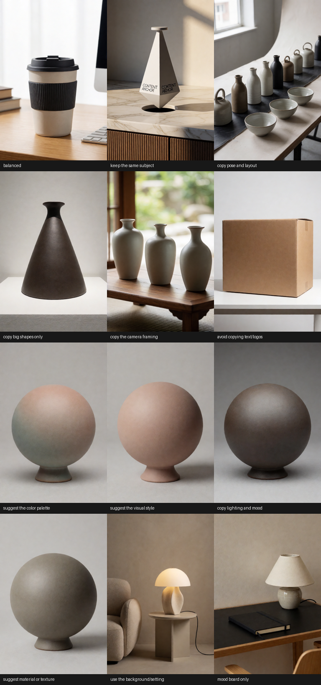

The synthetic source images used throughout ship with the repo:


## Contents

- [Fast Start](#fast-start)
- [What V10 Adds](#what-v10-adds)
- [How The Demos Were Made](#how-the-demos-were-made)
- [New Quick Recipes](#new-quick-recipes)
- [Create Your Own Recipes](#create-your-own-recipes)
- [Guide Direction: Counter-Examples](#guide-direction-counter-examples)
- [Per-Card Timing](#per-card-timing)
- [Manual Layer Dials](#manual-layer-dials)
- [Balance Strong Cards](#balance-strong-cards)
- [Reuse Image Studies](#reuse-image-studies)
- [Reading The Stack Report](#reading-the-stack-report)
- [The Prepared-References Preview](#the-prepared-references-preview)
- [Multi-Reference Recipes](#multi-reference-recipes)
- [Embedded Demo Workflows](#embedded-demo-workflows)
- [Troubleshooting](#troubleshooting)

## Fast Start

Use one guide card per image, exactly as in V9:

```text
Load Image -> KG Krea 2 Image Guide Card V10 -> KG Krea 2 Reference Stack Encoder V10 -> KSampler positive input
```

Then wire the two new stack outputs:

```text
Reference Stack Encoder V10 (stack_report) -> Preview Any
Reference Stack Encoder V10 (prepared_references) -> Preview Image
```

Try the bundled examples first:

| File | Purpose |
| --- | --- |
| [krea-v10-full-showcase-workflow.json](../example_workflows/krea-v10-full-showcase-workflow.json) | Best first run. Six cards including the new palette, environment, and framing recipes, per-card timing, gentle balance, and both feedback outputs. |
| [krea-v10-counter-example-workflow.json](../example_workflows/krea-v10-counter-example-workflow.json) | The new `away from this image` direction: keep the subject, push a style out. |
| [krea-v10-reference-stack-workflow.json](../example_workflows/krea-v10-reference-stack-workflow.json) | Compact starter graph for building your own V10 stack. |

Copy [example_assets/krea-reference-examples](../example_assets/krea-reference-examples/)
into your ComfyUI `input/` folder so the bundled workflows can find their
example images.

V9 and V10 cross-connect: a V9 card plugs into the V10 stack (the V10 controls
use their defaults) and a V10 card plugs into a V9 stack (which ignores the
V10 controls). Saved V9 workflows keep working unchanged.

## What V10 Adds

| Control | Where | What it does |
| --- | --- | --- |
| `suggest the color palette` | card | Palette-only quick recipe (was manual-only in V9). |
| `use the background/setting` | card | Environment quick recipe (was manual-only in V9). |
| `copy the camera framing` | card | Framing-only quick recipe (was manual-only in V9). |
| `mood board only` | card | Loose-inspiration quick recipe (was manual-only in V9). |
| Custom recipes | card | Your own YAML/JSON recipe files appear in `Use image for` as first-class choices. |
| `Guide direction` | card | `toward this image` (V9 behavior) or `away from this image` (counter-example). |
| `When this card guides` | card | Per-card timing: recipe decides, whole image, early layout only, or final details only. |
| `Structure layers pull` / `Finish layers pull` | card | Manual-mode dials over the structure-vs-finish conditioning layers. |
| `Balance strong cards` | stack | Budgets the total pull of hot stacks so cards degrade gracefully instead of fighting. |
| `Reuse image studies` | stack | Content-keyed cache; strength/timing tweaks re-run with zero encoder passes. |
| `stack_report` | stack output | Plain-language account of what every card requested, got, and why. |
| `prepared_references` | stack output | Contact sheet of exactly what the vision encoder studied. |

The text/logo guard's full-guard prompt rewriter also understands common
marking words in Spanish, French, German, Portuguese, and Italian.

## How The Demos Were Made

Every journey in this guide shares the same house setup, so the settings
tables list only what changes per demo:

| House setting | Value |
| --- | --- |
| Model / CLIP / VAE | `krea2_turbo_nvfp4` / `qwen3vl_4b_fp8_scaled` / `qwen_image_vae` |
| Sampler | 8 steps, cfg `1.0`, `euler` / `simple`, AuraFlow shift `3.14`, 512x768, fixed seed per demo |
| Stack | `artist friendly` feel, `medium (384)` detail, `keep full image shape`, `smart per-card timing`, handoff `0.40`, written prompt strength `1.25` |
| Negative prompt | `boring, dull, blurry, low-quality, fake letters, readable text, logo, watermark, oversaturated colours` |

Drag any result PNG into ComfyUI to load its embedded V10 workflow, or open
the `.workflow.json` beside it in [assets/krea-v10/demos](assets/krea-v10/demos/).

## New Quick Recipes

The four V10 recipes cover the jobs that previously required `manual tuning`.
Each journey below shows the input, the card settings, the exact prompt, and
the result.

### Suggest The Color Palette

| Input | Result |
| --- | --- |
|  | 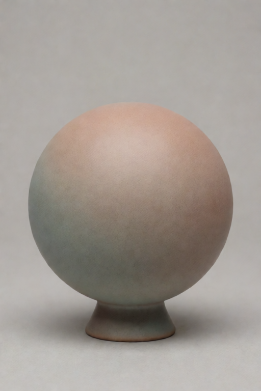 |

| Setting | Value |
| --- | --- |
| Recipe | `suggest the color palette` |
| Strength | `0.85` (demo; start near `0.30` to `0.45` in multi-card stacks) |
| Seed | `972101` |
| Prompt | `a matte ceramic sphere on a small plinth, neutral gray studio backdrop, soft even light, clean unmarked design, no readable text` |
| Demo files | [result PNG](assets/krea-v10/demos/suggest-color-palette.png), [workflow JSON](assets/krea-v10/demos/suggest-color-palette.workflow.json) |

Palette-only is deliberately the gentlest recipe. Compare the pair below -
same prompt, same seed, the only change is the card: the neutral gray canvas
warms toward the source's cream-coral cast while the abstract source shapes
stay out entirely. The image is reduced to a palette wash at low study
resolution before the encoder sees it, so color relationships are all that
*can* arrive.

| Prompt only (no cards) | With the palette card |
| --- | --- |
| 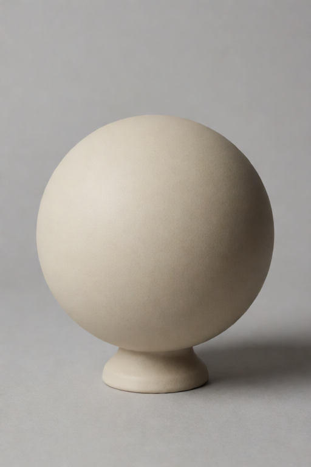 |  |

### Use The Background/Setting

| Input | Result |
| --- | --- |
|  | 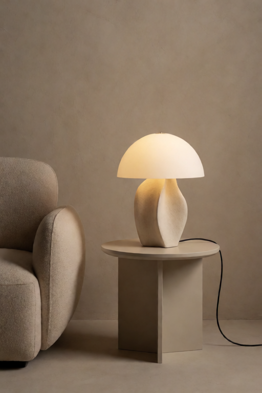 |

| Setting | Value |
| --- | --- |
| Recipe | `use the background/setting` |
| Strength | `0.35` |
| Seed | `972102` |
| Prompt | `a sculptural table lamp on a small side table, editorial product photo, cohesive interior scene, no readable text` |
| Demo files | [result PNG](assets/krea-v10/demos/use-background-setting.png), [workflow JSON](assets/krea-v10/demos/use-background-setting.workflow.json) |

The environment recipe brings location, spatial atmosphere, and context -
the interior, side table, and room light arrive from the reference while the
prompt keeps ownership of the lamp.

### Copy The Camera Framing

| Input | Result |
| --- | --- |
|  | 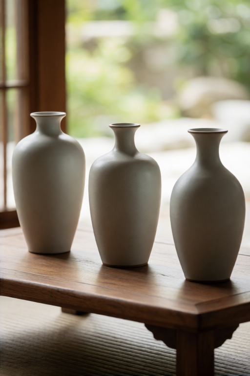 |

| Setting | Value |
| --- | --- |
| Recipe | `copy the camera framing` |
| Strength | `0.30` |
| Seed | `972103` |
| Prompt | `three ceramic vases in a row on a low wooden table, plain unmarked surfaces, soft daylight, refined product photography, no readable text` |
| Demo files | [result PNG](assets/krea-v10/demos/copy-camera-framing.png), [workflow JSON](assets/krea-v10/demos/copy-camera-framing.workflow.json) |

Framing borrows camera distance, crop, and viewpoint only - the diagonal
row arrangement echoes the reference while subject, palette, and surface
come from the prompt. The recipe studies the reference in grayscale at its
own aspect ratio, because the frame *is* the information. It pairs well with
`When this card guides` set to `early layout only`.

### Mood Board Only

| Input | Result |
| --- | --- |
|  | 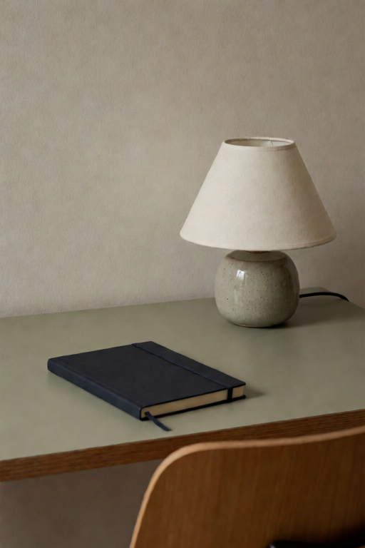 |

| Setting | Value |
| --- | --- |
| Recipe | `mood board only` |
| Strength | `0.25` (hard cap `0.6`) |
| Seed | `972104` |
| Prompt | `a calm desk scene with a small ceramic lamp and a closed notebook, editorial photo, no readable text` |
| Demo files | [result PNG](assets/krea-v10/demos/mood-board-only.png), [workflow JSON](assets/krea-v10/demos/mood-board-only.workflow.json) |

Mood board whispers: loose inspiration under a hard cap, suggesting a
feeling without dictating content.

## Create Your Own Recipes

The built-in recipes are settings bundles - and in V10 you can write your
own. A custom recipe is a small YAML or JSON file; every file that passes
validation appears in `Use image for` as a first-class choice,
indistinguishable from a built-in.

### Where recipe files go

| Location | Notes |
| --- | --- |
| `custom_recipes/` inside this node pack | Ships with a README and a template. Easiest to find. |
| `<ComfyUI user dir>/krea_reference/recipes/` | Survives reinstalling or updating the node pack. Create the folder if it does not exist. |

Files named with a leading `_` or `.` are ignored - that is how the bundled
template ([_example-vintage-postcard.yaml](../custom_recipes/_example-vintage-postcard.yaml))
ships without adding itself to your dropdown.

### Your first recipe, in three steps

1. Create `custom_recipes/soft-palette-hint.yaml` containing:

   ```yaml
   label: soft palette hint
   role: palette
   cap: 0.5
   ```

2. In ComfyUI, refresh node definitions (or restart).
3. Open a V10 guide card: `soft palette hint` is now in `Use image for`.

Only `label` (the dropdown text) and `role` (which built-in behavior family
to start from) are required. Every omitted field defaults from the role's
tuning tables, so a two-line recipe is already well-behaved.

### The full schema

A file holds one recipe, or a pack: `{"recipes": [recipe, recipe, ...]}`.

| Field | Required | Values | Default |
| --- | --- | --- | --- |
| `label` | yes | The dropdown text. Must not collide with a built-in choice or another custom label. | - |
| `role` | yes | `balanced`, `style`, `palette`, `composition`, `framing`, `identity`, `environment`, `lighting`, `material`, `loose`, `shape only`, `text/logo safe` | - |
| `description` | no | Free text for humans reading the file. | `""` |
| `treatment` | no | `normal`, `grayscale`, `soft blur`, `strong blur`, `palette wash`, `color wash`, `grayscale blur`, `shape wash` | `normal` |
| `color` | no | `0.0`-`1.0`: how much color survives preparation. | `1.0` |
| `detail` | no | `0.0`-`1.0`: how much fine detail survives. | `1.0` |
| `study` | no | `stack`, `256`, `384`, `512`, `768` | `stack` |
| `framing` | no | `stack`, `preserve aspect`, `center crop square`, `stretch square` | `stack` |
| `subject` | no | `recipe`, `avoid`, `allow`, `preserve` | `recipe` |
| `early`, `late` | no | `0.0`-`5.0`: phase multipliers for two-phase timing. | `1.0` |
| `guard` | no | `true` applies the full text/logo blank-surface clamp to this card. | `false` |
| `cap` | no | `0.0`-`3.0`: hard ceiling on effective strength. Omit for no cap. | none |
| `shape` | no | `0.0`-`3.0`: spatial/structure pull. | role default |
| `global` | no | `0.0`-`4.0`: overall look/style pull. | role default |
| `layers` | no | Exactly 12 numbers (`0.0`-`8.0`): per-layer conditioning gains. | role table |

A complete example (the shipped template):

```yaml
label: vintage postcard style
description: Warm faded palette and a soft print finish, without copying the source subject.
role: style
treatment: palette wash
color: 0.9
detail: 0.05
study: "384"
framing: stack
subject: avoid
early: 0.85
late: 0.9
guard: false
cap: 0.85
shape: 0.3
global: 1.7
layers: [0.25, 0.35, 0.45, 0.6, 0.8, 1.0, 1.0, 2.5, 5.0, 1.1, 4.0, 1.2]
```

The same recipe as JSON is the same mapping with JSON syntax - both formats
are equivalent.

### Deriving the `layers` array

`layers` is the only field without an obvious hand-set value. The 12
positions are Krea 2's deepstack conditioning bands, mapped by the V9
empirical sweeps: positions `0`-`4` carry layout and subject structure,
`5`-`6` are a neutral transition, and the finish/palette response
concentrates at `8` (strongest), `10`, then `7`, with `9` and `11` mild.

Omit `layers` to use your role's tuned table - the right default. To derive
your own: start from the closest family table, scale the front half (`0`-`5`)
by how much structure should arrive, scale the back half (`6`-`11`) by how
strongly the finish should arrive, and keep the spike ordering
(`8` > `10` > `7`). Each entry lands as
`clamp(effective strength x shape x gain, -6, +6)` on the token channel, so
gains trade off against your `shape` value - and the `global` field carries
the overall look independently of all twelve numbers.

The family tables, the full chunk map, the math, a copy-paste derivation
snippet (the same scaling the card's manual Structure/Finish dials apply),
and a worked example live in
[custom_recipes/README.md](../custom_recipes/README.md#deriving-the-layers-array).
The full determination of what each of the 12 bands carries - verified from
code, established by convergent evidence, and with a turnkey measurement kit -
is documented in [docs/deepstack-layers/](deepstack-layers/README.md).

### How validation behaves

- **Strict about keys.** An unknown key (say, `colour`) rejects the recipe
  with a named error, so typos cannot silently become no-ops.
- **Forgiving about omissions.** Everything except `label` and `role` has a
  sensible role-derived default.
- **The node always loads.** Invalid recipes are skipped with a warning in
  the ComfyUI log naming the file and the reason; your other recipes and the
  built-ins are unaffected.
- **First definition wins.** Files scan in sorted name order; a duplicate
  label in a later file is skipped with a collision warning.

Custom recipes compose with every other V10 control: `Guide direction`,
`When this card guides`, and the strength slider all apply on top, the stack
report names your recipe on its card line, and a `guard: true` recipe is
clamped exactly like the built-in text/logo guard.

### Recipe design tips

- Start from the closest built-in: copy its values from the
  [technical paper's recipe tables](krea-v9-technical-paper.md) or the
  shipped template, then move one number at a time.
- `role` does more than defaults: it selects the instruction language the
  encoder writes for the card and the per-layer gain table.
- Keep `subject: avoid` on style-family recipes unless you specifically want
  the source subject to survive.
- Give whisper-jobs a `cap` so a slider bump cannot blow past their intent.
- Test with the prepared-references preview: if the treated frame still
  shows what you meant to strip, strengthen `treatment` or lower `detail`.

### Sharing recipes and saved workflows

Saved workflows reference custom recipes **by label**. If you share a
workflow that uses one, ship the recipe file with it; without the file the
card falls back to `balanced` with a logged warning. Renaming a label
orphans existing workflows the same way - prefer adding a new recipe over
renaming an old one.

## Guide Direction: Counter-Examples

`Guide direction` is the biggest new idea in V10. Every card still gets a job;
now it also gets a direction:

- `toward this image` - exact V9 behavior: the reference pulls the result
  toward its look.
- `away from this image` - the card becomes a **counter-example**: the stack
  isolates what this image contributes and re-adds it negatively, steering the
  result away from whatever aspect the card's job selects.

The job picks *what* to repel:

| Combination | Meaning |
| --- | --- |
| `away` + `suggest the visual style` | Not this style. |
| `away` + `suggest the color palette` | Not this palette. |
| `away` + `copy pose and layout` | Not this composition. |
| `away` + `keep the same subject` | Keep this subject out entirely. |

### The direction journey

The pair below shows exactly what an away card negates. Same prompt, same
seed (`972106`); the only change is connecting the style card pulled
`toward this image` at `0.65`:

| Step 1: prompt only | Step 2: style pulled toward |
| --- | --- |
| 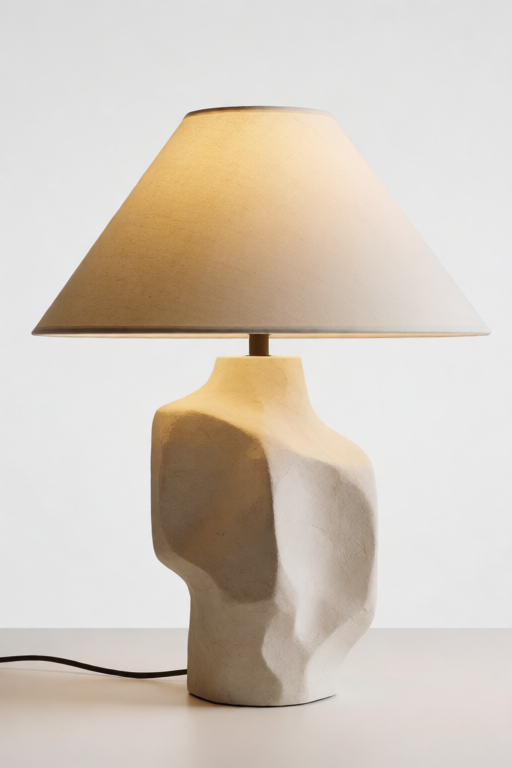 | 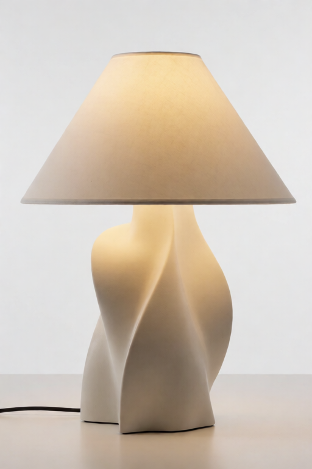 |

| Setting | Value |
| --- | --- |
| Style source |  |
| Prompt (both steps) | `a sculptural table lamp in a clean studio product photo, no readable text` |
| Step 2 card | `suggest the visual style`, `toward this image`, strength `0.65` |
| Demo files | [step 1 PNG](assets/krea-v10/demos/counter-example-baseline.png), [step 2 PNG](assets/krea-v10/demos/counter-example-toward.png) + `.workflow.json` beside each |

The style source's organic, abstract form language arrives in step 2 - and
that contribution is precisely what the same card set to
`away from this image` pushes out of the result. Away also pushes harder per
slider unit than toward, because it extrapolates past removal - which is why
the rules below say start low. Step 3 (the away render, same seed) requires
the V10 nodes on the render machine and lands with it; run
[krea-v10-counter-example-workflow.json](../example_workflows/krea-v10-counter-example-workflow.json)
to produce it yourself today.

Rules of thumb:

- Start low: `0.10` to `0.30`. Repulsion gets strange faster than attraction.
- Always pair an away card with a written prompt or a toward card that says
  what you *do* want; pure repulsion with no positive signal wanders.
- A counter-example card always avoids subject copying, whatever
  `Subject copying` says.
- The stack report marks away cards and prints their negative targets.

## Per-Card Timing

V9 timing was a stack-level choice plus recipe-baked early/late behavior. V10
adds `When this card guides` on every card:

| Choice | Behavior |
| --- | --- |
| `recipe decides` | Keep the recipe or manual early/late behavior (V9 default). |
| `whole image` | Guide both phases at full card strength. |
| `early layout only` | Keep the card's early behavior; remove its influence in the final phase. |
| `final details only` | Remove the card's influence early; keep its late behavior. |

Typical uses: a framing or layout card set to `early layout only` composes the
image and then gets out of the way; a material card set to
`final details only` touches only the finish. The text/logo guard still clamps
last - a guarded card never regains late-phase influence.

### The timing journey

Same style card, same seed (`972105`), same prompt - the only change is
`When this card guides`:

| `early layout only` | `final details only` |
| --- | --- |
| 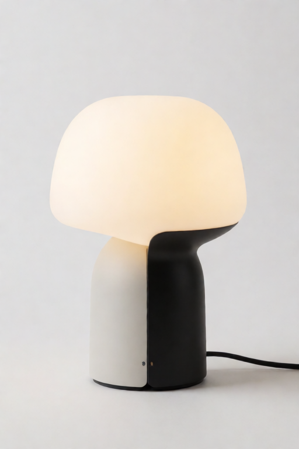 | 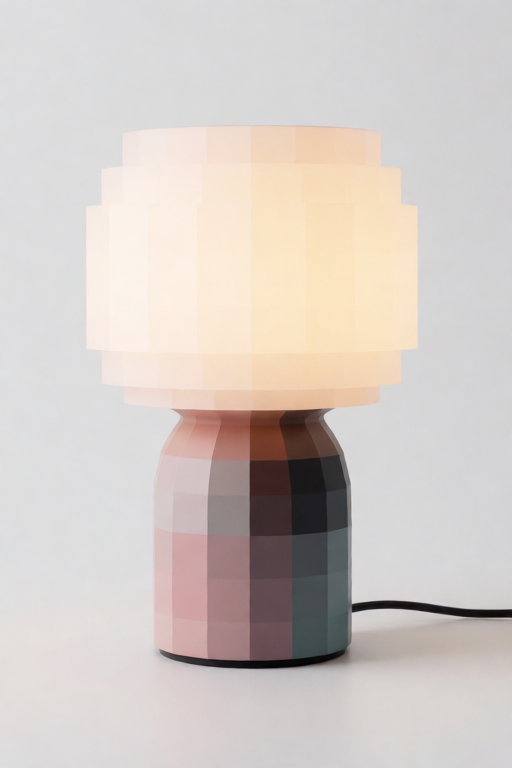 |

| Setting | Value |
| --- | --- |
| Style source |  |
| Card | `suggest the visual style`, strength `0.75` |
| Prompt (both) | `a modern table lamp in a clean studio product photo, no readable text` |
| Demo files | [early-only PNG](assets/krea-v10/demos/timing-style-early-only.png), [final-only PNG](assets/krea-v10/demos/timing-style-final-only.png) + `.workflow.json` beside each |

Early-only lets the style shape the composition - the graphite two-tone
structure echoes the source - then hands the finish back to the prompt.
Final-only is the mirror image: the prompt owns the layout and the style
arrives only in the surface, bringing the source's coral into the frame and
base. One widget, two very different pictures.

## Manual Layer Dials

In `manual tuning` mode only, two new dials scale the per-layer conditioning
gains in plain language:

- `Structure layers pull` - the early conditioning bands that carry layout and
  subject structure.
- `Finish layers pull` - the late bands that carry palette, texture, and
  rendering finish.

Lower structure and raise finish for a style card that keeps dragging the
subject along; do the opposite for a layout card that keeps recoloring things.
Quick recipes ignore both dials (their tables are already tuned), and the web
extension greys them out outside manual mode.

## Balance Strong Cards

Several simultaneously strong cards blend less faithfully than the same cards
used separately - they fight. `Balance strong cards` puts a budget on the
stack's total pull per timing phase and softly scales every card down when the
stack exceeds it:

| Choice | Budget | Use when |
| --- | --- | --- |
| `off - use my values` | none | Exact V9 behavior. The default. |
| `gentle balance` | `2.5` | Four or more active cards, or two or three aggressive ones. Rarely intervenes otherwise. |
| `strict balance` | `1.5` | Conservative blends where fidelity beats punch. |

The written prompt is never balanced - only image cards are scaled - and the
stack report states the applied scale whenever balancing intervenes.

## Reuse Image Studies

The expensive part of every run is the encoder passes that study each image in
context. Those studies depend only on the prompt and the prepared images -
never on strengths, direction, timing, or balance. `Reuse image studies`
caches them:

- `reuse between runs - faster tuning` (default): re-runs that change only
  strengths, direction, timing, handoff, or balance reuse every study and skip
  all encoder passes. The report's `Studies:` line shows exactly what was
  reused.
- `always re-study`: exact V9 behavior; every run pays full encode cost.

The cache keys on image and prompt *content*, so editing an image or the
prompt re-studies automatically - stale reuse cannot happen. The one caveat:
reuse assumes the connected CLIP is unchanged between runs. Pick
`always re-study` while hot-swapping CLIP patches or LoRA hooks.

The tuning ritual this enables: queue once, read the report, then tweak one
strength at a time and re-queue - each re-run is nearly free.

## Reading The Stack Report

Wire `stack_report` into a `Preview Any` node. A typical report:

```text
KG Krea 2 Reference Stack Encoder V10 - stack report
Prompt: "a ceramic travel mug on a wooden desk in a bright studio" at strength 1.15.
Timing: smart per-card timing. with early-to-final handoff at 0.40.
Balance: gentle balance - cards were within budget, nothing scaled.
Studies: 7 encoder passes this run; studies cached for faster strength tuning.

Card 1 (keep the same subject): requested 0.80 -> guiding at 0.70 after the slider feel curve. Targets: early shape 0.70x / look 0.70x, final shape 0.70x / look 0.70x.
Card 6 (avoid copying text/logos): requested 0.03 -> capped at 0.03 by the text/logo guard. ...
```

What to look for:

| Line | Tells you |
| --- | --- |
| `requested X -> guiding at Y` | The slider feel curve's effect. If a card feels dead at `0.05`, this line shows why. |
| `capped at X by ...` | A recipe cap or the text/logo guard clamped the card. Raising the slider further does nothing. |
| `Balance: ... scaled strong cards to X` | The stack intervened; your relative card ratios were kept, total pull was reduced. |
| `Studies: N encoder passes ... reused M` | The run's real cost and what the cache saved. |
| `Skipped without cost: ...` | Cards that contributed nothing (no image, or strength 0) and why. |

## The Prepared-References Preview

Wire `prepared_references` into a `Preview Image` node. It shows one frame per
active card: exactly what the vision encoder studied after framing, washes,
color reduction, and detail reduction.

This makes the invisible visible. If a style card's frame still shows a
recognizable subject, the subject can leak - lower `Small details kept`, pick
a stronger `Prepare image by` treatment, or reduce the study resolution. If a
palette card's frame is nothing but soft color blocks, it is doing its job.

## Multi-Reference Recipes

| Scenario | Setup |
| --- | --- |
| Product in a place | `keep the same subject` for the product, `use the background/setting` for the location, `suggest the color palette` for grade. Turn on `gentle balance`. |
| Composed shot, free contents | `copy the camera framing` at `early layout only`, then style/material cards for the finish. |
| "Anything but that" | Normal toward cards for what you want, plus one `away` card holding the look to avoid at `0.15` to `0.25`. |
| Fast strength search | Any stack with `reuse between runs`; queue, read the report, tweak one card, repeat. |

### The full showcase journey

Six cards, one job each - rendered as a single journey:

| Setting | Value |
| --- | --- |
| Cards | `keep the same subject` `0.80` (slot1) - `suggest the visual style` `0.55` (slot2) - `use the background/setting` `0.35` (slot8) - `suggest the color palette` `0.40` (slot4) - `copy the camera framing` `0.30`, `early layout only` (slot6) - `avoid copying text/logos` `0.03` (slot5) |
| Prompt | `a ceramic travel mug on a wooden desk in a bright studio, no readable text` (strength `1.15`) |
| Seed | `972107` |
| Demo files | [result PNG](assets/krea-v10/demos/full-showcase.png), [workflow JSON](assets/krea-v10/demos/full-showcase.workflow.json) |

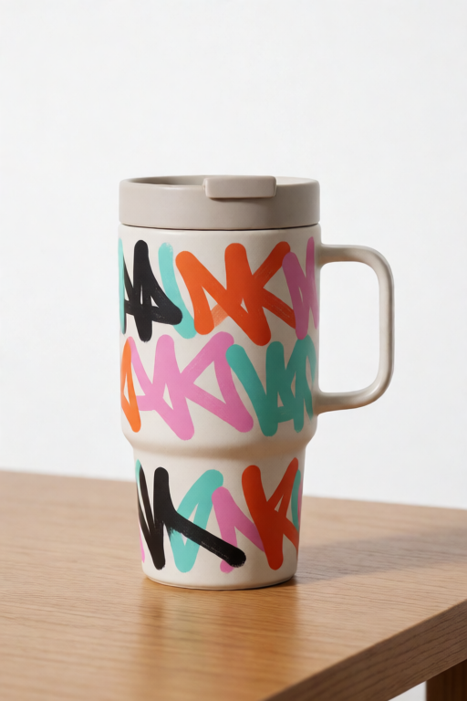

The mug is the prompt's, the desk and light read bright-studio, and the
row-of-objects framing echoes the pose reference before handing off - notice
even the second mug slipping in from the framing card's arrangement. This
render used `off - use my values` balance; the shipped
[showcase workflow](../example_workflows/krea-v10-full-showcase-workflow.json)
turns `gentle balance` on as its starting point:

```text
Reference 1: keep the same subject, 0.80
Reference 2: suggest the visual style, 0.55
Reference 3: use the background/setting, 0.35
Reference 4: suggest the color palette, 0.40
Reference 5: copy the camera framing, 0.30, early layout only
Reference 6: avoid copying text/logos, 0.03
Stack: gentle balance, reuse between runs
```

## Embedded Demo Workflows

Drag any demo PNG into ComfyUI to load its V10 workflow, or open the JSON
beside it. Full per-demo settings live in
[guide-demo-manifest.json](assets/krea-v10/demos/guide-demo-manifest.json).

| Journey | PNG | JSON |
| --- | --- | --- |
| Suggest the color palette | [suggest-color-palette.png](assets/krea-v10/demos/suggest-color-palette.png) | [workflow](assets/krea-v10/demos/suggest-color-palette.workflow.json) |
| Palette journey, prompt only | [suggest-color-palette-off.png](assets/krea-v10/demos/suggest-color-palette-off.png) | [workflow](assets/krea-v10/demos/suggest-color-palette-off.workflow.json) |
| Use the background/setting | [use-background-setting.png](assets/krea-v10/demos/use-background-setting.png) | [workflow](assets/krea-v10/demos/use-background-setting.workflow.json) |
| Copy the camera framing | [copy-camera-framing.png](assets/krea-v10/demos/copy-camera-framing.png) | [workflow](assets/krea-v10/demos/copy-camera-framing.workflow.json) |
| Mood board only | [mood-board-only.png](assets/krea-v10/demos/mood-board-only.png) | [workflow](assets/krea-v10/demos/mood-board-only.workflow.json) |
| Timing: early layout only | [timing-style-early-only.png](assets/krea-v10/demos/timing-style-early-only.png) | [workflow](assets/krea-v10/demos/timing-style-early-only.workflow.json) |
| Timing: final details only | [timing-style-final-only.png](assets/krea-v10/demos/timing-style-final-only.png) | [workflow](assets/krea-v10/demos/timing-style-final-only.workflow.json) |
| Direction journey: prompt only | [counter-example-baseline.png](assets/krea-v10/demos/counter-example-baseline.png) | [workflow](assets/krea-v10/demos/counter-example-baseline.workflow.json) |
| Direction journey: style toward | [counter-example-toward.png](assets/krea-v10/demos/counter-example-toward.png) | [workflow](assets/krea-v10/demos/counter-example-toward.workflow.json) |
| Full showcase | [full-showcase.png](assets/krea-v10/demos/full-showcase.png) | [workflow](assets/krea-v10/demos/full-showcase.workflow.json) |

Two renders intentionally wait for the V10 nodes to reach the render
machine: the away-direction result (step 3 of the direction journey) and a
balance on/off comparison. Both workflows already ship, so you can produce
them on your own V10 install today.

If a loaded demo reports missing images, copy
`example_assets/krea-reference-examples/` into your ComfyUI `input/` folder.

## Troubleshooting

| Problem | What to try |
| --- | --- |
| A card seems to do nothing. | Read the stack report: the feel curve, a recipe cap, or the guard is usually named on that card's line. |
| Away card makes the image muddy or empty. | Lower its strength below `0.30`, and make sure something positive (prompt or toward card) says what you *do* want. |
| Many cards fight each other. | Turn on `gentle balance`, or lower the two strongest cards. The report shows the applied scale. |
| Style card drags its subject in. | Check the prepared-references preview; if the subject is visible there, lower detail or strengthen the treatment. In manual mode, lower `Structure layers pull`. |
| Re-runs are slow while tuning. | Set `Reuse image studies` to `reuse between runs` and keep the prompt fixed while you tune strengths. |
| Behaves oddly after swapping CLIP patches. | Use `always re-study` while experimenting with CLIP-side changes. |

## Companion Files

- [V10 documentation index](krea-v10-documentation-index.md)
- [V10 visual HTML guide](krea-v10-user-guide.html)
- [V10 technical companion paper](krea-v10-technical-paper.md)
- [Guide Card V10 node docs](nodes/kg-krea-2-image-guide-card-v10.md)
- [Reference Stack V10 node docs](nodes/kg-krea-2-reference-stack-encoder-v10.md)
- [V9 user guide](krea-v9-user-guide.md)
- [Example workflows](../example_workflows/README.md)
