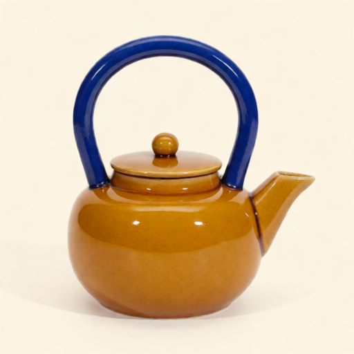
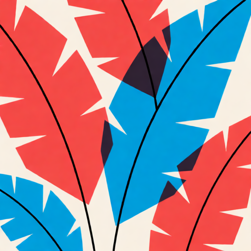
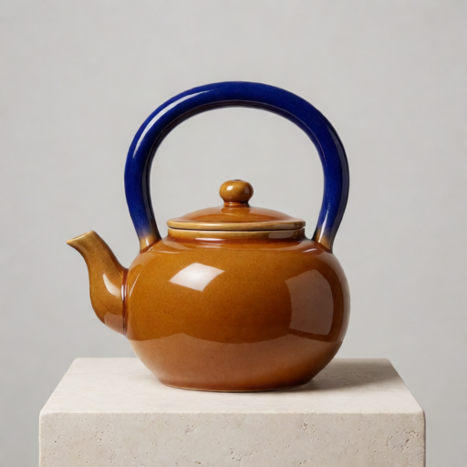
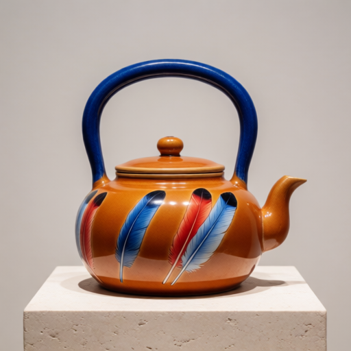
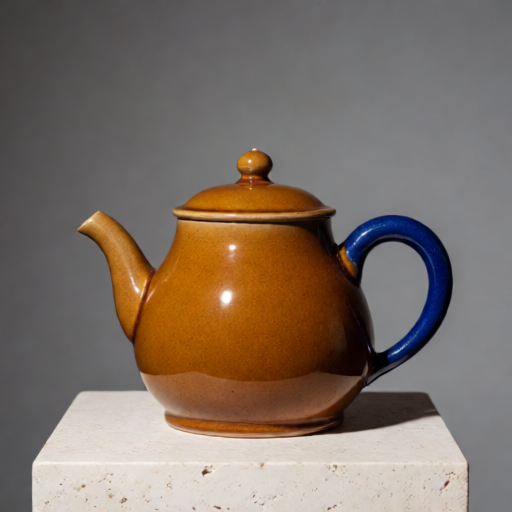
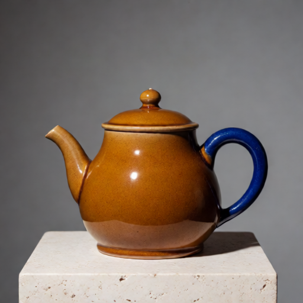
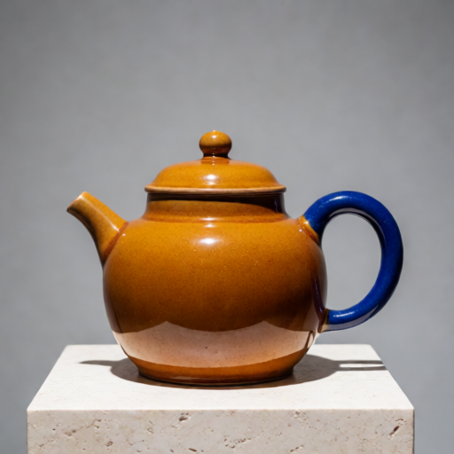
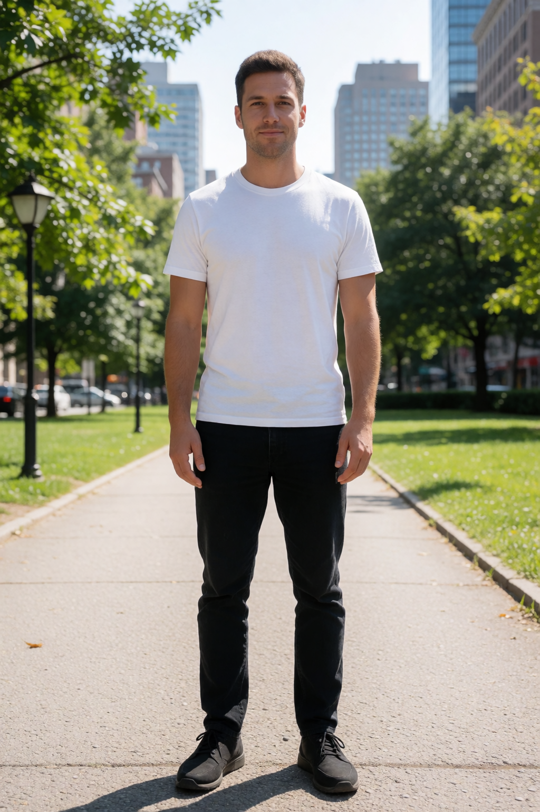

# V11 example gallery

These are actual synthetic test renders. Captions distinguish input images, plain controls and V11 output. See the [worked examples](krea-v11-worked-examples.md) for prompts, settings and interpretation, and the [native workflow downloads](../example_workflows/README.md#open-directly-in-comfyui) to start in ComfyUI.

## Reference image guidance

| Synthetic product reference | Synthetic style reference |
|---|---|
|  |  |

| V11 balanced reference result | V11 subject plus graphic style result |
|---|---|
|  |  |

The left output uses the unchanged balanced recipe at strength 0.65 with balancing off. The right uses subject strength 0.9 plus style 0.55 with gentle sign-preserving balance. Both use seed 424242. They demonstrate two setups, not a one-variable style ablation. Shared prompt: “A studio photograph of the same amber ceramic teapot with cobalt handle on a pale stone pedestal, full object visible, centered against a clean warm gray backdrop, crisp detail, no other objects, no lettering.” Graphic motifs may appear around the product instead of becoming its surface finish; borders, source-content leakage and weak fine-texture transfer remain limitations.

## A slider near neutral and in its working range

| Plain prompt / zero baseline | V11 brightness +0.05 | V11 brightness +3 |
|---|---|---|
|  |  |  |

Prompt: “A natural studio photograph of an amber ceramic teapot with a cobalt blue handle on a pale stone pedestal, moderately lit gray backdrop, full object visible, crisp glaze.” Fixed seed 424242, reach 1, budget 2, whole-image timing. The +0.05 example stays close to the plain image, while +3 changes brightness and also the object's shape. The ten-seed near-zero benchmark found less departure from neutral in 20/20 comparisons; this single row illustrates that result without promising identity preservation at stronger values.

## Native V11 slider showcase

Output from the downloadable [Concept Slider showcase](../example_workflows/krea-slider-v11-showcase-workflow.json), with its saved multiple-card setup and NVFP4 model at 1024x1536. The graph also contains a plain comparison branch. This is a multi-slider example, not a calibrated height measurement.

## Reuse and provenance

All images are synthetic project examples. [Asset notes](assets/krea-v11/README.md) record models, seeds and control distinctions. Documentation images have local metadata removed and are not drag-to-load workflow PNGs. Use the native JSON downloads to load a ComfyUI workflow.
