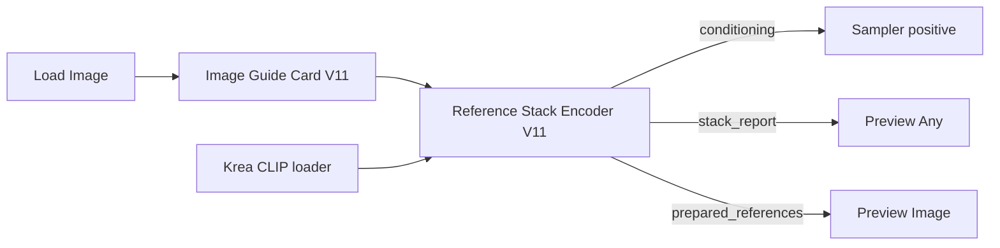
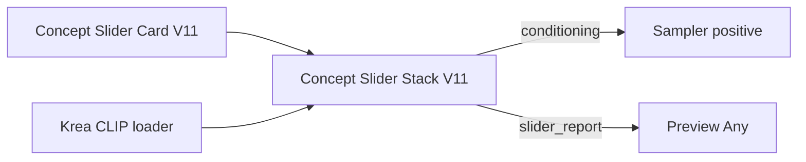

# Krea Reference V11

[View the V11 example gallery](krea-v11-gallery.md): synthetic reference inputs, reference-guided outputs, a slider value comparison and the native showcase result.

V11 is an explicit alternative to the V9/V10 reference nodes and Concept Slider V1. Existing graphs keep their original node classes and behavior. The `balanced` recipe and all V10 recipe tables are reused without retuning.

## Start here

Use package **0.5.0 or newer**. Install/update Krea Reference, restart ComfyUI, then refresh the browser. Select a Krea 2 diffusion model, the Krea Qwen3-VL text encoder and the matching Qwen image VAE already installed on your host. The portable examples name model files that you may need to reselect. V11 adds no trained weights.

Choose [Reference starter](../example_workflows/krea-v11-reference-stack-workflow.json) for image guidance or [Concept Slider showcase](../example_workflows/krea-slider-v11-showcase-workflow.json) for text-defined attributes. For detailed recipes and troubleshooting, follow the [nine worked examples](krea-v11-worked-examples.md).

| Instrument | Card class | Encoder class |
|---|---|---|
| Reference images | `KGKrea2ImageGuideCardV11` | `KGTextEncodeKreaImageReferencesV11` |
| Concept Sliders | `KGKrea2ConceptSliderCardV11` | `KGKrea2ConceptSliderStackV11` |

These are serialized class identifiers, not just display titles. Every reference/slider card and stack in the provided V11 graphs uses one of these classes, including negative and comparison branches. Standard loaders, samplers and model enhancers retain their independent names.

### Reference wiring

The Comfy stack accepts up to 12 reference cards; the Studio reference package exposes four image slots. Keep normal model, negative-conditioning, latent, sampler, VAE decode and Save Image connections from the example. A guide card alone does not condition the sampler.

### Slider wiring

The Comfy slider stack accepts up to eight cards; the Studio slider package exposes four. The showcase starts with several nonzero cards. For a first experiment, set all cards to zero, then enable only brightness at +3. Its plain comparison branch uses a V11 stack without cards.

## Reference controls

Recipe selection supplies coordinated settings; manual controls are not universally independent overrides of a quick recipe. Start with `Use image for`, strength, direction and timing. The inherited [guide-card field reference](previous-versions/v10/nodes/kg-krea-2-image-guide-card-v10.md) describes unchanged recipe/manual behavior; the balance/cache changes below are V11-specific.

| Card control | Purpose / practical use |
|---|---|
| Reference image | Image studied by this card. Connected Load Image nodes need a valid filename even for a zero-strength card. |
| How strongly this image guides | Requested image influence, 0–3, default 0.2. Recipe caps, feel curve and balancing affect the applied result; inspect the report. |
| Use image for | Select a built-in or installed custom recipe: subject, style, pose/layout, palette, framing and other roles. |
| Manual mode borrows | Select the role when using manual recipe controls. |
| Prepare image by; Color kept; Small details kept | Control preparation in the applicable recipe/manual mode. Inspect prepared_references to see what was actually studied. |
| Study this image at; Frame this reference by | Per-card study size/framing, or use stack settings. Study resolution is separate from generated-image resolution. |
| Subject copying | Subject policy used by the resolved recipe/manual setup. It is not an identity guarantee. |
| Early layout guidance; Final detail copying | Relative phase guidance in the resolved recipe/manual setup. |
| Maximum image pull | Cap used in resolving card influence; recipe behavior still matters. |
| Shape copied; Overall style reach | Shape/style contributions in manual mode; avoid raising both while diagnosing a single problem. |
| Guide direction | Toward uses the reference contribution; away reverses its signed contribution. |
| When this card guides | Recipe timing, whole image, early only or final only. |
| Structure layers pull; Finish layers pull | Manual layer emphasis; these are encoder layers, not spatial masks. |

| Stack control | Purpose / starting point |
|---|---|
| Final image prompt | Describe the desired finished image, rather than only naming references. |
| Written prompt strength | Text contribution, default 1; independent of image strength. |
| Image slider feel | Artist-friendly, literal or extra-gentle interpretation of requested strengths. Keep fixed during A/B comparisons. |
| Image detail level | Study-size choices 256/384/512/768. Medium 384 is a practical starting point; higher can copy unwanted content. |
| Image framing | Keep full shape, center crop square or stretch square. This prepares references, not the output canvas. |
| When images guide | Smart per-card, whole-image or two-phase behavior. Use smart timing when exploring explicit card timing. |
| Early-to-final handoff | Phase boundary 0–1, default 0.4. |
| Text/logo guard prompt handling | Full prompt rewrite or gentler preservation when using the guard behavior; inspect the report. |
| Balance strong cards | Off by default; gentle budget 2.5 or strict budget 1.5. V11 scales signed layer targets toward zero. Smaller budget is stronger limiting, not necessarily better quality. |
| Reuse image studies | Reuse for faster tuning or always re-study for diagnostics. |

The `balanced` recipe and all recipe tables are unchanged. Custom recipes load through the same existing recipe system; do not redefine reserved built-in labels. See [technical notes](krea-v11-technical-notes.md) for the precise budget rule.

## Slider controls

| Control | Meaning |
|---|---|
| What this slider changes | Attribute used to derive automatic poles, e.g. brightness. A preset replaces the effective attribute description. |
| Slider value | -6 to +6; zero skips the card. The sign selects the negative or positive pole. Values are not physical units or calibrated probabilities. |
| What +6 looks like (optional) | Explicit positive endpoint. Nonempty text overrides that preset/automatic endpoint. |
| What -6 looks like (optional) | Explicit negative endpoint. Set both poles for a fully specified custom axis. |
| Slider preset | custom or automatic, person height, plaza crowd. Presets fill missing pole text; they do not override your nonempty poles. |
| When this slider guides | whole image, early layout only, final details only. |
| Final image prompt | Shared scene description on the stack. |
| Overall slider reach | 0–3, default 1. Multiplies all card requests before per-axis and combined limits; zero gives plain conditioning. |
| Combined slider budget | 0–6, default 2. Caps the sum of absolute coefficients separately per phase; zero gives plain conditioning. |
| Early-to-final handoff | 0–1, default 0.4. Splits early/final sampling intervals. |
| Reuse slider studies | Reuse content studies or always re-study. Changing values can reuse studies, while changing prompt/poles requires new ones. |

The budget is shared, so adding an axis can weaken another. Duplicate and reversed identical pole pairs are combined before budgeting. At reach 1, value +3 requests coefficient 1 and value +6 requests coefficient 2. Default budget 2 allows one full-range axis; it does not promise a safe maximum perceptual change. The [cookbook](krea-v11-worked-examples.md#8-understand-duplicate-opposite-and-competing-sliders) works through cancellation and timing.

## Web Studio use

Use the separate Studio portable imports named `krea2_v11_int8_reference.workflow.json` and `krea2_v11_int8_sliders.workflow.json`, not these ComfyUI canvas JSON files. Import in Admin Workflows, include disabled entries in the list, review dependencies and enable the selected new provider. Publishing source files does not import them into a running Studio database.

The reference provider retains four optional images and existing workflow options. The text-only slider provider exposes four cards through 27 prompt controls: six per card plus reach, budget and handoff. Prompt and output controls use the existing Studio panels. See the Studio package guide for its exact field mappings. Reference and slider providers are separate; V11 does not introduce a combined image-anchor-plus-slider encoder.

## Select V11

In ComfyUI, add **KG Krea 2 Image Guide Card V11** and **KG Krea 2 Reference Stack Encoder V11** from `advanced/conditioning`. Existing V9/V10 image cards can feed the V11 stack through the same reference-card link type. Select a V11 sign-preserving balance mode explicitly; balance remains off by default.

For attributes, use **KG Krea 2 Concept Slider Card V11** with **KG Krea 2 Concept Slider Stack V11**. V1 cards also work with the V11 slider stack, using whole-image timing. The V11 card adds concrete person-height and plaza-crowd presets; explicit pole text overrides a preset. Height wording describes a man: use custom poles for another subject. Crowd reduction needs a scene containing people to have room to decrease.

## Changes

- Reference balance limits the sum of maximum absolute layer targets. It scales signed targets toward zero, preserving suppression and away direction. It ignores the inactive pooled channel. This is a coefficient budget, not a measured perceptual guarantee.
- Image-study keys hash the full prepared image content and include the CLIP patch revision. Unknown patch revisions bypass the cache. In-place model modifications outside Comfy's revision protocol require `always re-study`.
- Slider stacks group duplicate/opposite pole pairs before encoding and budget their total absolute coefficients separately for early/final phases. Default total budget is 2, equal to a single full-range slider at reach 1; up to 6 can be selected deliberately.
- Per-card timing can affect the whole image, early layout, or final details. The stack handoff defaults to 0.4. Timing is a creative control, not a promise that late influence preserves every structure.
- Near neutral, total applied axis weight below 0.25 blends the plain prompt and steered conditioning branches. Zero remains exactly plain; larger working values retain the existing composition. This transition can add a denoiser branch and cost more near zero.
- Zero overall reach, zero budget, or fully cancelled axes bypass pole encoding entirely. Unsupported active token-muting hosts raise a clear error instead of producing a silent slider.

## Compatibility and limitations

V11 uses the Krea Qwen3-VL encoder and existing Krea model/VAE assets. The reference and slider stacks remain separate; connecting their finished conditioning together is not a supported combined encoder.

There is no automatic migration. Copy an accepted workflow before selecting V11 classes. V10 balance labels must be replaced with the explicitly named V11 balance option. V11 timing/preset packet additions have no effect in older slider stacks. Do not feed a V11 card into V1 when expecting those additions to work.

Reference image preparation stays at the accepted V10 behavior until controlled comparisons support a change. No automatic model replacement, alternative style backend, asymmetrical gain calibration, or new trained weights are included. Strong controls can still change identity, framing, or style. Begin around +/-2 to 4 and inspect both directions.

## Validation and rollback

The 105-test contract suite passes. Live synthetic comparisons verified exact neutral bypass for zero reach, zero budget and cancelled axes. At brightness +/-0.05 over ten seeds, V11 stayed closer to the zero image in all 20 comparisons; mean absolute RGB difference fell from 37.52 to 5.02 on a 0-255 scale. This is one prompt/model continuity benchmark, not a general image-quality score. The ordinary +3 brightness output matched Slider V1 in three same-seed comparisons, and the balanced reference recipe with balancing off matched V10 in three comparisons.

Style-reference borders and weak fine-texture transfer remain possible. Person-height and plaza-crowd presets do not guarantee identity, framing, clothing, or anatomy preservation. Decreasing a crowd can still be weak. Reference preparation and recipe tables are unchanged.

Portable ComfyUI graphs: [reference starter](../example_workflows/krea-v11-reference-stack-workflow.json) and [slider showcase](../example_workflows/krea-slider-v11-showcase-workflow.json). Choose the model files installed on your host; reference examples use replaceable sample-image filenames. See the [technical notes](krea-v11-technical-notes.md) for the coefficient and cache contract.

Rollback is workflow selection: choose the unchanged V10 reference stack or Slider V1 stack and the original workflow copy. Keeping V11 installed does not change existing node behavior. Do not delete older nodes or overwrite saved workflow files during migration.
