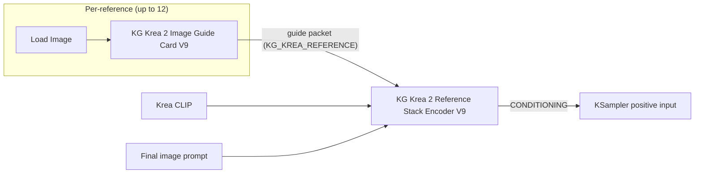
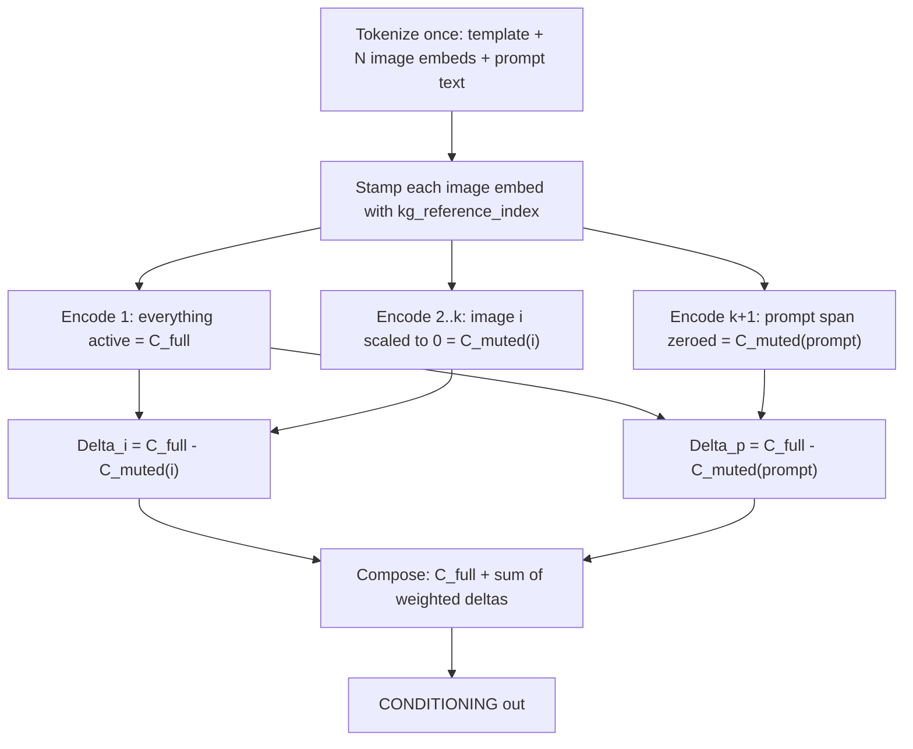
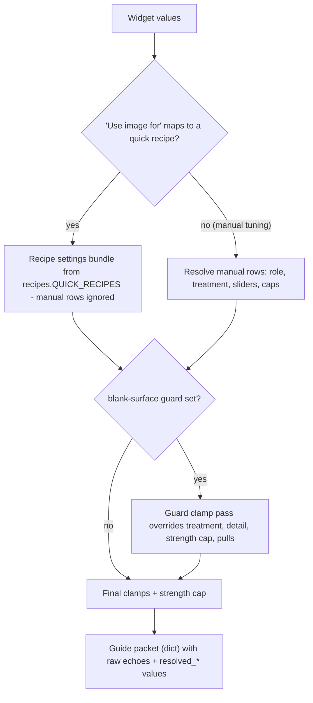
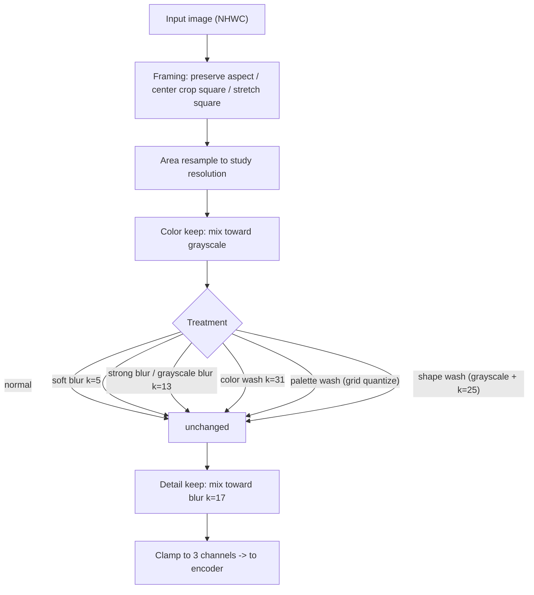
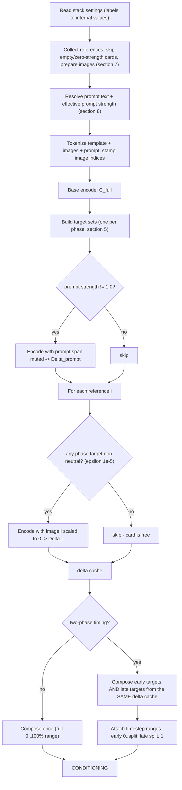
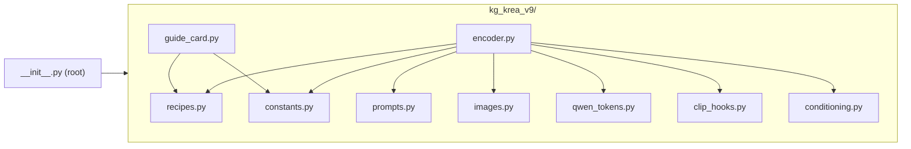

# Krea 2 V9 Reference Conditioning: A Technical Paper

**Author:** Kevin Gilper
**Subject:** `KG Krea 2 Image Guide Card V9` and `KG Krea 2 Reference Stack Encoder V9`
**Source:** [`kg_krea_v9/`](../kg_krea_v9) (package version 0.1.5)
**Audience:** node maintainers, ComfyUI developers, ML practitioners porting the techniques, and technically curious artists.

The way I think about documentation is simple: no black boxes. If a node steers your image, you should be able to see every number that did it and check the math yourself. This paper is that check for the V9 reference stack. It has two goals:

1. **Prove the work.** Every mechanism is described with its exact math, the assumptions it rests on, the failure modes of those assumptions, and the tests that pin the behavior.
2. **Enable others.** A competent reader should be able to maintain the node, extend it, or port the underlying techniques to another model or host without reverse-engineering the source.

Every claim in this paper is traceable to a file in this repository. Where a behavior comes from empirical tuning rather than derivation, the paper says so plainly.

---

## Table of Contents

1. [How to read this paper](#1-how-to-read-this-paper)
2. [The problem and the design goals](#2-the-problem-and-the-design-goals)
3. [Background: what the node builds on](#3-background-what-the-node-builds-on)
4. [The core technique: ingredient isolation by mute-and-diff](#4-the-core-technique-ingredient-isolation-by-mute-and-diff)
5. [The control space: from one slider to per-layer weights](#5-the-control-space-from-one-slider-to-per-layer-weights)
6. [The guide card: from widgets to a guide packet](#6-the-guide-card-from-widgets-to-a-guide-packet)
7. [Image preparation: destroy before encode](#7-image-preparation-destroy-before-encode)
8. [Prompt scaffolding and the text/logo guard](#8-prompt-scaffolding-and-the-textlogo-guard)
9. [The encoder pass plan: caching, composing, scheduling](#9-the-encoder-pass-plan-caching-composing-scheduling)
10. [Token-row analysis: locating the prompt inside the template](#10-token-row-analysis-locating-the-prompt-inside-the-template)
11. [Safe temporary model patching](#11-safe-temporary-model-patching)
12. [A worked end-to-end example](#12-a-worked-end-to-end-example)
13. [Data contracts and frozen surfaces](#13-data-contracts-and-frozen-surfaces)
14. [Verification: the executable specification](#14-verification-the-executable-specification)
15. [Limitations and failure modes](#15-limitations-and-failure-modes)
16. [Extending the node](#16-extending-the-node)
17. [Porting the techniques to other systems](#17-porting-the-techniques-to-other-systems)
18. [Glossary](#18-glossary)
19. [Appendix A: constants reference](#appendix-a-constants-reference)
20. [Appendix B: symbol table](#appendix-b-symbol-table)

---

## 1. How to read this paper

| You are... | Read... |
| --- | --- |
| Checking whether the approach is sound | Sections 4, 5, 12, 14, 15 |
| Maintaining this package long-term | Sections 6 through 11, 13, 14, 16 |
| Porting the technique to another model or host | Sections 4, 5, 10, 11, 17 |
| Curious how "suggest the visual style" actually works | Sections 2, 4 (intro), 5.4, 12 |

Each major section opens with a plain-language summary before the math. If you only read those summaries, you will still come away with a correct (if less precise) model of the system.

---

## 2. The problem and the design goals

### 2.1 The problem

Krea 2's prompt encoder is a multimodal language model: reference images and written text share one token stream, and the encoder reads them jointly to produce the conditioning that steers the diffusion sampler. That design is powerful but gives the artist almost no control:

- An image is either **in** the prompt or **not**. There is no strength dial.
- An image influences **everything at once**: subject, palette, layout, lighting, texture, and any text or logos it contains.
- The encoder is very good at reading. If a reference contains a brand logo or a printed word, the model has *seen* it, and the sampler will happily reproduce it.

Artists need per-image, per-aspect control: *this* image is only for lighting, *that* one only for pose, and *do not copy the writing on that box*.

### 2.2 The design goals

The V9 stack was built against five goals, and every mechanism in this paper serves at least one of them:

| # | Goal | Mechanisms that serve it |
| --- | --- | --- |
| G1 | **Per-image strength** that feels linear to a human | Mute-and-diff deltas (§4), slider feel curves (§5.4) |
| G2 | **Per-aspect roles** (style vs. layout vs. lighting...) | Token/pooled split (§5.1), per-layer gains (§5.2), image preparation (§7), role prompt language (§8) |
| G3 | **Text/logo safety** as a real guarantee-in-depth, not a wish | Image washes (§7), near-zero conditioning caps (§6.4), prompt rewriting with a strength floor (§8.3) |
| G4 | **Predictable cost**, meaning you pay only for what you use | Delta cache and neutrality predicate (§9.2) |
| G5 | **Stability**, meaning no setting combination should explode | Soft caps (§5.3), clamps (§6), divisibility fallback (§9.4) |

One more principle runs underneath all five: the artist stays in charge. Where a behavior involves a real trade-off, like the text/logo guard's prompt handling, V9 exposes it as an explicit widget choice instead of deciding silently (§8.3).

### 2.3 What the artist sees

Two nodes (registered in [`kg_krea_v9/__init__.py`](../kg_krea_v9/__init__.py)):



The **guide card** turns one image plus plain-language choices ("use image for: suggest the visual style", "how strongly: 0.45") into a *guide packet*, a dictionary of resolved numeric targets. The **stack encoder** consumes up to 12 packets plus the written prompt and produces standard ComfyUI `CONDITIONING`. Downstream nodes (samplers) need no modification.

---

## 3. Background: what the node builds on

*So basically: the prompt is a document that contains pictures. The encoder reads the whole document and outputs two things, a big per-token tensor and one small summary vector. Everything V9 does is arithmetic on those two outputs.*

### 3.1 The chat template

ComfyUI's Krea/Qwen integration wraps the prompt in a chat template. The encoder ([`kg_krea_v9/encoder.py`](../kg_krea_v9/encoder.py)) assembles it from three parts (template strings built in [`kg_krea_v9/prompts.py`](../kg_krea_v9/prompts.py)):

```text
<|im_start|>system
{role instructions - built per connected card, see section 8.1}
<|im_end|>
<|im_start|>user
<|vision_start|><|image_pad|><|vision_end|>     <- one line per reference image
<|vision_start|><|image_pad|><|vision_end|>
{written prompt, or the auto-prompt when empty}
<|im_end|>
<|im_start|>assistant
```

Each `<|image_pad|>` is replaced at tokenization time by an *image embed*: a dictionary in the token row that later expands into many embedding positions (more positions at higher study resolution). Text tokens occupy one position each. This "document with pictures" structure is what makes the whole approach possible: images and text live in one addressable sequence.

### 3.2 The conditioning format

`clip.encode_from_tokens_scheduled(tokens)` returns a list of schedule entries. Each entry is:

```text
[ cond, extras ]
   |       |
   |       └── dict; the relevant key is "pooled_output": a [B, P] tensor
   └── a [B, T, D] tensor: one D-wide row per sequence position
```

- **`cond` (token-level)** feeds the sampler's cross-attention. It carries *where things go*: layout, structure, subject placement.
- **`pooled_output` (global)** is a single vector per prompt, consumed by the model family's global-conditioning pathway. It carries *overall look*: palette, tone, finish.

The V9 role tables (§5.1) exploit exactly this split. The node treats the split as an empirical, testable property of the model family, not as a claim about any specific layer's semantics.

One more structural fact matters. In this model family the token-level width `D` is a concatenation of **12 equal chunks**: vision-language "deepstack" features injected from successive encoder layers.

```text
cond[b, t, :]  =  [ chunk 0 | chunk 1 | chunk 2 | ... | chunk 10 | chunk 11 ]
                    each chunk is D/12 wide
```

V9 *assumes* 12 chunks and *verifies* the assumption at runtime: if `D % 12 != 0` it falls back gracefully and warns once (§9.4). The chunk count lives in one place (the length of the gain tables in [`kg_krea_v9/recipes.py`](../kg_krea_v9/recipes.py)).

### 3.3 What ComfyUI gives us to work with

Three host capabilities make the technique implementable (all isolated in [`kg_krea_v9/clip_hooks.py`](../kg_krea_v9/clip_hooks.py) and [`kg_krea_v9/qwen_tokens.py`](../kg_krea_v9/qwen_tokens.py)):

1. **Tokenize with images.** `clip.tokenize(text, images=..., llama_template=...)` returns inspectable token rows in which image embeds are ordinary dict items.
2. **Patchable embed preprocessing.** The model object exposes `preprocess_embed` (per-embed) and `process_tokens` (whole row), both of which can be temporarily replaced.
3. **Scheduled encoding.** Repeated calls with the same tokens produce shape-identical outputs, which is what makes subtraction meaningful.

---

## 4. The core technique: ingredient isolation by mute-and-diff

*The way this works is: encode the prompt once with everything on. Then, for each ingredient you want to control, encode again with just that ingredient silenced, and subtract. The difference is what that ingredient contributed. Think of it like a mixing board: the full mix is one take, muting one track tells you exactly what that track was adding, and once you know that, you can bring the track back at any fader level you like.*

### 4.1 Definitions and the extrapolation identity

Let the prompt contain ingredients (reference images and the written text). Fix the token layout, and define for ingredient $i$:

- $C_{\text{full}}$: the conditioning encoded with every ingredient active,
- $C_{\text{muted}(i)}$: the conditioning encoded with ingredient $i$ silenced *in place* (§4.3), everything else unchanged,
- the **delta** of ingredient $i$:

$$\Delta_i \;=\; C_{\text{full}} - C_{\text{muted}(i)}$$

The composed output for a single ingredient at *target strength* $t$ (where $t=1$ means "as encoded") is:

$$C_{\text{out}} \;=\; C_{\text{full}} + (t - 1)\,\Delta_i$$

Substituting the definition of $\Delta_i$ gives the identity that anchors the whole design:

$$C_{\text{out}} \;=\; C_{\text{muted}(i)} + t\,\Delta_i$$

Three consequences, each exact (not approximate) for a single ingredient:

- $t = 1 \Rightarrow C_{\text{out}} = C_{\text{full}}$. Native strength. The delta term vanishes, and V9 skips computing $\Delta_i$ entirely (§9.2).
- $t = 0 \Rightarrow C_{\text{out}} = C_{\text{muted}(i)}$. The ingredient is removed *exactly as well as the muting mechanism removes it*.
- $0 < t < 1$ interpolates linearly between two *actually observed* encoder outputs. $t > 1$ extrapolates beyond $C_{\text{full}}$ along the ingredient's direction.

Readers familiar with classifier-free guidance will recognize the shape: CFG computes `uncond + s·(cond − uncond)` in noise-prediction space, and V9 computes the same linear extrapolation **per ingredient, in conditioning space**. The extrapolation is not the novel part. The in-place muting is, because it yields a well-defined, shape-aligned $\Delta_i$ for *each ingredient separately* inside one joint context.

With multiple ingredients, V9 composes additively (implemented in [`kg_krea_v9/conditioning.py`](../kg_krea_v9/conditioning.py)):

$$C_{\text{out}} \;=\; C_{\text{full}} \;+\; \sum_i W_i \odot \Delta_i$$

where $W_i$ is a scalar $(t_i - 1)$ for the written prompt, and a structured weight (per-channel and per-layer, §5) for images. The additive form is an approximation whose error can be characterized precisely. See §4.4.

### 4.2 Why mute in place (and not just re-encode without the image)

A tempting simpler design: encode the prompt once *with* the image and once *without* it, and subtract. This fails structurally. Removing an image changes the token layout: every downstream position shifts by the image's embedding size, positional encodings move, and the two outputs are no longer comparable element by element. The subtraction $C_{\text{full}} - C_{\text{muted}}$ is only meaningful if position $k$ means the same thing in both tensors.

V9 therefore mutes **in place**. The muted encode has *the identical token layout*: same sequence length, same positions, same image slots, with only the ingredient's *signal* silenced. Both output tensors have identical shape by construction, and the code enforces it defensively:

- schedule-count mismatch raises `RuntimeError` (`conditioning_delta`, [`kg_krea_v9/conditioning.py`](../kg_krea_v9/conditioning.py)),
- per-entry shape mismatch raises `RuntimeError`,
- the pooled delta is only computed when both pooled tensors exist and agree in shape.

### 4.3 The two muting mechanisms

Both are temporary patches on the loaded CLIP model, installed for exactly one encode and always restored (§11).

**Image muting: scale the embed to zero.** Before any encoding, the encoder walks the token rows and stamps every image embed with its 0-based reference index (`tag_image_references`, [`kg_krea_v9/qwen_tokens.py`](../kg_krea_v9/qwen_tokens.py)). During a muted encode, the `preprocess_embed` hook ([`kg_krea_v9/clip_hooks.py`](../kg_krea_v9/clip_hooks.py)) checks the stamp against the requested `image_scales` map (a muted encode of image $i$ passes `image_scales = {i: 0.0}`) and multiplies the image's embedding **and each of its deepstack feature tensors** by the scale:

```text
emb        <- emb * strength
deepstack  <- [d * strength for each d]     (only when present)
```

At scale 0 the image's slots still exist and still occupy attention positions, but they carry a zero vector. The attention mask is deliberately left untouched: the baseline is "image present but silent," which keeps geometry identical to the full encode.

**Prompt muting: zero the span and its mask.** The written prompt is contiguous text, so it can be silenced more aggressively. The `process_tokens` hook zeroes both the embedding values *and* the attention mask over the prompt's embedding span, then recomputes the token counts:

```text
embeds[:, start:end]         <- 0.0
attention_mask[:, start:end] <- 0
num_tokens                   <- recomputed per row from the mask
```

Locating `start:end` is a token-walking problem solved in §10. The span bounds are clamped into the tensor's valid range before use, so a wrong guess degrades to a partial mute rather than an exception.

Why the asymmetry (mask kept for images, zeroed for text)? Image muting reuses the *same* hook that applies per-card strengths at encode time. One mechanism, one code path, any scale in $[0,\infty)$, and keeping the mask makes scale a continuous dial with no geometry change anywhere on it. The prompt path exists only for muting, and zeroing the mask pushes the muted encode as close as possible to "the text truly absent" while still preserving sequence length.



### 4.4 Assumptions, and exactly how wrong they can be

The single-ingredient identity in §4.1 is exact. Two approximations enter beyond it. Being precise about them is what separates "it works" from "we know why it works."

**(a) Additivity across ingredients.** The encoder is a transformer, and ingredients interact through attention, so contributions are not strictly additive. The error can be quantified under a **bilinear interaction model**. For two ingredients $A, B$ with presence variables $x_A, x_B \in [0,1]$, model the encoder output as:

$$C(x_A, x_B) \;=\; C_\varnothing + x_A\,a + x_B\,b + x_A x_B\, m$$

where $a, b$ are the pure contributions and $m$ is the pairwise interaction term. The single-mute deltas measured by V9 are then $\Delta_A = a + m$ and $\Delta_B = b + m$ (each delta, measured with the *other* ingredient present, absorbs the interaction). Composing at targets $t_A, t_B$:

$$C_{\text{est}} = C(1,1) + (t_A-1)\Delta_A + (t_B-1)\Delta_B = C_\varnothing + t_A a + t_B b + (t_A + t_B - 1)\,m$$

while the "true" bilinear value at scaled inputs would be $C_\varnothing + t_A a + t_B b + t_A t_B\, m$. The error is:

$$C_{\text{est}} - C_{\text{true}} \;=\; -\,(1-t_A)(1-t_B)\;m$$

This little result explains three design choices at once:

1. **The error vanishes whenever either target is 1.** Cards you don't touch cost nothing in fidelity (and nothing in compute, §9.2).
2. **The error grows as the *product* of departures from neutral.** One aggressive card among neutral ones stays exact. Several simultaneously aggressive cards degrade gracefully and multiplicatively, not catastrophically.
3. **Sub-neutral targets are interpolation.** For $t \in [0,1]$ each term moves toward an actually-encoded anchor point ($C_{\text{muted}}$), so the composition stays inside the span of observed encoder outputs. Only $t > 1$ extrapolates, and that is exactly where the soft caps (§5.3) bound the excursion.

The bilinear model is a *model*, clearly weaker than the true encoder. But it is the correct second-order picture, and the design treats its lesson (keep products of departures bounded) as a hard rule enforced by caps and clamps.

**(b) Linearity of the downstream sampler in the conditioning.** Scaling a delta by $w$ does not scale the sampler's *visual response* by $w$. Diffusion models respond nonlinearly, and V9 does not assume otherwise. It assumes only **monotonicity** in the useful range (more delta means more of that ingredient's character), and then shapes the *perceptual* response with the slider-feel curves (§5.4), which were tuned against observed outputs. This is the standard division of labor: linear algebra where structure permits, empirical curves where perception rules.

---

## 5. The control space: from one slider to per-layer weights

*At a high level: one artist slider fans out into three kinds of numbers. A weight for "where things go" (token channel), a weight for "overall look" (pooled channel), and twelve weights for the encoder's feature layers, which is how a style card can push palette hard while barely touching structure. All of it is clamped so nothing can explode.*

### 5.1 Two channels: token and pooled

Each image delta $\Delta_i$ has two parts (matching §3.2): the token-level delta (a `[B, T, D]` tensor) and the pooled delta (a `[B, P]` vector). V9 weights them **independently**:

$$
\begin{aligned}
t_i &= \sigma_i \cdot P^{\text{shape}}_i &&\text{(token target; weight applied: } t_i - 1\text{)}\\
g_i &= \sigma_i \cdot P^{\text{global}}_i &&\text{(pooled target; weight applied: } g_i - 1\text{)}
\end{aligned}
$$

where $\sigma_i$ is the card's effective strength (§5.4) and $P^{\text{shape}}, P^{\text{global}}$ are the card's *pulls*, role-dependent constants from [`kg_krea_v9/recipes.py`](../kg_krea_v9/recipes.py):

| Role | shape pull | global pull | Reading |
| --- | --- | --- | --- |
| balanced | 1.00 | 1.00 | everything, evenly |
| style | 0.18 | 1.35 | look, not layout |
| palette | 0.04 | 1.75 | color relationships only |
| composition | 1.25 | 0.35 | layout, not look |
| framing | 0.90 | 0.25 | camera only |
| identity | 1.00 | 1.00 | subject fidelity |
| environment | 0.65 | 0.80 | background context |
| lighting | 0.25 | 1.25 | light behavior |
| material | 0.18 | 1.20 | surface feel |
| loose | 0.12 | 0.65 | mood board |
| shape only | 1.20 | 0.05 | silhouette only |
| text/logo safe | 0.08 | 0.00 | near-total suppression |

The table is the quantitative heart of goal G2. A *style* card at any strength pushes the global vector 7.5× harder than the token stream (1.35 / 0.18), and a *composition* card inverts that ratio. These constants came out of my tuning sweeps, validated against the recipe demo gallery in [`docs/assets/krea-v9/demos/`](assets/krea-v9/demos/).

The **written prompt** uses a single scalar for both channels. Its delta enters the composition as a 2-tuple, and the compose algorithm (§9.3) applies the same weight $(s_p - 1)$ to token and pooled parts alike.

### 5.2 Per-layer gains: steering inside the token channel

The token weight is further refined per deepstack chunk. Each role carries a 12-entry gain table $\gamma_0 \ldots \gamma_{11}$, and the effective per-chunk weight is:

$$w_{i,\ell} \;=\; \min\!\big(t_i\,\gamma_\ell,\; L_{\max}\big) - 1, \qquad L_{\max} = 6.0$$

computed in `_reference_targets` ([`kg_krea_v9/encoder.py`](../kg_krea_v9/encoder.py)). When per-layer weights are present they **replace** the scalar token weight (the compose algorithm's 4-tuple form, §9.3). The pooled weight is unaffected.

The gain tables ([`kg_krea_v9/recipes.py`](../kg_krea_v9/recipes.py)):

| Chunk ℓ | 0 | 1 | 2 | 3 | 4 | 5 | 6 | 7 | 8 | 9 | 10 | 11 |
| --- | --- | --- | --- | --- | --- | --- | --- | --- | --- | --- | --- | --- |
| EVEN (balanced, composition, framing, identity, shape only) | 1.0 | 1.0 | 1.0 | 1.0 | 1.0 | 1.0 | 1.0 | 1.0 | 1.0 | 1.0 | 1.0 | 1.0 |
| STYLE (style, environment, loose) | 0.25 | 0.35 | 0.45 | 0.60 | 0.80 | 1.0 | 1.0 | 2.5 | **5.0** | 1.1 | **4.0** | 1.2 |
| PALETTE | 0.15 | 0.20 | 0.30 | 0.45 | 0.70 | 1.0 | 1.0 | 2.8 | **5.5** | 1.3 | **4.5** | 1.2 |
| MATERIAL | 0.20 | 0.30 | 0.45 | 0.65 | 0.85 | 1.0 | 1.0 | 2.0 | **4.0** | 1.2 | **3.0** | 1.1 |
| LIGHTING | 0.20 | 0.25 | 0.35 | 0.50 | 0.80 | 1.0 | 1.0 | 2.2 | **4.5** | 1.4 | **4.0** | 1.2 |
| text/logo safe | 0.15 | 0.15 | 0.15 | 0.15 | 0.15 | 0.15 | 0.15 | 0.15 | 0.15 | 0.15 | 0.15 | 0.15 |

**Where these numbers come from, stated plainly:** my tuning sweeps, documented in the source comments. Chunks 8 and 10 carried the strongest palette/finish response, and early chunks carry subject structure. The style-family tables therefore *suppress* early chunks (0.15 to 0.25) and *spike* late ones (up to 5.5), which is how a style card imports rendering finish without dragging the style image's subject along. Nothing in this table is derived from first principles. It is measured behavior, encoded as data, and you can re-derive it with the sweep methodology in §16.4.

**A full determination of what each chunk carries** - verified from code, then established by a convergent-evidence analysis of the tables above (the four appearance tables were tuned independently for four different jobs yet agree chunk-for-chunk: 0-4 structure, monotonic ramp; 5-6 transition; 7/8/10 appearance, chunk 8 strongest), plus a turnkey single-chunk sweep kit for the fresh measurement - lives in [`docs/deepstack-layers/`](deepstack-layers/README.md). Run `python docs/deepstack-layers/analyze_tables.py` to reproduce the convergent-evidence table from the live code.

### 5.3 The soft cap: bounding worst-case extrapolation

The cap $L_{\max} = 6.0$ (`MAX_LAYER_SCALE`, [`kg_krea_v9/encoder.py`](../kg_krea_v9/encoder.py)) exists because three multiplicative dials compound. Worst case without it:

$$\underbrace{f_{\text{artist}}(3.0)}_{3.3} \times \underbrace{P^{\text{shape}}_{\max}}_{3.0} \times \underbrace{\gamma_{\max}}_{5.5} \;=\; 54.45\times \text{ native scale}$$

A 54× single-chunk excursion is far outside any regime where §4.4's monotonicity assumption holds. In practice it produces garbage. The cap clamps the effective per-chunk *scale* (target, not weight) to 6× native, so the largest possible per-chunk weight is $6.0 - 1 = 5.0$. The contract test pins the arithmetic: strength 2.0 (linear feel) × gain 5.0 = 10.0, capped to 6.0, weight +5.0 (`test_layer_soft_cap_limits_token_layer_targets`).

Note the cap applies to the *product*, not the factors, so an artist can still trade slider against gain freely under the ceiling.

### 5.4 Slider feel: the strength curves

The card slider is passed through one of three curves ("Image slider feel," implemented as `effective_image_strength` in [`kg_krea_v9/recipes.py`](../kg_krea_v9/recipes.py)):

$$
f_{\text{artist}}(s)=\begin{cases}
0 & s\le 0.01\\[2pt]
s^{1.6} & 0.01 < s\le 1\\[2pt]
1+1.15\,(s-1) & s>1
\end{cases}
\qquad
f_{\text{gentle}}(s)=\begin{cases}
0 & s\le 0.02\\[2pt]
s^{2.7} & 0.02 < s\le 1\\[2pt]
1+1.10\,(s-1) & s>1
\end{cases}
$$

with $f_{\text{linear}}(s) = \max(0, s)$ as the literal escape hatch. Sample values:

| slider s | 0.05 | 0.1 | 0.2 | 0.3 | 0.5 | 0.7 | 0.9 | 1.0 | 1.5 | 2.0 | 3.0 |
| --- | --- | --- | --- | --- | --- | --- | --- | --- | --- | --- | --- |
| artist | 0.008 | 0.025 | 0.076 | 0.146 | 0.330 | 0.565 | 0.845 | 1.000 | 1.575 | 2.150 | 3.300 |
| extra gentle | 0.000 | 0.002 | 0.013 | 0.039 | 0.154 | 0.382 | 0.752 | 1.000 | 1.550 | 2.100 | 3.200 |

**Why a power curve.** Image references in this architecture are *dominant*: even weak image signal visibly overpowers text. A slider that maps linearly to target strength feels like a light switch, where everything interesting happens below 0.3. The exponent (1.6 default, 2.7 for stubborn references) stretches the low end so equal slider movements produce roughly equal *perceived* changes. Think of it like an audio fader: faders are logarithmic for the same reason, because human perception is nonlinear and the control should match the ear, not the electronics.

**Why a dead zone.** Below 0.01 (0.02 for gentle) the output is exactly 0, and a zero-strength card is skipped entirely (no delta encode, no compose entry, §9.2). "Basically off" is *actually* off, in both signal and cost.

**The key thing is the mental model**, worth internalizing before §12: the reference image is physically in the context at full strength, and the slider expresses *what fraction of that native influence to keep*. At the default slider 0.2 with artist feel, $\sigma = 0.2^{1.6} = 0.076$, so the card keeps about 7.6% of the image's native pull. V9 whispers by default. Strength 1.0 keeps 100% and costs nothing. Values above 1.0 amplify beyond native.

---

## 6. The guide card: from widgets to a guide packet

*The key thing is: the card is a compiler. Input: plain-language widget choices. Output: a dictionary of resolved numbers (the packet). Quick recipes are pre-baked settings bundles, manual mode exposes the raw dials, and the text/logo guard is a clamp pass that overrides anything unsafe.*

### 6.1 Resolution flow

Implemented in [`kg_krea_v9/guide_card.py`](../kg_krea_v9/guide_card.py) (`build`, with `_recipe_settings` / `_manual_settings` / `_apply_blank_surface_guard`):



### 6.2 Quick recipes

Each non-manual "Use image for" choice selects a full settings bundle from `QUICK_RECIPES` ([`kg_krea_v9/recipes.py`](../kg_krea_v9/recipes.py)). The complete table (this *is* the product behavior, so it is reproduced exactly):

| Recipe | role | treatment | color | detail | study | subject | early | late | cap | shape | global | layers |
| --- | --- | --- | --- | --- | --- | --- | --- | --- | --- | --- | --- | --- |
| balanced | balanced | normal | 1.0 | 1.0 | stack | recipe | 1.0 | 1.0 | none | 1.0 | 1.0 | EVEN |
| identity ("keep the same subject") | identity | normal | 1.0 | 1.0 | stack | preserve | 1.0 | 1.0 | none | 1.0 | 1.0 | EVEN |
| composition ("copy pose and layout") | composition | grayscale blur | 0.0 | 0.25 | stack | avoid | 1.2 | 0.2 | 1.25 | 1.3 | 0.3 | EVEN |
| lighting ("copy lighting and mood") | lighting | soft blur | 0.85 | 0.55 | stack | avoid | 1.0 | 0.55 | 1.25 | 0.25 | 1.3 | LIGHTING |
| style gentle ("suggest the visual style") | style | palette wash | 0.85 | 0.05 | 384 | avoid | 0.85 | 0.85 | 0.90 | 0.35 | 1.85 | STYLE |
| texture gentle ("suggest material or texture") | material | strong blur | 0.65 | 0.05 | stack | avoid | 0.5 | 0.75 | 0.95 | 0.35 | 1.55 | MATERIAL |
| shape only ("copy big shapes only") | shape only | shape wash | 0.0 | 0.0 | 256 | avoid | 1.1 | 0.0 | 1.00 | 1.2 | 0.05 | EVEN |
| text/logo safe ("avoid copying text/logos") | text/logo safe | shape wash | 0.0 | 0.0 | 256 | avoid | 0.75 | 0.0 | **0.03** | 0.08 | 0.0 | 0.15×12 |

Reading a row end to end, take *composition*: convert to grayscale and blur (kill palette and texture before the encoder sees them, §7), keep only 25% of fine detail, boost structural pull 1.3× while cutting global-look pull to 0.3×, push hard early in sampling (×1.2) and nearly release late (×0.2) so the layout locks in but textures come from elsewhere, and cap strength at 1.25 because structure extrapolates badly.

Each recipe is a *policy bundle*. Preprocessing, channel weights, layer gains, scheduling, and prompt language all agree about the card's job, and that agreement across five mechanisms, not any single one, is what makes the recipes feel reliable.

### 6.3 Manual mode math

Manual mode ("Use image for: manual tuning") resolves:

$$
P^{\text{shape}} = B^{\text{shape}}(\text{role}) \cdot \text{clamp}_{[0,2]}(\text{Shape copied}), \qquad
P^{\text{global}} = B^{\text{global}}(\text{role}) \cdot \text{clamp}_{[0,3]}(\text{Overall style reach})
$$

where $B$ are the role baselines from §5.1's table (selected by "Manual mode borrows"). The layer gains come from the role's table and are not directly editable. That is a deliberate simplification, and per-layer editing is an extension point (§16). The user's "Maximum image pull" (range [0,3], default 3.0 which is a no-op) becomes the strength cap, applied **before** the feel curve:

$$\sigma = f_{\text{curve}}\big(\min(s_{\text{slider}},\, s_{\text{cap}})\big)$$

Final packet clamps: $P^{\text{shape}} \in [0,3]$, $P^{\text{global}} \in [0,4]$. Early/late multipliers clamp to $[0,5]$, color and detail to $[0,1]$.

### 6.4 The blank-surface guard clamp

If the resolved role is `text/logo safe` (via recipe or manual borrow), a clamp pass overrides whatever the artist chose (`_apply_blank_surface_guard`):

| Setting | Forced value | Why |
| --- | --- | --- |
| treatment | shape wash | grayscale + heavy blur destroys glyph detail before encoding |
| color kept / detail kept | 0.0 / 0.0 | color and micro-detail carry logo identity |
| study resolution | 256 | fewer vision tokens = less capacity to memorize marks |
| early multiplier | min(current, 0.75) | structure guidance allowed, weakened |
| late multiplier | 0.0 | the late phase is where glyph texture would re-enter |
| subject policy | avoid | belt and braces in the prompt channel |
| strength cap | 0.03 | see arithmetic below |
| shape pull | min(current, 0.08) | whisper of silhouette only |
| global pull | 0.0 | zero global-look transfer |
| layer gains | min(each, 0.15) | uniform floor-level token influence |

The numbers compound into near-erasure. With the slider at 0.5 and literal feel: $\sigma = \min(0.5, 0.03) = 0.03$, token target $= 0.03 \times 0.08 = 0.0024$ (weight $-0.9976$), pooled weight exactly $-1.0$, per-chunk targets $0.03 \times 0.08 \times 0.15 = 0.00036$ (weights $\approx -0.9996$). With the default artist feel the residue is smaller still ($f_{\text{artist}}(0.03) = 0.0037$). **The guarded image's conditioning contribution is suppressed to roughly the 0.1% level.** What remains of its influence flows almost entirely through the *prompt* channel (§8.3), which describes it as a blank panel. This is the defense-in-depth of goal G3: destroyed input, near-zero weights, and rewritten language. Three independent mechanisms that would each have to fail for a logo to survive.

### 6.5 The packet schema

The packet (full assembly at the end of `build`) has three key groups:

1. **Raw echoes.** Every widget value as entered (`purpose`, `color_kept`, `shape_copied`, ...). These make packets self-documenting in saved workflows and tests.
2. **Resolved values.** The post-recipe, post-guard, post-clamp numbers the encoder actually uses, all prefixed `resolved_` (`resolved_role`, `resolved_shape_pull`, `resolved_layer_pull`, ...), plus `v9_blank_surface_guard` and `v9_strength_cap`.
3. **Fallback keys.** Unprefixed duplicates (`role`, `treatment`, `shape_pull`, ...) so hand-built or future-version packets remain readable. The encoder reads `resolved_x` when present and falls back to `x` (`_card_value`, [`kg_krea_v9/encoder.py`](../kg_krea_v9/encoder.py)). A card built by hand with only bare keys works.

The packet also carries `source_version: "v9"` and `strength` (post-cap, pre-curve; the curve belongs to the stack, so one card behaves consistently under different stack feel settings).

---

## 7. Image preparation: destroy before encode

*Here's the thing: the encoder reads everything it is shown, and no instruction reliably makes it un-see something. The only guaranteed filter is to destroy the unwanted information before the encoder looks. Think of it like redacting a document before handing it to a very careful reader: whatever survives redaction is fair game. So V9 redacts by feature. Blur kills texture, grayscale kills palette, and the palette wash kills everything except palette.*

### 7.1 The principle

Prompt-side steering (§5, §8) modulates *how much* of an image's reading survives. It cannot change *what was read*. Preparation is the complementary control: an information-theoretic guarantee that certain content never enters the encoder. A card's role determines both. The composition recipe blurs and grayscales its image (structure survives, palette and texture do not) *and* down-weights the global channel. When both controls agree, the residual leakage of the unwanted aspect is the product of two small factors.

### 7.2 The pipeline

`prepare_image` in [`kg_krea_v9/images.py`](../kg_krea_v9/images.py), applied per card before tokenization:



**Framing and resolution.** The study side $R \in \{256, 384, 512, 768\}$ comes from the card, or the stack default when the card says "use stack setting" (`stack` sentinel). Preserve-aspect mode solves for a scale that hits a constant *pixel budget* (vision-token cost grows with area, roughly quadratically with side):

$$\text{scale} = \sqrt{\frac{R^2}{w \cdot h}}, \qquad w' = \max(16, \operatorname{round}(w\cdot\text{scale})),\; h' = \max(16, \operatorname{round}(h\cdot\text{scale}))$$

Example: a 1024×768 input at $R = 384$ gives scale $= 0.4330$, output 443×333 = 147,519 px ≈ $384^2$ = 147,456 px. Aspect is preserved and cost is constant. Center-crop and stretch produce exactly $R \times R$. Resampling is area interpolation (the correct antialiasing choice for downscale).

**Color keep** mixes toward the per-pixel luma average:

$$\text{out} = (1 - c)\cdot \text{gray} + c \cdot \text{rgb}, \qquad c \in [0,1]$$

Treatments `grayscale`, `grayscale blur`, and `shape wash` force $c = 0$ regardless of the widget.

**Blur** is a box filter via `avg_pool2d` (stride 1, same-padding), and even kernel sizes are bumped to the next odd so padding stays symmetric. Kernel sizes are calibrated to the *feature scale to destroy* at study resolution: k=5 softens micro-texture, k=13 destroys small print and fine grain, k=25 on grayscale leaves only mass distribution, and k=31 in color leaves only smooth color fields.

**Detail keep** is a final low-pass mix, $\text{out} = (1-d)\cdot\text{blur}_{17}(\text{x}) + d\cdot \text{x}$: a single dial between "as treated" and "very soft."

### 7.3 The palette wash

The most surgical filter (`palette_wash_samples`): keep palette and coarse color placement, remove everything else.

```text
1. grid_h = clamp(height // 48, 2, 10);  grid_w = clamp(width // 48, 2, 10)
2. palette = adaptive_avg_pool2d(image, (grid_h, grid_w))     # per-cell mean color
3. palette = nearest-upsample back to full size               # blocky color map
4. palette = 0.85 * palette + 0.15 * mean_color(image)        # pull toward global average
5. return box_blur(palette, k=9)                              # soften cell edges
```

At the style recipe's default study side (384) the grid is 8×8 to 10×10 cells, so at most about 100 color samples survive from the entire image. No subject, no texture, no glyphs, and the style-gentle recipe pairs this with detail 0.05. Step 4's pull toward the global mean (15%) tames outlier cells. Step 5 removes the hard cell borders that would otherwise read as a checkerboard *composition* cue.

---

## 8. Prompt scaffolding and the text/logo guard

*So basically: numbers steer how strongly each image pulls, and language tells the encoder what each image is for. The system prompt assigns roles. If the artist writes nothing, the node writes a prompt from the roles. And when a text/logo-safe card is present, the node rewrites marking words, because telling this model "no text" makes text more likely. The guard replaces negations with positive descriptions of blank surfaces.*

### 8.1 The system prompt

`role_system_prompt` ([`kg_krea_v9/prompts.py`](../kg_krea_v9/prompts.py)) builds one instruction block per encode:

- A header framing the images as "controlled visual ingredients" that must not be rendered as labels or captions.
- One `Input k role: ...` line per reference, from the `ROLE_INSTRUCTIONS` table (e.g., style: *"borrow palette, tonal feel, medium, art direction, rendering finish, and atmosphere without copying the style reference subject"*).
- One `Input k subject rule: ...` line when the card's subject policy is not "recipe decides" (`SUBJECT_POLICY_INSTRUCTIONS`: avoid / allow / preserve).

Note the clean channel separation: **subject policy affects only language**. It adds no numeric weight anywhere. Guard-mode variants: when any guard card is present the header switches to blank-surface framing, and when *every* card is text/logo safe the entire system prompt collapses to the positive blank-surface phrase (nothing else needs saying).

### 8.2 The auto-prompt

An empty "Final image prompt" triggers `blank_prompt`: a sentence assembled from the connected roles ("Create a cohesive final image from the connected visual sources. Keep the main subject ... from the primary content source. Apply palette ... from the style source ..."), one clause per role family that is actually present.

The strength rule has a deliberate asymmetry (`_resolve_prompt`, [`kg_krea_v9/encoder.py`](../kg_krea_v9/encoder.py)): if the prompt is auto-generated and the prompt-strength slider is at or below 0, the strength floors to **1.0**. A written prompt at strength 0 means "mute my text" (weight −1, a real request). An auto-prompt at strength 0 would mean "generate scaffolding and then erase it," which is never useful, so the floor gives no-prompt workflows their scaffold at neutral cost (strength 1.0 means no prompt delta encode, §9.2). This is why the no-prompt style-transfer workflow ships with prompt strength 0.0.

### 8.3 The text/logo guard's prompt arm

When any connected card carries the blank-surface guard, the stack applies one of two prompt policies ("Text/logo guard prompt handling"):

**Full guard: rewrite my prompt.** Three coordinated actions:

1. **Sanitize** the written prompt (`sanitize_text_logo_prompt`). Two regex passes *in a load-bearing order*:
   - Pass 1 rewrites **negated marking requests**: `(no|without|free of) [readable] (text|writing|words|letters|numbers|logos|symbols|glyphs|branded marks|marks|markings)` becomes `plain unmarked`.
   - Pass 2 rewrites **marking nouns**: signs/signage become `plain blank board`, labels/screens become `plain blank surface`, posters become `plain blank panel`, logos become `plain blank mark-free area`, UI becomes `plain blank interface surface`, text/writing/words/letters/numbers/symbols/glyphs become `plain surface`, and so on.
   - Then whitespace collapses, and a positive prefix is prepended: *"Create the requested scene with smooth blank unmarked surfaces wherever the reference has markings."*

   **Why negations first: a two-line proof by counterexample.** Run the passes in the opposite order on `"a shop sign with no text"`. Pass 2 would produce `"a shop plain blank board with no plain surface"`, the negation pattern no longer matches (its noun is gone), and the output *requests the absence of a plain surface*, the exact opposite of the goal. Negations-first yields `"...with plain unmarked"`. Order is semantics here, not style.

   **Why rewrite negations at all.** The prompt encoder is a language model reading surface tokens. "No text" *contains* "text," and in embedding space negation is weak: the concept is activated by mention. It is the classic "don't think of an elephant" failure, and empirically, negated requests increase the probability of the very content they negate. The guard therefore replaces negation with a *positive description of the desired state*, which is the reliable way to steer a generative reader.

2. **Floor the prompt strength** at 3.5. After the delta weight conversion, the blank-surface language lands at weight $3.5 - 1 = +2.5$, deliberately dominant. (Pinned by `test_full_guard_rewrites_prompt_and_floors_prompt_strength`.)

3. **Append the guard suffix.** The positive phrase `"smooth empty blank panel, plain clean featureless surface, undecorated unmarked interior, simple stand"` joins the prompt after a blank line.

**Gentle guard: keep my prompt words.** Only action 3. The artist's exact words and exact prompt strength survive. The guard adds language but rewrites nothing and re-weights nothing. This mode exists because rewriting changes composition, and an artist who wrote a precise scene description may prefer weaker guarding to altered wording. The trade-off stays explicit and user-visible, which is why it is a widget and not a heuristic. The human makes that call, not the node. (Pinned by `test_gentle_guard_keeps_prompt_words_and_prompt_strength` and `..._still_respects_explicit_prompt_strength`.)

---

## 9. The encoder pass plan: caching, composing, scheduling

*The key thing is: encoder passes are the only expensive step, so the node pays for exactly what you use. Encode once with everything on. Pay one extra encode for the prompt only if its strength isn't 1.0, and one extra encode per card that actually asks for something non-neutral. Mix the deltas per the targets, twice if early/late scheduling is on, and hand the sampler one conditioning per time window. Composing is cheap tensor math.*

### 9.1 The full pass plan

`execute` in [`kg_krea_v9/encoder.py`](../kg_krea_v9/encoder.py):



### 9.2 The delta cache and the neutrality predicate

Encoder passes are the only expensive operation (each is a full forward pass of the multimodal language model). The pass count is:

$$N_{\text{passes}} \;=\; 1 \;+\; \mathbb{1}\!\left[s_p \ne 1\right] \;+\; \sum_{i=1}^{n} \mathbb{1}\!\left[\text{needs}(i)\right]$$

where the per-image neutrality predicate (`_image_delta_needed`), checked across **all** phases with $\varepsilon = 10^{-5}$, is:

$$\text{needs}(i) \iff \exists\,\text{phase}:\; |t_i - 1| > \varepsilon \;\lor\; |g_i - 1| > \varepsilon \;\lor\; \max_\ell |w_{i,\ell}| > \varepsilon$$

(Recall $w_{i,\ell}$ already has the $-1$ baked in, so its neutral value is 0.) Consequences worth spelling out:

- A **balanced or identity card at strength exactly 1.0** is completely free: $t = g = 1$, and every layer target is $\min(1 \cdot 1, 6) - 1 = 0$. The image still participates natively via the base encode.
- A **style card at strength 1.0 is *not* free**: its pulls (0.35 / 1.85) put both channel targets off-neutral, and its non-even gains leave most $w_\ell \ne 0$, so its delta is needed even at native strength. Neutrality is a property of the *targets*, not the slider.
- A zero-strength card (or slider inside the dead zone) never reaches the predicate. It was dropped at collection time.

Deltas are computed once and stored in a dict keyed `"prompt"` or the image index, and both phases of two-phase scheduling reuse the same cache. Memory note: the cache holds one full conditioning-sized tensor set per active ingredient. Linear in active cards, same order as the encodes themselves.

### 9.3 The compose algorithm

`compose_conditioning` ([`kg_krea_v9/conditioning.py`](../kg_krea_v9/conditioning.py)) accepts weighted deltas in three arities:

```text
(delta, w)                    -> token weight w, pooled weight w        (the prompt entry)
(delta, w_tok, w_pool)        -> independent channel weights
(delta, w_tok, w_pool, layers)-> layers (12 weights) REPLACE w_tok      (image entries)
```

Per schedule entry $k$, the algorithm (faithful pseudocode of the implementation):

```python
cond_out   = cond_full.clone()
pooled_out = pooled_full.clone()
for (delta, w_tok, w_pool, layers?) in weighted_deltas:
    if scalar w_tok == 0 and w_pool == 0:  continue      # micro-skip
    if layers is present:
        if D % 12 == 0:
            view delta as [..., 12, D/12]                 # fp32 for the multiply,
            cond_out += (delta * layers[:, None]).view_as # cast back to orig dtype
        else:
            w = mean(layers)                              # fallback (section 9.4)
            if w != 0: cond_out += delta * w
    elif w_tok != 0:
        cond_out += delta_cond * w_tok
    if w_pool != 0 and both pooled tensors exist:
        pooled_out += delta_pooled * w_pool
```

Mathematically, with $d = D/12$ and chunk slices $S_\ell = [\ell d, (\ell{+}1)d)$:

$$C_{\text{out}}[\ldots, S_\ell] \;=\; C_{\text{full}}[\ldots, S_\ell] + \sum_i w_{i,\ell}\, \Delta_i[\ldots, S_\ell] \qquad\quad g_{\text{out}} = g_{\text{full}} + \sum_i (g_i - 1)\, \Delta^{\text{pool}}_i$$

Numerical hygiene: the per-chunk multiply runs in float32 and casts back to the original dtype, so fp16 conditioning does not accumulate error through the reshape-scale-add. Cost: $O(S \cdot T \cdot D)$ adds per delta. That is microseconds against encoder passes measured in hundreds of milliseconds.

### 9.4 The divisibility fallback (and warning once)

If the loaded model's conditioning width does not split into 12 chunks, per-layer intent cannot be applied. The fallback substitutes the **flat mean** of the 12 weights:

$$\bar w_i = \frac{1}{12}\sum_{\ell} w_{i,\ell}$$

Because $w_\ell = t\,\gamma_\ell - 1$ below the cap, this mean equals $t \cdot \bar\gamma - 1$, so the role's mean gain becomes a broad multiplier on the token target. Mean gains: STYLE 1.52, PALETTE 1.59, MATERIAL 1.31, LIGHTING 1.45. So on an incompatible model a style card at unit token target still pushes about 1.5× broad token influence. The *aim* degrades (no layer targeting), and the *energy* is preserved. The event logs a warning **once per process** (module flag `_layer_fallback_warned` in [`kg_krea_v9/conditioning.py`](../kg_krea_v9/conditioning.py)) naming the width, the chunk count, and the consequence. Once, because it fires per compose call and would otherwise flood the log on every generation. Pinned by `test_compose_layer_fallback_averages_and_warns_once`.

### 9.5 Two-phase scheduling

Diffusion sampling is coarse-to-fine: early steps decide layout and mass, late steps decide texture and finish. "When images guide" exposes this:

- **guide the whole image** (constant): one composition over the full range.
- **smart per-card timing** / **layout early, details later** (two-phase; currently the same code path, the two labels reserve UX room): two compositions from the same delta cache, with per-card phase multipliers applied to the base strength before the pulls:

$$\sigma_i^{\text{early}} = \sigma_i \cdot m^{\text{early}}_i, \qquad \sigma_i^{\text{late}} = \sigma_i \cdot m^{\text{late}}_i$$

then attached to complementary sampler windows via ComfyUI's `start_percent` / `end_percent` (non-mutating copy, `with_timestep_range`):

```text
sampling progress   0% ───────────────── split (default 40%) ───────────────── 100%
early composition   ██████████████████████
late composition                          ████████████████████████████████████████
```

Degenerate splits collapse cleanly: split at or below 0 means the late composition covers the whole range, split at or above 1 means early covers the whole range. The composition recipe is the archetype, early ×1.2 / late ×0.2: the pose is imposed while the canvas is still liquid, then almost released so the late phase renders texture from the style/prompt channels instead of the (deliberately blurred) structure reference. Since both compositions reuse the cache, two-phase costs **zero extra encoder passes**.

---

## 10. Token-row analysis: locating the prompt inside the template

*So basically: to mute the written prompt, the node must find exactly where it lives inside the tokenized chat template. That means walking past the system block, past the role header, past all the image slots, and then converting token positions into embedding positions, because each image slot expands into many embeddings.*

All logic in [`kg_krea_v9/qwen_tokens.py`](../kg_krea_v9/qwen_tokens.py), keyed on named Qwen special tokens:

| Constant | ID | Token |
| --- | --- | --- |
| `IM_START_TOKEN` | 151644 | `<\|im_start\|>` |
| `IM_END_TOKEN` | 151645 | `<\|im_end\|>` |
| `VISION_END_TOKEN` | 151653 | `<\|vision_end\|>` |
| `USER_ROLE_TOKEN` | 872 | `user` |
| `NEWLINE_TOKEN` | 198 | `\n` |
| `DOUBLE_NEWLINE_TOKEN` | 271 | `\n\n` |

**Step 1: find the user content** (`krea_user_content_start`). Scan for `<|im_start|>` occurrences, keeping at most the second (system turn, then user turn). If the two following tokens are exactly `user`, `\n`, skip all three. Defensive by construction: a malformed row yields start 0, over-approximating the span toward the row start rather than crashing.

**Step 2: bound the prompt** (`find_prompt_bounds`). From the content start, walk to the *last* image embed (counting dict items of type `image`), step past it, then skip any `<|vision_end|>` and newline tokens. That is `prompt_start`. `prompt_end` is the first `<|im_end|>` at or after it (row end if absent). Token items may be bare or weight-wrapped tuples, and `token_elem` unwraps them.

**Step 3: expand to embedding positions** (`expanded_offset`). Token index becomes embedding offset, where a text token contributes 1 position and image embed $j$ contributes its reported embedding size:

$$\text{offset}(a, b) = \sum_{\text{item} \in \text{row}[a:b]} \begin{cases}\text{size}_j & \text{item is image embed } j\\ 1 & \text{otherwise}\end{cases}$$

The sizes come from the encoder's own `embeds_info` (sorted by image index, `image_embedding_sizes`). Measured, not assumed. A worked micro-example with one image of embedding size 5:

```text
token row:   im_start user \n  [IMG]  vis_end \n  "a"  "fox"  im_end
token idx:   0        1    2   3      4       5   6    7      8
emb. offset: 0        1    2   3      8       9   10   11     12
                                └ IMG expands to 5 positions (3..7)
prompt token bounds:  start=6, end=8   ->   embedding bounds: start=10, end=12
```

The muting hook then zeroes embedding positions 10 and 11 (the half-open span [10, 12)). Bounds are computed from batch row 0 and applied across the batch; see §15 for the (theoretical) caveat.

---

## 11. Safe temporary model patching

*The way this works is: the node borrows the loaded model, swaps two of its methods for the duration of exactly one encode, and always puts them back, even if the encode throws. Between node executions the model is untouched.*

Both hooks in [`kg_krea_v9/clip_hooks.py`](../kg_krea_v9/clip_hooks.py) follow the same pattern:

```python
@contextmanager
def hook(clip, ...):
    original = getattr(target, "method", None)
    if original is None:          # unknown model shape: do nothing, still yield
        yield
        return
    target.method = patched       # wraps original; never replaces logic wholesale
    try:
        yield
    finally:
        target.method = original  # restored on success AND on exception
```

Design properties worth naming:

- **Graceful absence.** If the model does not expose the expected method (a different CLIP type is connected), the hook yields without patching. The encode still runs, and the corresponding control silently becomes a no-op rather than an error. This is deliberate: a wrong-model workflow produces un-steered output the artist can see, instead of a crash.
- **Wrapping, not replacing.** The patched functions call the original and post-process its outputs (scale, zero). Upstream behavior (device placement, dtype, tokenizer details) is inherited, not re-implemented.
- **Composition.** `encode_with_controls` nests the two hooks (image scaling outside, prompt muting inside) so a single encode can apply both.
- **Serial execution assumed.** The patch is process-global state on the shared model object. ComfyUI executes nodes serially, so this is safe in the host. A port to a concurrent executor must lock or re-enter per encode (§17).

The image hook has one extra affordance: an embed with no stamped index falls back to reading `kg_reference_strength` from the embed dict (default 1.0). That is a forward-compat channel for external nodes that want per-embed strength without the V9 tagging step.

---

## 12. A worked end-to-end example

*One card, real numbers, every stage. Style transfer: a painting connected through "suggest the visual style," slider at 1.4, defaults elsewhere (artist feel, smart timing, split 0.40, written prompt "a portrait of a fox" at strength 1.0).*

**Card resolution** (§6). "suggest the visual style" selects the style-gentle recipe: role `style`, treatment `palette wash`, color 0.85, detail 0.05, study 384, subject `avoid`, early/late 0.85/0.85, cap **0.9**, pulls 0.35/1.85, STYLE gains. The slider 1.4 caps to 0.9, so the packet carries `strength = 0.9`.

**Effective strength** (§5.4): $\sigma = f_{\text{artist}}(0.9) = 0.9^{1.6} = 0.8449$.

**Image preparation** (§7): resize to about $384^2$ px preserving aspect, mix to 85% color, palette-wash to a color grid of at most 10×10 cells, detail keep 0.05 (near-total low-pass). The encoder will see a soft blocky color map: no fox, no brushstrokes, no subject from the style image.

**Prompt assembly** (§8): the system prompt gains `Input 1 role: borrow palette, tonal feel, ... without copying the style reference subject.` and `Input 1 subject rule: Do not copy this reference image's subject identity ...`. The user turn is one image-pad line plus "a portrait of a fox."

**Targets** (§5), per phase with $m^{\text{early}} = m^{\text{late}} = 0.85$, so base $= 0.8449 \times 0.85 = 0.7181$:

- token target $t = 0.7181 \times 0.35 = 0.2513$ (scalar weight −0.749, superseded by layers)
- pooled target $g = 0.7181 \times 1.85 = 1.3286$, so **pooled weight +0.329**
- per-chunk weights $w_\ell = \min(0.2513\,\gamma_\ell, 6) - 1$:

| ℓ | 0 | 1 | 2 | 3 | 4 | 5 | 6 | 7 | **8** | 9 | **10** | 11 |
| --- | --- | --- | --- | --- | --- | --- | --- | --- | --- | --- | --- | --- |
| w | −0.937 | −0.912 | −0.887 | −0.849 | −0.799 | −0.749 | −0.749 | −0.372 | **+0.257** | −0.724 | **+0.005** | −0.698 |

Read the row: structural chunks are *suppressed* to 6 to 25% of native, while the two finish-carrying chunks are held at or slightly above native. The card imports look while actively *removing* the style image's structure. The numbers are the mechanism behind the recipe's name.

**Pass plan** (§9): prompt strength is 1.0, so no prompt delta. The card is non-neutral, so one image delta. **Total: 2 encoder passes.** Both phases have identical targets here (0.85 = 0.85), so early and late compositions are numerically equal, and with split 0.40 the sampler receives two range-tagged copies covering 0 to 40% and 40 to 100%.

**Compose** (§9.3): $C_{\text{out}} = C_{\text{full}} + W \odot \Delta_1$ per chunk, pooled $+0.329\,\Delta^{\text{pool}}_1$.

For contrast, the same math on a **"keep the same subject"** card at default 0.2: $\sigma = 0.076$, all targets $= 0.076$, all weights $= -0.924$. A whisper: the subject image keeps just 7.6% of its native pull on every channel. And an **"avoid copying text/logos"** card at 0.5: token weight −0.998, pooled −1.0, per-chunk −0.9996 (§6.4). Near-erasure, by design.

---

## 13. Data contracts and frozen surfaces

Three surfaces are load-bearing. Changing them breaks users invisibly, so all three are pinned by tests (§14):

1. **Node keys and widget labels.** ComfyUI saves workflows by node key (`KGKrea2ImageGuideCardV9`, `KGTextEncodeKreaImageReferencesV9`) and widget *label*. Renaming any label silently breaks every saved workflow and API-format call. Labels are therefore a **frozen API**: appending new labels is allowed, renaming or reordering existing ones is a breaking change. (`test_v9_card_labels_are_frozen`, `test_v9_stack_labels_are_frozen_and_add_guard_choice` assert exact ordered lists.)
2. **The guide packet.** The card-to-encoder dict with `resolved_*` preferred keys, bare-key fallbacks, and `source_version` (§6.5). The encoder must keep reading old shapes, and the card must keep writing both key groups.
3. **The encoder's method seams.** The class-level private methods (`_encode_with_controls`, `_compose_conditioning`, `_conditioning_delta`, `_apply_prompt_delta`, `_prepare_image_v9`, `_tag_image_references`, `_with_timestep_range`, `_blur_samples`) are thin delegators to the modules, deliberately kept *on the class* so tests (and downstream tinkerers) can patch a single well-known seam. `test_v9_is_fully_standalone` asserts their presence.

The web extension ([`web/krea_reference_stack_v9_ui.js`](../web/krea_reference_stack_v9_ui.js)) couples only to node keys and widget labels, the same frozen surface, with no Python coupling. It is pure UX (compact card sockets, greying manual-only rows outside manual mode), and the backend accepts any subset of the 12 card inputs regardless.

Module layout and dependencies (all one-way, no cycles):



`recipes`, `prompts`, `qwen_tokens`, `conditioning`, `images`, and `clip_hooks` do not import each other, so each is independently portable (§17).

---

## 14. Verification: the executable specification

The claims in this paper are not just prose. The load-bearing ones are pinned by the ComfyUI-free contract tests in [`tests/test_krea_v9.py`](../tests/test_krea_v9.py), runnable in seconds:

```bash
python -m unittest discover -s tests -p "test_*.py" -v
```

The suite runs against a pure-Python tensor stub ([`tests/_kg_stub_env.py`](../tests/_kg_stub_env.py)) implementing exactly the semantics the math needs (broadcasting arithmetic, view/reshape, clone), so the numerical claims are tested as arithmetic, not mocked away.

| Claim (section) | Test |
| --- | --- |
| Widget labels frozen, in order (§13) | `test_v9_card_labels_are_frozen`, `test_v9_stack_labels_are_frozen_and_add_guard_choice` |
| Packet versioned; guard caps strength at 0.03 (§6.4, §6.5) | `test_v9_card_packet_is_versioned` |
| Delta = elementwise full − muted, incl. pooled (§4.1) | `test_conditioning_delta_subtracts_cond_and_pooled` |
| Shape mismatch refuses loudly (§4.2) | `test_conditioning_delta_rejects_shape_mismatch` |
| Scalar token/pooled weights compose independently (§9.3) | `test_compose_scalar_weights` |
| Per-chunk weights scale exactly their chunk (§5.2, §9.3) | `test_compose_layer_weights_scale_each_chunk` |
| Non-divisible width: flat mean + warn once per process (§9.4) | `test_compose_layer_fallback_averages_and_warns_once` |
| Soft cap: 2.0 × 5.0 capped at 6.0, weight +5.0 (§5.3) | `test_layer_soft_cap_limits_token_layer_targets`, `test_v9_max_layer_scale_constant` |
| Curve formulas incl. dead zones and slopes above 1 (§5.4) | `test_strength_curves` |
| Full guard rewrites prompt and floors strength to weight +2.5 (§8.3) | `test_full_guard_rewrites_prompt_and_floors_prompt_strength` |
| Gentle guard keeps words and strength; respects explicit strength (§8.3) | `test_gentle_guard_keeps_prompt_words_and_prompt_strength`, `test_gentle_guard_still_respects_explicit_prompt_strength` |
| Timestep ranges attach without mutating inputs (§9.5) | `test_with_timestep_range_sets_percentages` |
| Patchable seams exist on the class (§13) | `test_v9_is_fully_standalone` |

Runtime invariants complement the tests: schedule/shape mismatches raise `RuntimeError` rather than mis-subtracting, hooks restore in `finally`, and the fallback warning is once-per-process by module flag.

Additionally, the 0.1.5 package refactor was validated by an old-vs-new equivalence sweep (documented in the [changelog](../CHANGELOG.md)). The pre-refactor single-file module and the current package were loaded side by side under identical stubs and compared byte-for-byte across 577 card packets (every recipe and manual combination plus randomized inputs), 481 encoder orchestration runs (timings × guard modes × prompts × strengths × splits), 180 randomized conditioning-math cases, 480 prompt-builder cases, 200 token-analysis cases, and 12 hook cases. All identical. The current code *is* the validated behavior.

Before release, the maintainer checklist ([testing guide](testing.md)) adds a real-ComfyUI smoke test: install, confirm both node keys appear, and run the bundled workflows.

---

## 15. Limitations and failure modes

Stated plainly, because a paper that hides its weaknesses proves nothing:

1. **First-order composition.** Multi-card fidelity degrades with the product of departures from neutral (§4.4). Several simultaneously aggressive cards (all far from 1.0) blend less faithfully than the same cards used separately. Mitigations: whisper defaults, caps, and the interpolation-side bias of typical settings.
2. **Muting is not absence.** A zero-scaled image still occupies attention slots (mask kept, §4.3). $C_{\text{muted}}$ is "image present but silent," not "image never existed." The delta is aligned and well-defined precisely *because* of this, but $t = 0$ removes the ingredient only as well as zero-signal slots approximate absence.
3. **Template coupling.** Prompt-bound detection hard-codes Qwen-family token IDs (§10). A retokenized or retemplated model breaks span detection. The walk degrades to over-wide bounds rather than crashing, making prompt-strength control partially wrong rather than fatal. Porting requires re-deriving six constants.
4. **The 12-chunk assumption.** Divisibility is verified at runtime with a graceful mean fallback (§9.4), but on an incompatible model, layer-targeted recipes lose their targeting (style becomes roughly a broad 1.5× push). The one-time warning names the consequence.
5. **Cost is linear in active cards.** $N_{\text{passes}} = 1 + [s_p \ne 1] + \#\text{non-neutral cards}$ (§9.2). Twelve aggressive cards means roughly 13 to 14 full encoder forwards per generation. This is inherent to single-ablation attribution, and §17 sketches the escape hatches.
6. **The sanitizer is English-only regex.** Marking nouns in other languages pass through the full guard's rewrite (the suffix and numeric suppression still apply). Extending the vocabulary is a data change (§16.6).
7. **Guard is defense-in-depth, not proof.** Three independent mechanisms each reduce the probability of mark reproduction multiplicatively, but none is a formal guarantee. Adversarially strong marks (a logo that survives k=25 grayscale blur as a *shape*) can still echo as a silhouette. That is by design, since silhouette is what shape-only-style guarding intentionally keeps.
8. **Batch-row assumption.** Prompt bounds are computed from token row 0 and applied batch-wide (§10). ComfyUI encodes one prompt per call, so this is theoretical today. A port that batches heterogeneous prompts must compute per-row bounds.
9. **Shared-model patching assumes serial execution** (§11). Concurrent executors need a lock around `encode_with_controls`.
10. **"Smart" timing equals "two phase" today** (§9.5). The label reserves room for genuinely per-card scheduling (different splits per card) without a future label break.

---

## 16. Extending the node

All extension points are data-first: most changes are table edits, not logic edits. Golden rule for every change: **append labels, never rename** (§13), and run the contract tests.

### 16.1 Add a quick recipe

1. Add the settings bundle to `QUICK_RECIPES` in [`kg_krea_v9/recipes.py`](../kg_krea_v9/recipes.py) (all 14 keys; copy the closest existing recipe).
2. Append a label-to-recipe-key entry to `PURPOSE_LABELS` in [`kg_krea_v9/guide_card.py`](../kg_krea_v9/guide_card.py).
3. If the recipe introduces a new *role*, see §16.2 first.
4. Add a demo workflow/PNG if it is user-facing, and extend the label test's expected list.

### 16.2 Add a role

A role is a coordinated row across four tables: `ROLE_PULL_DEFAULTS` + `ROLE_LAYER_PULL_DEFAULTS` ([`recipes.py`](../kg_krea_v9/recipes.py)), `ROLE_INSTRUCTIONS` ([`prompts.py`](../kg_krea_v9/prompts.py)), and, if manually selectable, a label in `MANUAL_TARGET_LABELS` ([`guide_card.py`](../kg_krea_v9/guide_card.py)). Optionally a clause in `blank_prompt` for auto-prompt coverage. Unknown roles already fall back safely (balanced pulls, EVEN gains, balanced instruction), so a partial row degrades rather than breaks.

### 16.3 Add an image treatment

Add the branch in `prepare_image` ([`kg_krea_v9/images.py`](../kg_krea_v9/images.py)) and a label in `PREP_LABELS`. Decide explicitly whether the treatment forces `color_keep = 0` (join the grayscale-family tuple). Keep the pipeline order (framing, then color, then treatment, then detail) so treatments compose predictably with the detail dial.

### 16.4 Re-tune layer gains for a new checkpoint

The measurement methodology behind §5.2's tables, reusable as-is: hold one reference card at fixed strength; for each chunk $\ell$, run a sweep with a **single-chunk spike** (gain table = 1.0 everywhere except $\gamma_\ell \in \{2, 4, 6\}$); render a fixed prompt/seed grid; score which visual aspect (palette, texture, structure, lighting) responds. Chunks with strong finish response get spikes in the style-family tables, and chunks carrying structure stay at or below 1 for style roles. The soft cap (§5.3) already bounds whatever you write.

### 16.5 Support a different chunk count

The count is implied by table length (12). For a model family with $n \ne 12$ chunks: extend the tables to length $n$. The compose path derives everything from the list length and the divisibility check. Making length model-conditional would be the first structural (non-table) change, and the fallback keeps mismatched configurations safe meanwhile.

### 16.6 Extend the guard vocabulary

Add patterns to the two regex tables in `sanitize_text_logo_prompt` ([`kg_krea_v9/prompts.py`](../kg_krea_v9/prompts.py)). Preserve the pass order: negations before nouns. Section 8.3's counterexample is the reason. For non-English support, add parallel pattern tables; the prefix and suffix strings live in the same module.

### 16.7 Per-card scheduling ("smart" earning its name)

The seam is ready: `_reference_targets` already produces per-card phase strengths, and the schedule branch currently builds two global compositions. True per-card timing means per-card splits, which means more range-tagged compositions (one per distinct split boundary), all still from one delta cache. Cost stays encode-free. Only the compose count grows.

---

## 17. Porting the techniques to other systems

The package separates **portable math** from **host adapters** (§13's dependency graph). To port, replace the adapters and keep the math.

**Host requirements checklist.** The technique needs a system where:

1. Text and reference images share one token/embedding sequence in the prompt encoder (any Qwen-VL-style multimodal conditioner qualifies).
2. You can intercept per-image embeddings during encode (to scale them): the `preprocess_embed` equivalent.
3. You can zero a span of embeddings plus attention mask: the `process_tokens` equivalent (only needed for prompt-strength control).
4. Encoding is deterministic per token layout, and repeated encodes are shape-stable (required for meaningful subtraction).
5. Conditioning is consumable as (token tensor, optional pooled vector). Pooled-less systems simply drop the global channel and its pulls.
6. Optional: the sampler accepts per-timestep-range conditioning (for §9.5; otherwise ship the constant schedule only).

**What ports verbatim:** `conditioning.py` (delta/compose/fallback: pure tensor algebra), `recipes.py` (tables and curves: pure data and functions), `prompts.py` (policy text; swap vocabulary per §16.6), and the pass-plan/cache/neutrality logic in `encoder.py`.

**What you rewrite:** `clip_hooks.py` (bind to your encoder's interception points) and `qwen_tokens.py` (your template's special tokens and expansion sizes). Both are dependency-free modules of about 100 lines each. That is deliberate.

**Technique summary for a from-scratch reimplementation** (the five ideas, independent of any code):

1. **In-place muting.** Silence one ingredient without changing sequence geometry, so full-vs-muted outputs subtract positionally (§4.2, §4.3).
2. **Delta extrapolation.** `out = full + (t−1)·Δ`. Below 1 interpolates between observed encodes, above 1 amplifies, and neutral ingredients are free (§4.1, §9.2).
3. **Channel-split weighting.** Weight token vs. pooled (and per-layer chunks) independently to turn one strength into aspect control (§5).
4. **Destroy-before-encode.** Preprocessing as the guaranteed information filter that prompt-side weighting cannot provide (§7).
5. **Positive-language guarding.** Rewrite negations into positive descriptions of the desired state, with a strength floor to make the rewrite dominant (§8.3).

If per-card encoder passes are too costly in your setting, the two known escape hatches are: batch the muted encodes (they share the token layout, so one batched forward works), or cache deltas keyed on (image hash, layout hash) across generations. Neither is implemented here, and both are compatible with the math.

---

## 18. Glossary

| Term | Meaning |
| --- | --- |
| **Conditioning** | The encoder output steering the sampler: list of schedule entries, each `[token tensor, extras dict]`. |
| **Pooled output** | Single per-prompt vector in extras; the global-look channel. |
| **Deepstack chunk** | One of 12 equal slices of the token-tensor width, carrying features from successive encoder layers. |
| **Ingredient** | Anything mutable independently in the prompt: one reference image, or the written text. |
| **Delta (Δ)** | `C_full − C_muted(ingredient)`: the ingredient's in-context contribution. |
| **Target (t)** | Desired multiple of native influence; weight applied is `t − 1`. |
| **Pull** | Role constant converting effective strength into a channel target (shape for token, global for pooled). |
| **Gain (γ)** | Role constant scaling one chunk's target within the token channel. |
| **Guide packet** | The card-to-encoder dict of raw echoes plus resolved values (§6.5). |
| **Blank-surface guard** | The coordinated text/logo defense: washed image, near-zero caps, rewritten prompt (§6.4, §8.3). |
| **Neutrality** | All of a card's targets within ε of native; neutral cards cost no encoder pass. |
| **Two-phase** | Separate early/late compositions attached to complementary sampler ranges. |
| **Feel curve** | Perceptual slider mapping (artist `s^1.6`, extra gentle `s^2.7`, linear). |

---

## Appendix A: constants reference

| Constant | Value | Where | Role |
| --- | --- | --- | --- |
| `MAX_REFERENCE_CARDS` | 12 | encoder.py | card input sockets |
| `MAX_LAYER_SCALE` | 6.0 | encoder.py | per-chunk target cap (§5.3) |
| chunk count | 12 | recipes.py table length | deepstack split (§5.2) |
| neutrality ε | 1e-5 | encoder.py | delta-skip threshold (§9.2) |
| guard strength cap | 0.03 | recipes.py / guide_card.py | §6.4 |
| guard prompt-strength floor | 3.5 | encoder.py | weight +2.5 (§8.3) |
| artist curve | `s^1.6`, slope 1.15 above 1, dead zone 0.01 | recipes.py | §5.4 |
| extra-gentle curve | `s^2.7`, slope 1.10 above 1, dead zone 0.02 | recipes.py | §5.4 |
| default handoff split | 0.40 | encoder.py widget | §9.5 |
| blur kernels | 5 / 13 / 17 / 25 / 31 / 9 | images.py | soft / strong / detail / shape / color wash / palette smooth |
| palette grid | 2-10 cells per axis, 1 per 48 px | images.py | §7.3 |
| palette mean mix | 0.85 grid + 0.15 mean | images.py | §7.3 |
| min prepared side | 16 px | images.py | §7.2 |
| study sides | 256 / 384 / 512 / 768 | recipes labels | §7.2 |
| token IDs | 151644 / 151645 / 151653 / 872 / 198 / 271 | qwen_tokens.py | §10 |
| shape-pull clamp | [0, 3] | guide_card.py | §6.3 |
| global-pull clamp | [0, 4] | guide_card.py | §6.3 |
| manual multiplier clamps | shape [0,2], reach [0,3], early/late [0,5] | guide_card.py | §6.3 |

## Appendix B: symbol table

| Symbol | Meaning | Defined in |
| --- | --- | --- |
| `C_full` | conditioning with all ingredients active | §4.1 |
| `C_muted(i)` | conditioning with ingredient i silenced in place | §4.1, §4.3 |
| `Δ_i` | `C_full − C_muted(i)` | §4.1 |
| `s` | raw slider value | §5.4 |
| `s_cap` | card strength cap (recipe/guard/widget) | §6.3, §6.4 |
| `σ` | effective strength `f_curve(min(s, s_cap))` | §5.4 |
| `m_early, m_late` | per-card phase multipliers | §9.5 |
| `P_shape, P_global` | role pulls (token / pooled) | §5.1 |
| `t, g` | token / pooled targets (`σ·P`) | §5.1 |
| `γ_ℓ` | role layer gain for chunk ℓ | §5.2 |
| `w_ℓ` | per-chunk weight `min(t·γ_ℓ, L_max) − 1` | §5.2 |
| `L_max` | 6.0, the soft cap | §5.3 |
| `s_p` | effective written-prompt strength | §8.2, §8.3 |
| `m` | pairwise interaction term in the bilinear error model | §4.4 |
| `ε` | 1e-5 neutrality threshold | §9.2 |

---

*This paper documents package version 0.1.5. When behavior changes, update the affected section in the same pull request. The [contract tests](../tests/test_krea_v9.py) are the arbiter wherever prose and code disagree.*
