# Krea Reference V9 User Guide

Krea Reference lets every source image have a clear job before it reaches Krea.
Use one image for subject, another for style, another for lighting, another for
material, and another to prevent copied text or logos.


Every individual recipe PNG in this guide was saved from ComfyUI with workflow
metadata embedded in the image. Drag one of those PNG files into ComfyUI to load
the matching demo workflow. Companion workflow JSON files sit beside each PNG.

## Contents

- [Fast Start](#fast-start)
- [Mental Model](#mental-model)
- [Recipe Chooser](#recipe-chooser)
- [Visual Recipe Cards](#visual-recipe-cards)
- [Manual Controls](#manual-controls)
- [Reference Stack Encoder](#reference-stack-encoder)
- [Starting Strengths](#starting-strengths)
- [Multi-Reference Recipes](#multi-reference-recipes)
- [Embedded Demo Workflows](#embedded-demo-workflows)
- [Troubleshooting](#troubleshooting)

## Fast Start

Use one guide card per image:

```text
Load Image -> KG Krea 2 Image Guide Card V9 -> KG Krea 2 Reference Stack Encoder V9 -> KSampler positive input
```

| Step | What to do | Good default |
| --- | --- | --- |
| 1 | Load a source or reference image. | Start with the included synthetic examples. |
| 2 | On the guide card, choose `Use image for`. | Pick one job per image. |
| 3 | Set `How strongly this image guides`. | Start lower than you think. |
| 4 | Connect every card to the stack encoder. | Use the next open `Reference card` input. |
| 5 | Set `Written prompt strength`. | Use `1.0` for normal prompts, `0.0` for no-prompt style transfer. |

Try the bundled examples first:

| File | Purpose |
| --- | --- |
| [krea-v9-full-showcase-workflow.json](../example_workflows/krea-v9-full-showcase-workflow.json) | Best first run. Shows subject, style, material, lighting, and text/logo guard roles together. |
| [krea-v9-no-prompt-style-transfer-workflow.json](../example_workflows/krea-v9-no-prompt-style-transfer-workflow.json) | Apply image 2's style to image 1 without a written prompt. |
| [krea-v9-reference-stack-workflow.json](../example_workflows/krea-v9-reference-stack-workflow.json) | Compact starter graph for your own reference stack. |

Copy [example_assets/krea-reference-examples](../example_assets/krea-reference-examples/)
into your ComfyUI `input/` folder so the bundled workflows can find their
example images.


## Mental Model

| Concept | Plain-English Meaning |
| --- | --- |
| Prompt | What the final image should be. Use it for subject, scene, camera, material, mood, and constraints. |
| Guide card | What Krea should borrow from one image. Give each card one clear job. |
| Strength | How loudly that image speaks. Raise only the card that is too subtle. |
| Timing | When the image should guide. Structure usually helps earlier; style and material can help later. |

Good reference stacks are specific. Instead of asking every image to do
everything, assign separate roles:

```text
Image 1: keep the same subject
Image 2: suggest the visual style
Image 3: copy lighting and mood
Image 4: avoid copying text/logos
```

## Recipe Chooser

`Use image for` is the main creative control on the guide card. Quick recipes
fill in the lower-level manual controls for you.

| If you want to... | Choose this recipe | Start near |
| --- | --- | --- |
| Use one image as a broad reference | `balanced` | `0.45` |
| Keep a product, object, person, outfit, or character recognizable | `keep the same subject` | `0.70` to `0.85` |
| Borrow pose, crop, camera angle, or layout | `copy pose and layout` | `0.30` to `0.45` |
| Borrow atmosphere, glow, contrast, or shadows | `copy lighting and mood` | `0.45` to `0.70` |
| Borrow palette, medium, finish, or art direction | `suggest the visual style` | `0.50` to `0.80` |
| Borrow a surface quality | `suggest material or texture` | `0.50` to `0.75` |
| Borrow silhouette or massing only | `copy big shapes only` | `0.20` to `0.35` |
| Prevent text, labels, logos, or UI from copying | `avoid copying text/logos` | `0.03` |
| Tune every lower control yourself | `manual tuning` | depends on role |

## Visual Recipe Cards

Each card below shows the source image, the output image, suggested use, and the
embedded demo file. Open a PNG directly or drag it into ComfyUI to inspect the
workflow.

> **Note (2026-07):** every demo below is rendered on the current tuning -
> the retuned appearance recipes and the smooth (bilinear) palette wash -
> so what you see is what a current install produces from the embedded
> workflow. The V10 counterparts of these recipes live in the
> [V10 guide's recipe gallery](krea-v10-user-guide.md#the-recipe-gallery).

### Balanced

| Source | Output |
| --- | --- |
| 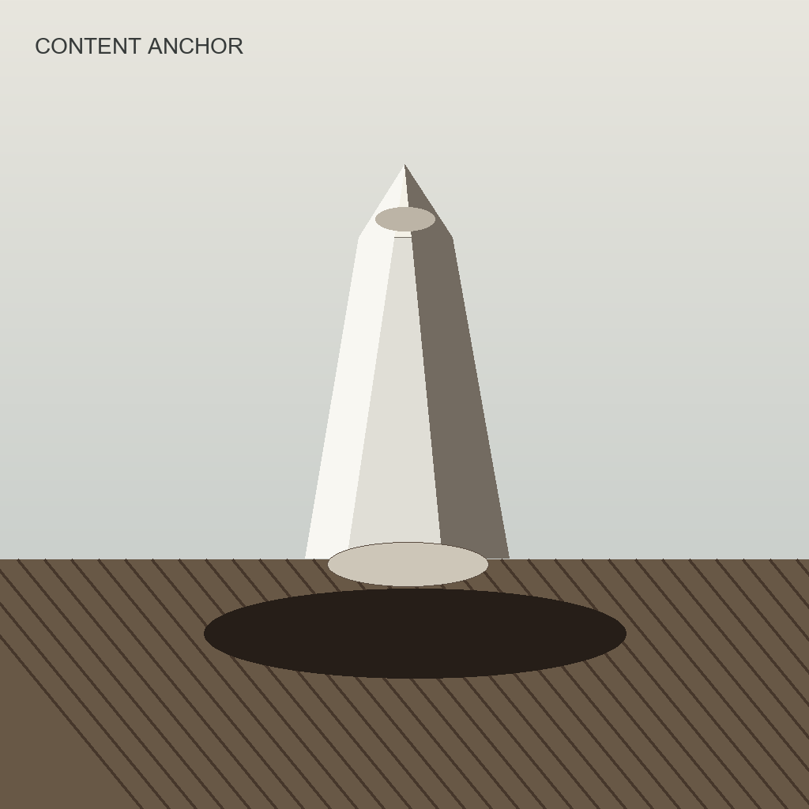 | 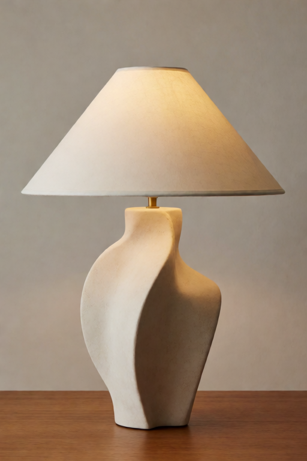 |

| Setting | Value |
| --- | --- |
| Recipe | `balanced` |
| Demo strength | `0.45` |
| Best for | General image reference behavior when one source should guide subject, camera, color, and mood. |
| Demo prompt | `a refined editorial product photograph of a sculptural table lamp on a simple wooden surface, calm neutral background, clean design, no readable text` |
| Demo seed | `972002` |
| Demo files | [embedded-workflow PNG](assets/krea-v9/demos/balanced.png), [workflow JSON](assets/krea-v9/demos/balanced.workflow.json) |

Use `balanced` when a source image should influence the result broadly, but no
single role needs to dominate. It is the best general-purpose starting point.

### Keep The Same Subject

| Source | Output |
| --- | --- |
|  | 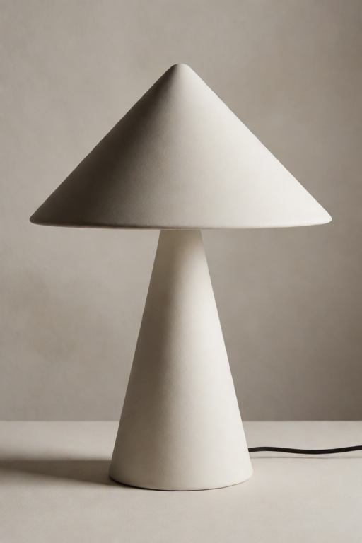 |

| Setting | Value |
| --- | --- |
| Recipe | `keep the same subject` |
| Demo strength | `0.80` |
| Best for | Product, character, outfit, person, or object consistency. |
| Demo prompt | `the same cone-shaped sculptural table lamp redesigned as a premium ceramic product, editorial studio photo, soft shadows, no readable text` |
| Demo seed | `972003` |
| Demo files | [embedded-workflow PNG](assets/krea-v9/demos/keep-same-subject.png), [workflow JSON](assets/krea-v9/demos/keep-same-subject.workflow.json) |

Use this when the core subject must remain recognizable. This is the one quick
recipe where high values such as `0.70` to `0.85` often make sense.

### Suggest The Visual Style

| Source | Output |
| --- | --- |
|  | 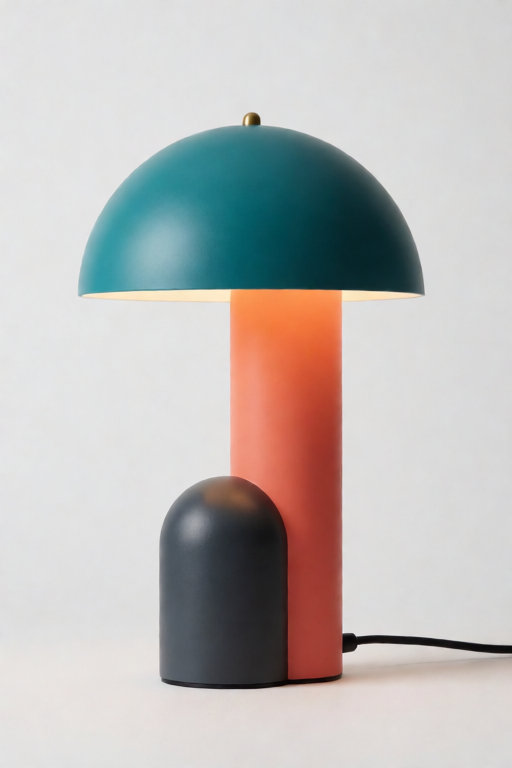 |

| Setting | Value |
| --- | --- |
| Recipe | `suggest the visual style` |
| Demo strength | `0.50` |
| Best for | Palette, finish, medium, art direction, and atmosphere. |
| Demo prompt | `a modern table lamp in a clean studio product photo, teal coral graphite art direction, abstract editorial styling, no readable text` |
| Demo seed | `972006` |
| Demo files | [embedded-workflow PNG](assets/krea-v9/demos/suggest-visual-style.png), [workflow JSON](assets/krea-v9/demos/suggest-visual-style.workflow.json) |

This is the main style-transfer recipe. It borrows palette and finish while
trying not to copy the style image's subject. The demo runs at `0.50`, where
the borrowed palette lands cleanly on a crisp subject; pushing toward `0.65`
transfers even harder but can start softening the subject's surfaces, and
dropping toward `0.35` keeps just a hint of the palette.

### Copy Lighting And Mood

| Source | Output |
| --- | --- |
|  | 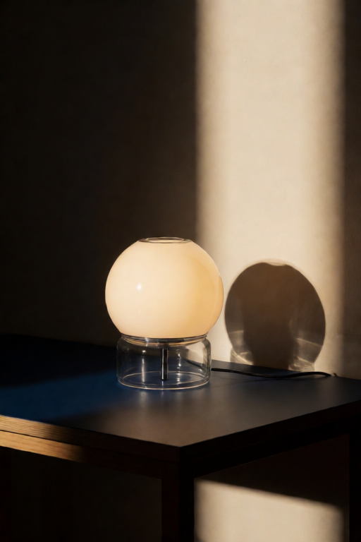 |

| Setting | Value |
| --- | --- |
| Recipe | `copy lighting and mood` |
| Demo strength | `0.42` |
| Best for | Light direction, shadow behavior, glow, haze, contrast, and color cast. |
| Demo prompt | `a spherical glass desk lamp on a dark blue tabletop, dramatic warm side beam, cinematic shadow, minimal editorial product photo, no readable text` |
| Demo seed | `972005` |
| Demo files | [embedded-workflow PNG](assets/krea-v9/demos/copy-lighting-mood.png), [workflow JSON](assets/krea-v9/demos/copy-lighting-mood.workflow.json) |

Use this when you want atmosphere without identity. It is useful for product
shots, interiors, mood boards, and cinematic color direction.

### Suggest Material Or Texture

| Source | Output |
| --- | --- |
| 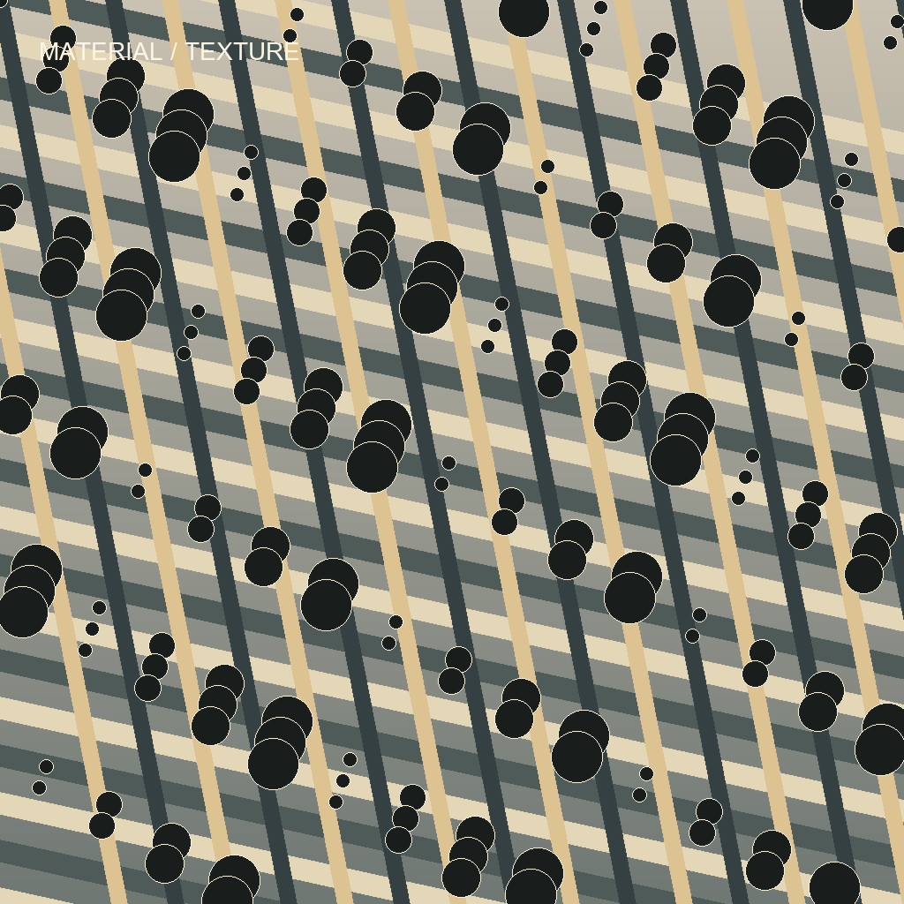 | 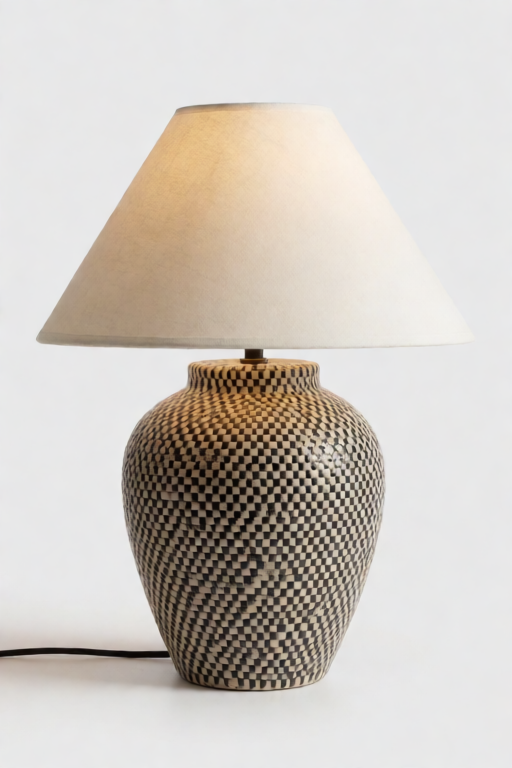 |

| Setting | Value |
| --- | --- |
| Recipe | `suggest material or texture` |
| Demo strength | `0.36` |
| Best for | Woven ceramic, stone, paper grain, fabric, brushed metal, painted finish, and other surface qualities. |
| Demo prompt | `a handcrafted ceramic table lamp with woven black-and-cream surface texture, editorial product photo, clean unmarked design` |
| Demo seed | `972007` |
| Demo files | [embedded-workflow PNG](assets/krea-v9/demos/suggest-material-texture.png), [workflow JSON](assets/krea-v9/demos/suggest-material-texture.workflow.json) |

Use this for material feel. If the exact pattern copies too strongly, lower
strength or use manual tuning with lower `Small details kept`.

### Copy Pose And Layout

| Source | Output |
| --- | --- |
|  | 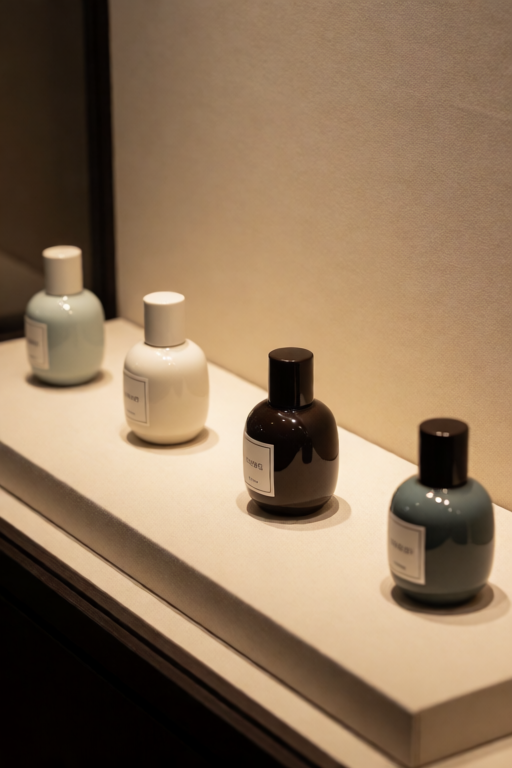 |

| Setting | Value |
| --- | --- |
| Recipe | `copy pose and layout` |
| Demo strength | `0.38` |
| Best for | Broad placement, camera angle, pose, crop, and spacing without copying the subject. |
| Demo prompt | `four small ceramic fragrance bottles arranged on a diagonal display shelf, refined product photography, warm gallery light, no readable text` |
| Demo seed | `972004` |
| Demo files | [embedded-workflow PNG](assets/krea-v9/demos/copy-pose-layout.png), [workflow JSON](assets/krea-v9/demos/copy-pose-layout.workflow.json) |

This recipe borrows structure. It suppresses color, subject identity, and exact
texture so the prompt can decide what appears inside that layout.

### Copy Big Shapes Only

| Source | Output |
| --- | --- |
| 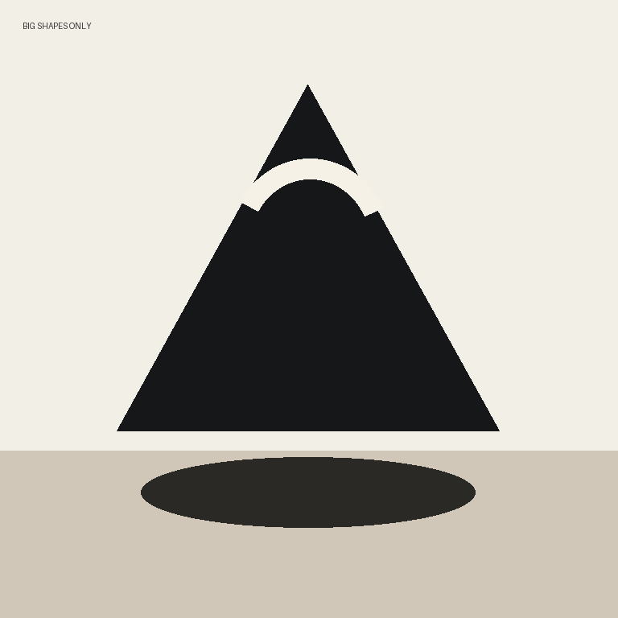 | 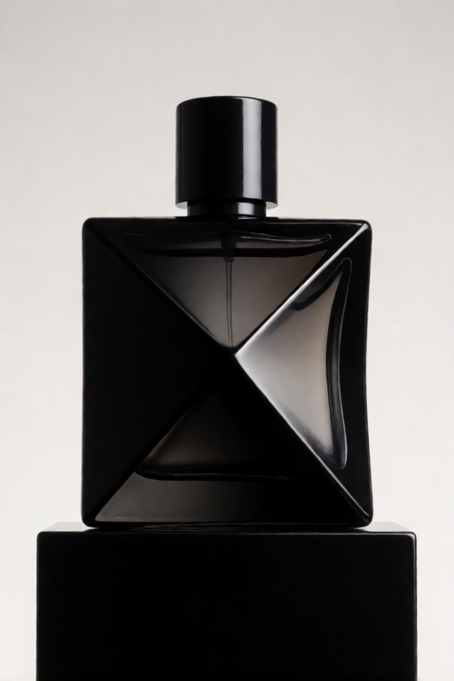 |

| Setting | Value |
| --- | --- |
| Recipe | `copy big shapes only` |
| Demo strength | `0.34` |
| Best for | Broad geometry, silhouette, massing, and spacing. |
| Demo prompt | `a black sculptural perfume bottle with a bold triangular silhouette on a plinth, luxury product photo, minimal background, no readable text` |
| Demo seed | `972008` |
| Demo files | [embedded-workflow PNG](assets/krea-v9/demos/copy-big-shapes-only.png), [workflow JSON](assets/krea-v9/demos/copy-big-shapes-only.workflow.json) |

Shape-only mode intentionally removes color and detail influence. Use it when
the reference has the silhouette you want, but the prompt should decide the
object, material, and finish.

### Avoid Copying Text/Logos

| Source | Output |
| --- | --- |
| 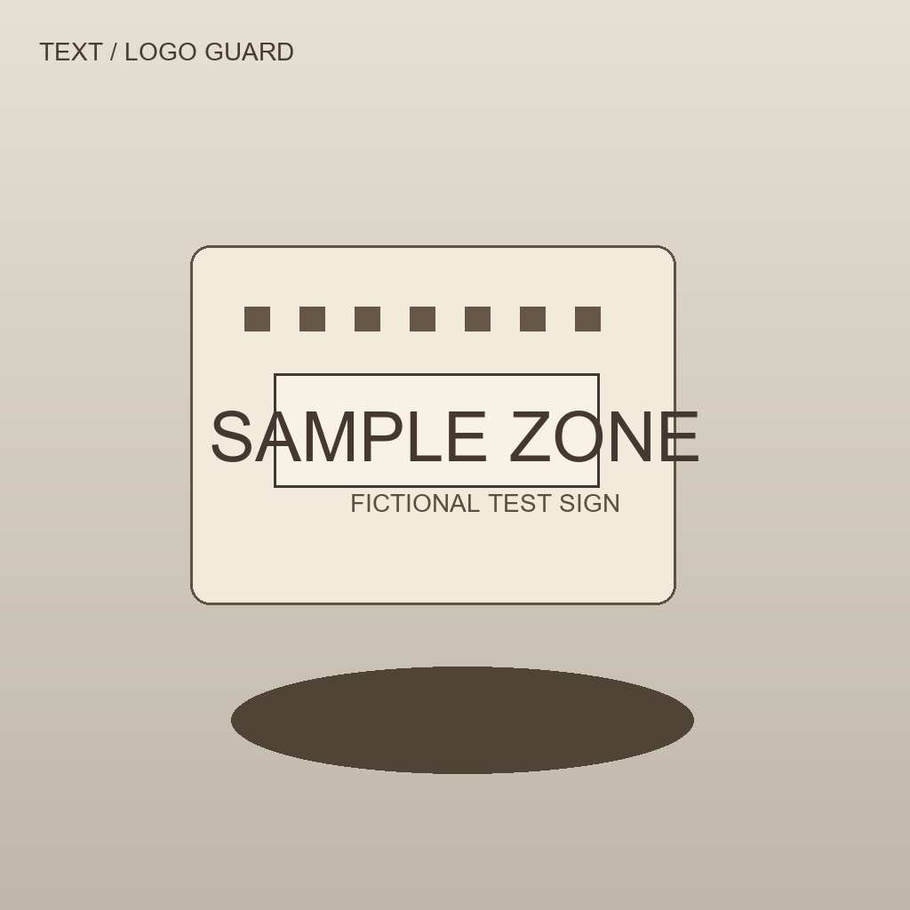 | 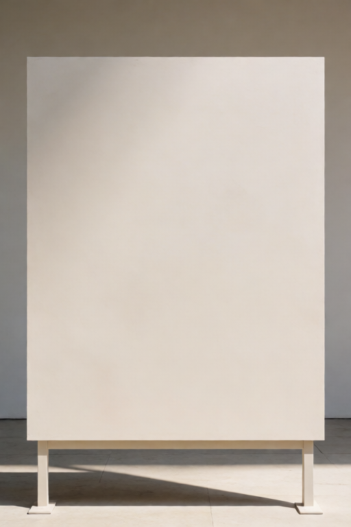 |

| Setting | Value |
| --- | --- |
| Recipe | `avoid copying text/logos` |
| Demo strength | `0.03` |
| Best for | Signs, logos, UI, labels, screenshots, packaging labels, and letter-like marks. |
| Demo prompt | `a clean gallery sign on a simple stand with a smooth blank center panel, plain unmarked surface, no readable words, no letters, no logo, soft daylight` |
| Demo seed | `972009` |
| Demo files | [embedded-workflow PNG](assets/krea-v9/demos/avoid-copying-text-logos.png), [workflow JSON](assets/krea-v9/demos/avoid-copying-text-logos.workflow.json) |

Keep strength very low. Pair this recipe with blank-surface prompt wording such
as `blank`, `unmarked`, `plain`, `clean`, or `empty panel`.

### Manual Tuning

| Source | Output |
| --- | --- |
|  | 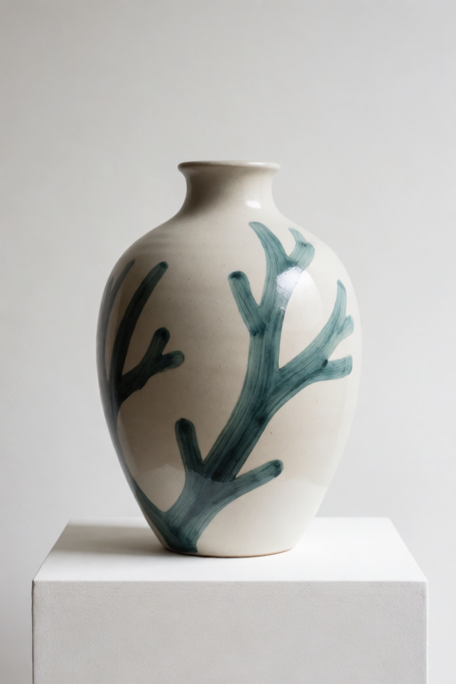 |

| Setting | Value |
| --- | --- |
| Recipe | `manual tuning` |
| Demo strength | `0.42` |
| Best for | Deliberate custom combinations of style, shape, lighting, detail, timing, and preprocessing. |
| Demo prompt | `a smooth ceramic vase on a white plinth, editorial product photograph, hand painted teal coral graphite accents, clean unmarked surface, soft studio light` |
| Demo seed | `972001` |
| Demo files | [embedded-workflow PNG](assets/krea-v9/demos/manual-tuning.png), [workflow JSON](assets/krea-v9/demos/manual-tuning.workflow.json) |

Manual mode is for deliberate control. In this demo the card borrows
`colors and art style` with a `palette wash` prep, keeps `Shape copied` alive
at `0.8`, and studies the reference coarsely (`256`). The palette wash - not
a muted shape dial - provides the structure safety: it destroys the source's
geometry before Krea studies it, so the live shape pull carries palette and
finish only. On Krea 2 `Overall style reach` has no effect (the model
exposes no pooled channel), so never rely on it to carry a look.

## Manual Controls

Manual controls count only when `Use image for` is `manual tuning`. In quick
recipe mode, the recipe supplies tested values for the lower controls.

| Control | Use it for |
| --- | --- |
| `Manual mode borrows` | Choose the ingredient: style, palette, layout, framing, identity, environment, lighting, mood, material, shape, or text/logo safety. |
| `Prepare image by` | Simplify the source before Krea studies it: grayscale, blur, palette wash, color wash, shape cleanup, or original image. |
| `Color kept` | Lower it when you want shape or layout without palette influence. |
| `Small details kept` | Lower it to avoid exact grain, letters, tiny marks, and over-copying. |
| `Study this image at` | Override the global image detail level for this one card. |
| `Frame this reference by` | Override the global framing mode for this one card. |
| `Subject copying` | Tell the stack whether the source subject should be avoided, allowed, or preserved. |
| `Early layout guidance` | Controls how much the card helps early composition when timing is smart or two-phase. |
| `Final detail copying` | Controls how much late detail can come through near the end. |
| `Maximum image pull` | Caps a manual card even if the main strength is high. |
| `Shape copied` | The card's main transfer volume on Krea 2. Keep it alive (`0.7`-`1.0`) even for pure style/palette/lighting/material work - what keeps those jobs structure-safe is a structure-destroying `Prepare image by` (palette wash), not a near-zero shape. Below ~`0.4` the card is effectively silent. |
| `Overall style reach` | Pooled overall-look pull. **Inert on Krea 2** (this model's text encoder has no pooled channel) - kept for other models. If manual style is too subtle, raise `Shape copied` under a palette-wash prep instead. |

## Reference Stack Encoder

The stack encoder receives your Krea CLIP, your final prompt, and up to 12 guide
cards. It turns them into the positive conditioning that goes into KSampler.

| Control | Starting advice |
| --- | --- |
| `Written prompt strength` | Use `1.0` as normal. Raise it when the prompt should win over references. Use `0.0` for blank-prompt image mixing. |
| `Image slider feel` | `artist friendly` is the best default. `extra gentle` helps when references dominate at low values. |
| `Image detail level` | Low is safer and looser. High studies more detail, which can help exact style but can also over-copy. |
| `Image framing` | Keep full image shape unless a reference should be center-cropped or stretched to square before study. |
| `When images guide` | `smart per-card timing` lets each card use its resolved early and late behavior. This is the default. |
| `Text/logo guard prompt handling` | `full guard` rewrites marking words into blank-surface language. `gentle guard` keeps your prompt words and appends protection. |

## Starting Strengths

| Strength | What it usually means | Good uses |
| --- | --- | --- |
| `0.00` | Off. | Keep a card connected but inactive. |
| `0.03` to `0.08` | Tiny nudge. | Text/logo guard, shape hints, stubborn prompts. |
| `0.10` to `0.25` | Gentle guidance. | Layout, material, mood-board influence. |
| `0.25` to `0.45` | Strong guidance. | Lighting, texture, pose, broad style. |
| `0.50` to `0.90` | Very strong. | Content anchor or deliberate style transfer. Watch for over-copying. |

## Multi-Reference Recipes

| Scenario | Setup |
| --- | --- |
| Product variation | `keep the same subject` for the product, `suggest the visual style` for art direction, and `copy lighting and mood` for the lighting reference. |
| Style onto content | Image 1 is `keep the same subject`; image 2 is `suggest the visual style`. Leave the prompt blank for pure image-to-image style mixing. |
| Packaging or UI safety | Use a normal product/layout card, then add `avoid copying text/logos` for labels, signs, screens, or logo-shaped panels. |
| Layout plus material | Use `copy pose and layout` for composition, then `suggest material or texture` for surface feel. |

Typical four-card stack:

```text
Reference 1: keep the same subject, strength 0.80
Reference 2: suggest the visual style, strength 0.45 to 0.65
Reference 3: copy lighting and mood, strength 0.30 to 0.45
Reference 4: avoid copying text/logos, strength 0.03
```

## Embedded Demo Workflows

Drag any individual PNG below into ComfyUI to load the matching workflow:

| Recipe | PNG | JSON |
| --- | --- | --- |
| Manual tuning | [manual-tuning.png](assets/krea-v9/demos/manual-tuning.png) | [manual-tuning.workflow.json](assets/krea-v9/demos/manual-tuning.workflow.json) |
| Balanced | [balanced.png](assets/krea-v9/demos/balanced.png) | [balanced.workflow.json](assets/krea-v9/demos/balanced.workflow.json) |
| Keep the same subject | [keep-same-subject.png](assets/krea-v9/demos/keep-same-subject.png) | [keep-same-subject.workflow.json](assets/krea-v9/demos/keep-same-subject.workflow.json) |
| Copy pose and layout | [copy-pose-layout.png](assets/krea-v9/demos/copy-pose-layout.png) | [copy-pose-layout.workflow.json](assets/krea-v9/demos/copy-pose-layout.workflow.json) |
| Copy lighting and mood | [copy-lighting-mood.png](assets/krea-v9/demos/copy-lighting-mood.png) | [copy-lighting-mood.workflow.json](assets/krea-v9/demos/copy-lighting-mood.workflow.json) |
| Suggest the visual style | [suggest-visual-style.png](assets/krea-v9/demos/suggest-visual-style.png) | [suggest-visual-style.workflow.json](assets/krea-v9/demos/suggest-visual-style.workflow.json) |
| Suggest material or texture | [suggest-material-texture.png](assets/krea-v9/demos/suggest-material-texture.png) | [suggest-material-texture.workflow.json](assets/krea-v9/demos/suggest-material-texture.workflow.json) |
| Copy big shapes only | [copy-big-shapes-only.png](assets/krea-v9/demos/copy-big-shapes-only.png) | [copy-big-shapes-only.workflow.json](assets/krea-v9/demos/copy-big-shapes-only.workflow.json) |
| Avoid copying text/logos | [avoid-copying-text-logos.png](assets/krea-v9/demos/avoid-copying-text-logos.png) | [avoid-copying-text-logos.workflow.json](assets/krea-v9/demos/avoid-copying-text-logos.workflow.json) |

If a loaded demo reports missing images, copy
`example_assets/krea-reference-examples/` into your ComfyUI `input/` folder so
paths such as `krea-reference-examples/slot1_content_anchor.png` resolve.

## Troubleshooting

| Problem | What to try |
| --- | --- |
| The reference is too strong. | Lower card strength, switch `Image slider feel` to `extra gentle`, or raise `Written prompt strength`. |
| The prompt is ignored. | Raise `Written prompt strength`, reduce the strongest card, or use more specific prompt language. |
| Style changes the subject. | Lower style strength, use `suggest the visual style`, or in manual mode lower `Shape copied`. |
| Material copies too literally. | Lower strength, lower `Small details kept`, or use `suggest material or texture`. |
| Text or logos appear. | Use `avoid copying text/logos`, strength around `0.03`, low detail, and blank-surface prompt wording. |
| Layout gets too tight. | Lower the layout card, use `smart per-card timing`, or reduce `Final detail copying` in manual mode. |

## Companion Files

- [V9 documentation index](krea-v9-documentation-index.md)
- [V9 visual HTML guide](krea-v9-user-guide.html)
- [Guide Card node docs](nodes/kg-krea-2-image-guide-card-v9.md)
- [Reference Stack node docs](nodes/kg-krea-2-reference-stack-encoder-v9.md)
- [Example workflows](../example_workflows/README.md)
