# Recipe Visual Guide

One picture per recipe: every built-in quick recipe and every bundled custom
recipe on the V10 guide card, each shown doing its job.

**How to read each figure.** Left is the reference image the card was given.
Middle is what the prompt renders with **no card connected**. Right is the
same prompt with **one guide card** set to the recipe named in the caption,
at the strength shown. Everything else - model, seed, steps, resolution - is
identical between the middle and right panels, so any difference is the
card's doing.

**Test conditions.** Krea 2 turbo, 512x512, 8 steps, one card per stack,
`When this card guides` left at its default (`smart per-card timing`), fixed
seed. The strengths shown are each recipe's documented starting strength -
the value its description tells you to try first. Prompts end with "no
readable text" so that any lettering you see (or don't see) comes from the
reference handling, not the prompt.

**References.** Museum and library images are public-domain/open-access:
Cleveland Museum of Art (CMA, CC0) and Library of Congress (LOC). The rest
were generated for this guide. Several deliberately stress a recipe (a
lettered poster for the text guard, a cluttered pattern for the palette).

**Shared prompts.** The demos reuse a small set of prompts so results stay
comparable:

| Name | Prompt |
| --- | --- |
| plain teapot | a simple ceramic teapot on a plain table, no readable text |
| desk teapot | a ceramic teapot on a wooden desk beside a window, morning light, a small stack of books nearby, no readable text |
| sunny dog | a friendly golden retriever sitting in a sunny park, no readable text |
| park dog | a friendly golden retriever sitting in a park, no readable text |
| cafe teapot | the same teapot on a wooden cafe table, warm evening light, cozy atmosphere, no readable text |
| park person | a person standing in a sunlit park, no readable text |
| plaza walker | a person walking through a city plaza in the morning, no readable text |

Jump to: [Built-in recipes](#built-in-recipes) ·
[Starter pack](#starter-pack) · [Designer artwork pack](#designer-artwork-pack) ·
[Edit and composite pack](#edit-and-composite-pack)

Related reading: the [V10 user guide](krea-v10-user-guide.md) explains every
widget; the [Recipe Kit](../custom_recipes/README.md) is where the bundled
packs live and where you write your own; the
[technical reference](krea-v10-technical-paper.md) has the conditioning math.

---

## Built-in recipes

The twelve `Use image for` choices that ship in the card itself, in dropdown
order.

### balanced

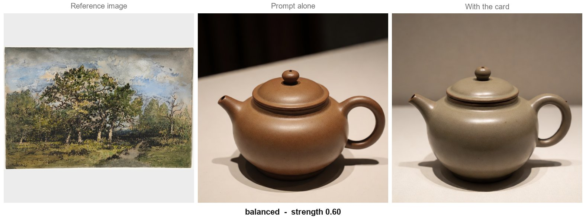

Ref: Diaz forest landscape (CMA 2008.389) · prompt: plain teapot · strength 0.60

**What you see:** a gentle, general pull - the landscape's warm woodland
palette and soft mood settle over the scene while the teapot stays exactly a
teapot. **Tips:** this is the safe default when you are not sure which recipe
you want; it borrows a little of everything and rarely surprises.

### keep the same subject

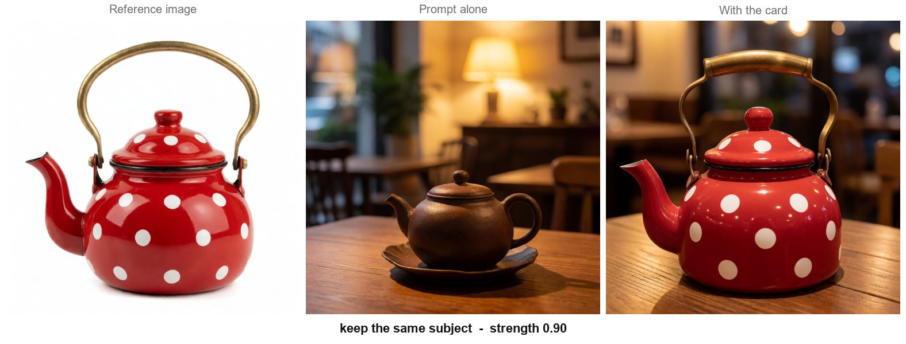

Ref: generated product shot of a red polka-dot kettle · prompt: cafe teapot · strength 0.90

**What you see:** the exact kettle - red enamel, white dots, brass handle -
transplanted onto the cafe table, in the prompt's warm evening light.
**Tips:** this recipe wants high strength (0.8-0.9). Clean product-style
references on plain backgrounds carry the subject most faithfully; a busy
reference also carries its surroundings (see `carry the subject over` in the
edit pack for the same lesson).

### copy pose and layout

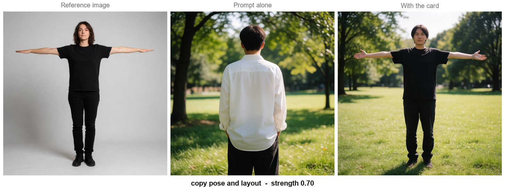

Ref: generated figure with arms spread wide · prompt: park person · strength 0.70

**What you see:** the person adopts the reference's exact pose - arms
straight out - and its centered, full-body placement, while face, clothing,
and park come from the prompt. **Tips:** the pose study is grayscale
internally; above about 0.7 it starts muting the result's colors. Stay near
0.7, or pair it with `suggest the color palette` on a second card if you need
to push harder.

### copy lighting and mood

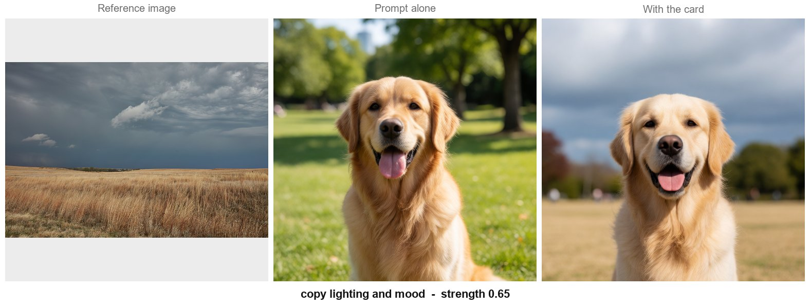

Ref: brewing storm over a field (LOC) · prompt: sunny dog · strength 0.65

**What you see:** the storm wins the argument with "sunny": the sky darkens,
the light goes low and dramatic, and the dog and park stay put. **Tips:**
lands from about 0.65; push toward 0.9 for full drama. Sky-dominant
references transfer their light best.

### suggest the visual style

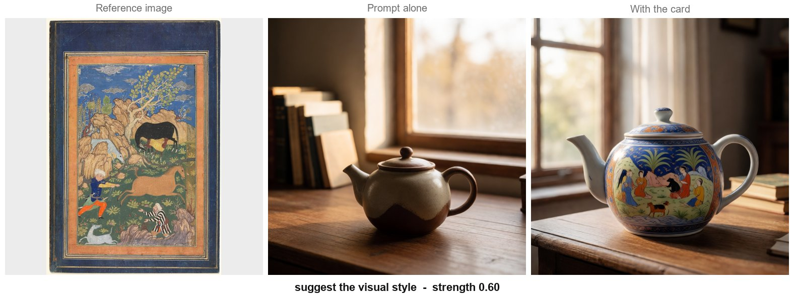

Ref: Persian miniature, Rustam asleep (CMA 1971.305) · prompt: desk teapot · strength 0.60

**What you see:** the whole image re-rendered in the miniature's painted
language - the teapot becomes ornamented porcelain carrying a tiny
hunting-scene, still sitting on a believable sunlit desk. **Tips:** give the
prompt a real scene to own (a bare prompt invites the reference to furnish
the background). Crop away mats, borders, and margins from artwork photos -
full-bleed references restyle; bordered ones arrive as framed objects.

### suggest material or texture

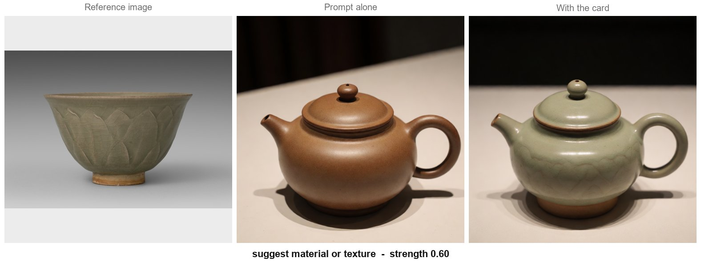

Ref: carved celadon bowl (CMA 1930.308) · prompt: plain teapot · strength 0.60

**What you see:** the teapot keeps its exact shape but changes material -
sea-green crackle glaze, faint carved relief under the surface, an unglazed
clay foot ring. Material without shape. **Tips:** 0.55-0.65 is the sweet
spot; higher starts nudging the silhouette toward the reference vessel.

### copy big shapes only

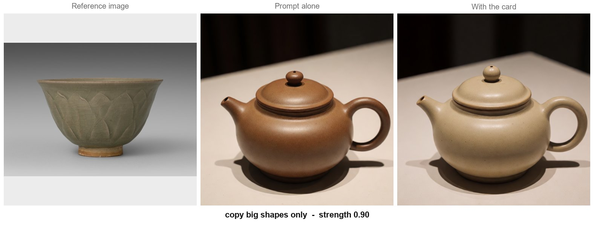

Ref: carved celadon bowl (CMA 1930.308) · prompt: plain teapot · strength 0.90

**What you see:** the teapot's body swells rounder and fuller, toward the
bowl's massing, while spout, handle, and lid survive - structure moved, scene
kept. **Tips:** this recipe reads the reference as a blurred silhouette, so
it works best when the reference has one big simple mass. Thin line-art
shapes wash out to nothing, and a hint of the reference's overall tone can
ride along at high strength.

### avoid copying text/logos

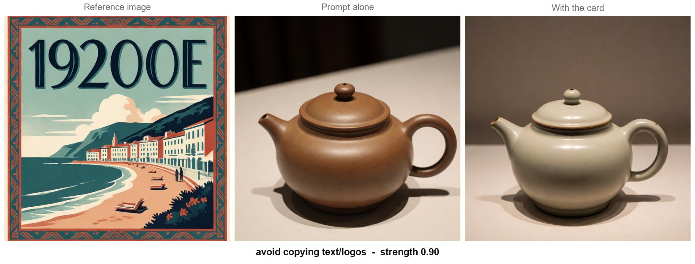

Ref: generated travel poster full of lettering · prompt: plain teapot · strength 0.90

**What you see:** almost nothing - which is the point. Even at strength 0.90
the guard clamps the card to a whisper: no lettering, no poster layout, just
the faintest tone shift. **Tips:** use this when a reference you need has
words or logos on it; the guard keeps surfaces clean no matter how high the
slider goes.

### suggest the color palette

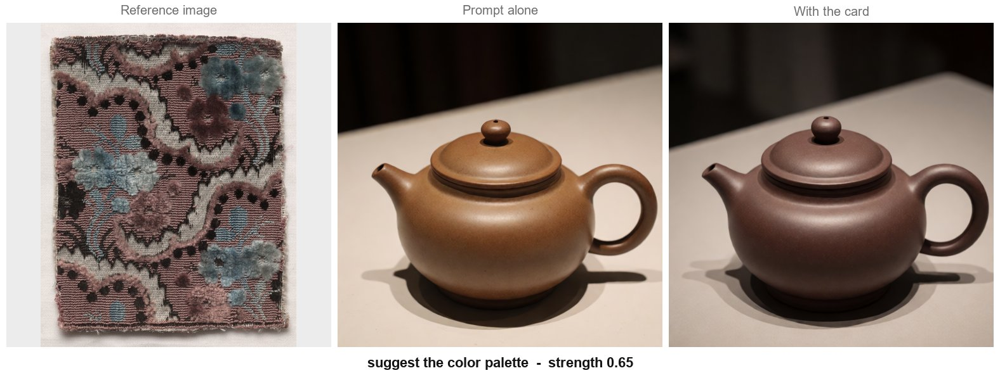

Ref: silk textile fragment (CMA 1940.480) · prompt: plain teapot · strength 0.65

**What you see:** the textile's palette washes the scene - the teapot and
table take on its dye colors - with none of its pattern or weave. **Tips:**
0.65 gives a clear two-tone statement; 0.9 becomes a soft overall wash.

### use the background/setting

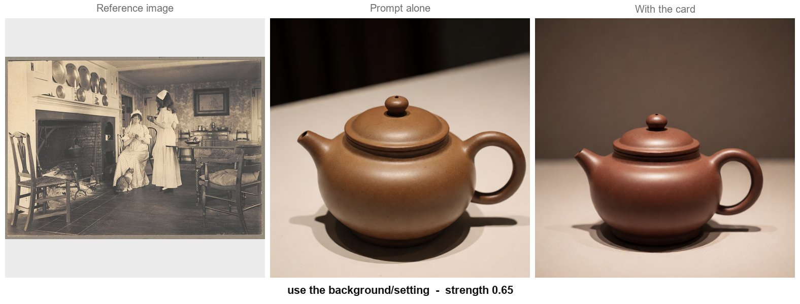

Ref: colonial street houses (LOC) · prompt: plain teapot · strength 0.65

**What you see:** the place arrives as mood - warm colonial brick-and-cream
tones behind and around the subject - rather than as literal houses pasted
in. **Tips:** this recipe is deliberately subtle; it colors the setting
rather than rebuilding it. If you want the reference to *be* the backdrop,
see `use the background only` in the edit pack, which pushes the same idea
harder.

### copy the camera framing

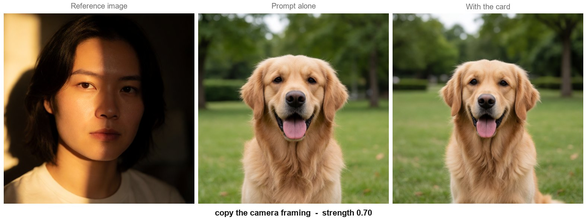

Ref: generated golden-hour portrait · prompt: park dog · strength 0.70

**What you see:** the portrait's camera character - subject-centered
framing and shallow depth of field, the park melting into bokeh. **Tips:**
like the pose recipe, framing rides a grayscale study: past about 0.7 the
color starts draining toward the reference's tonal study. It also works best
when reference and prompt content roughly match (portrait onto portrait);
the effect at color-safe strengths is a lean, not a shove.

### mood board only

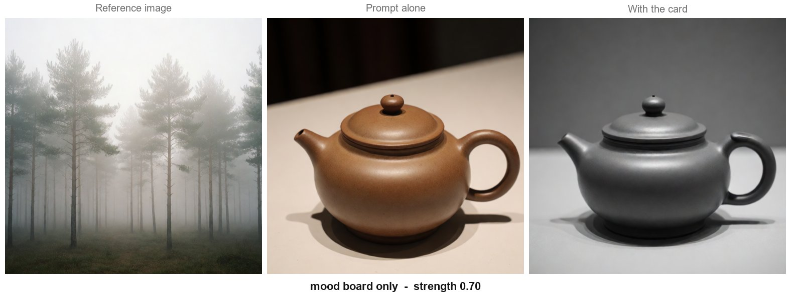

Ref: generated foggy forest · prompt: plain teapot · strength 0.70

**What you see:** the loosest pull of all - a cool, hushed, gray-green vibe
borrowed from the fog, nothing literal. **Tips:** this is the "inspiration,
not instruction" recipe; stack a few mood-board cards from different
references to average their feel.

---

## Starter pack

The five recipes in [`custom_recipes/starter-pack.yaml`](../custom_recipes/starter-pack.yaml) -
shipped examples of the custom-recipe format, enabled by default.

### borrow the weather

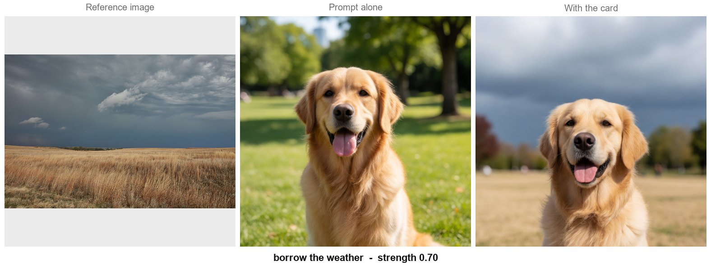

Ref: brewing storm over a field (LOC) · prompt: sunny dog · strength 0.70

**What you see:** the storm rolls in over the prompt's park - heavy sky,
pre-rain light - and the dog stays a cheerful dog. Compared with
`copy lighting and mood` on the same pair, this one is more about the sky
itself than the overall exposure. **Tips:** works from about 0.7; weather
lives in the whole image, so sky-heavy references carry best.

### borrow the clothing style

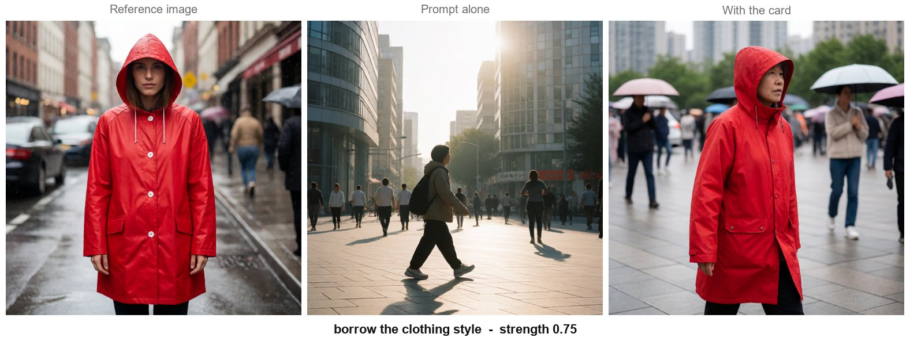

Ref: generated figure in a red hooded raincoat · prompt: plaza walker · strength 0.75

**What you see:** the walker now wears the reference's garment language -
bright red hooded raincoat - while remaining their own person in the
prompt's plaza. **Tips:** this recipe's `focus` field names the clothing and
skips the person; it is the shipped demonstration that a recipe can study
one aspect of an image.

### borrow drawing medium

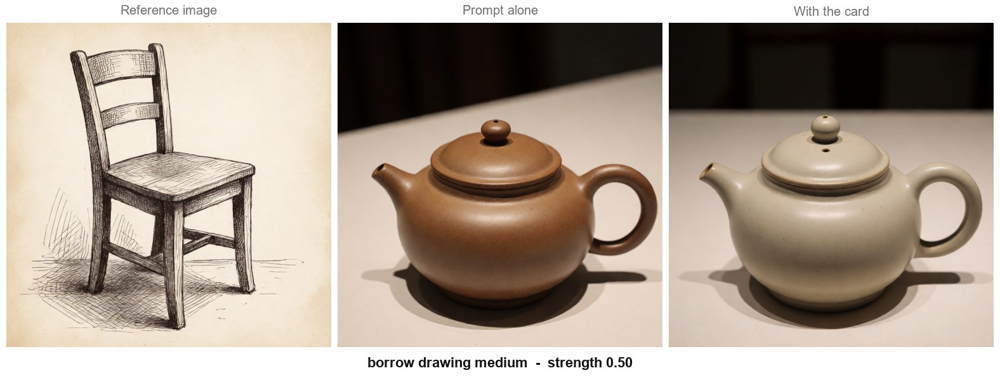

Ref: generated ink sketch of a chair · prompt: plain teapot · strength 0.50

**What you see:** a modest pull toward the sketch's graphic feel - and
honestly, only modest. **Tips:** this recipe is deliberately quiet: carrying
a line-art *medium* without also importing the drawing's *subject* is at the
edge of what the conditioning can do, and louder tunings start etching the
reference's chair into your scene. Treat it as a flavor card. For a full
graphic re-rendering, use `borrow the poster style` or
`suggest the visual style` instead.

### borrow photo finish

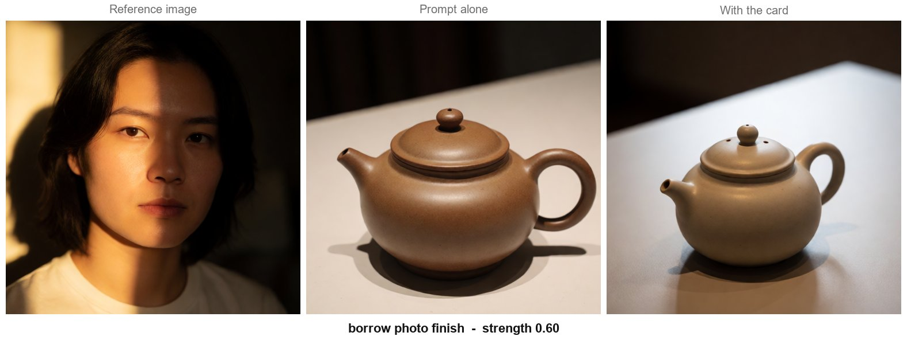

Ref: generated golden-hour portrait · prompt: plain teapot · strength 0.60

**What you see:** the photograph's finish lands on the ceramic still life -
warm golden cast, soft glowing highlights, gentle photographic depth.
**Tips:** lands between 0.55 and 0.65; by 0.75 the reference's people start
wanting into the scene.

### cinematic color grade

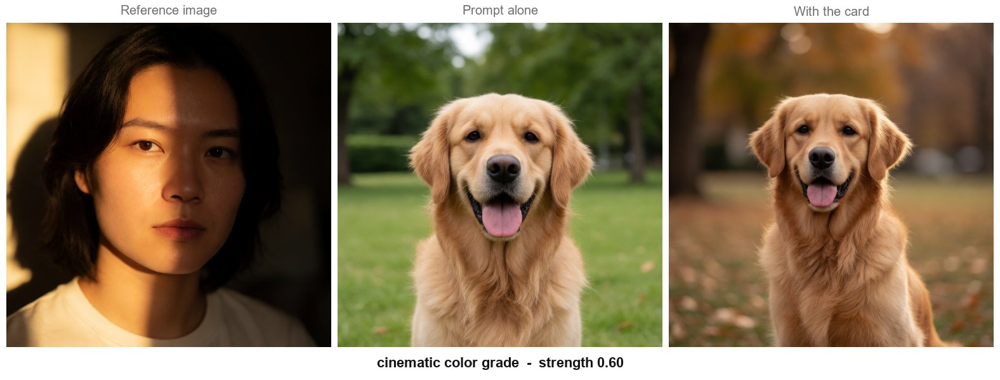

Ref: generated golden-hour portrait · prompt: park dog · strength 0.60

**What you see:** the portrait's grade applied like a LUT - warm amber
highlights, teal-leaning shadows - while the dog and park stay themselves.
**Tips:** palette-family recipes like this one are the safe way to push
color hard; they carry no structure at all.

---

## Designer artwork pack

The ten recipes in [`custom_recipes/designer-artwork-pack.yaml`](../custom_recipes/designer-artwork-pack.yaml),
for working *from* artwork: styles, materials, and two timing tools.

### borrow the poster style

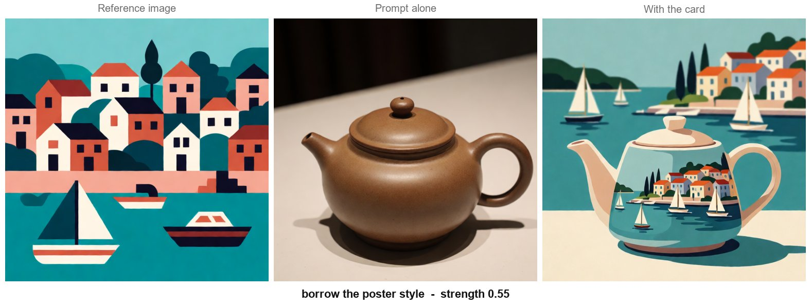

Ref: generated flat-graphic town scene (full-bleed) · prompt: plain teapot · strength 0.55

**What you see:** the scene re-drawn as a flat graphic poster - simplified
shapes, flat color fills, clean edges - without becoming a poster *object*.
**Tips:** feed it full-bleed artwork. A reference with borders or lettering
reads as a printed artifact, and the render will hang it on the wall or
stamp it on the pot instead of adopting its style. Crop first.

### borrow the soft media look

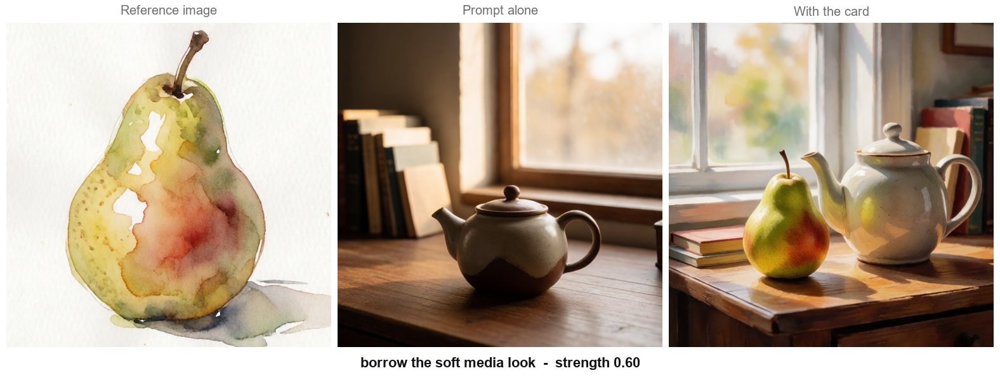

Ref: generated watercolor of a pear · prompt: desk teapot · strength 0.60

**What you see:** the whole desk scene rendered as genuine watercolor -
soft washes, pigment blooms, paper light. **Tips:** start at 0.6. The
medium lives on the reference's subject, so at higher strengths the pear may
join your scene; if it does, drop strength rather than fighting it with
wording.

### borrow the pattern energy

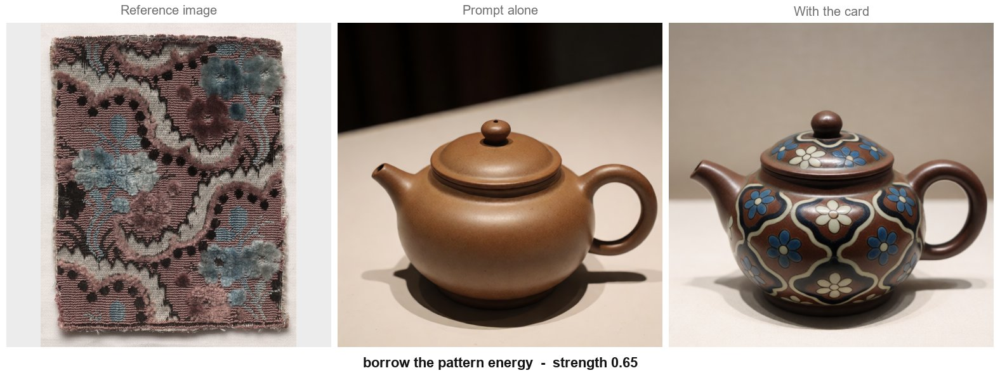

Ref: silk textile fragment (CMA 1940.480) · prompt: plain teapot · strength 0.65

**What you see:** the textile's motif rhythm decorating the teapot's
surfaces - ornament without copying any figure or word from the cloth.
**Tips:** works best with all-over pattern references (a pattern that
dominates its image transfers; a pattern in one corner does not). Start at
0.6-0.7.

### borrow the era print look

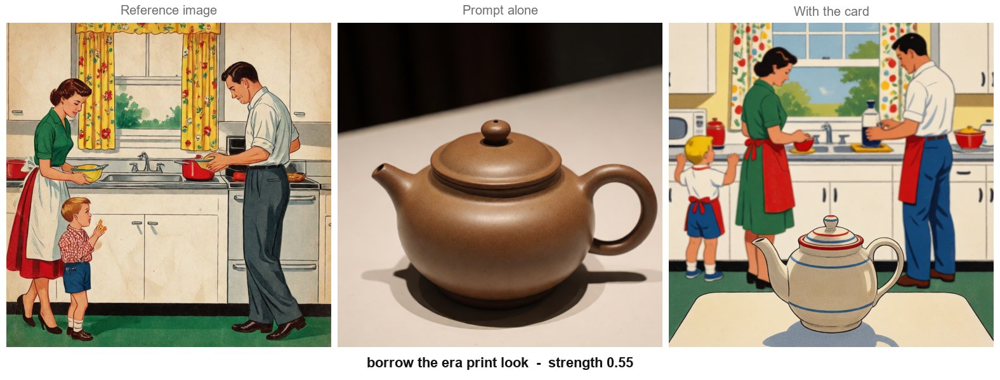

Ref: generated 1950s advertisement scene (full-bleed) · prompt: plain teapot · strength 0.55

**What you see:** the render takes on a vintage printed-page character -
period palette, ink softness, that slightly-yellowed plate feel. **Tips:**
same rule as the poster recipe: full-bleed period artwork restyles the
image; a bordered scan arrives as a framed print in the scene.

### borrow the paper and canvas

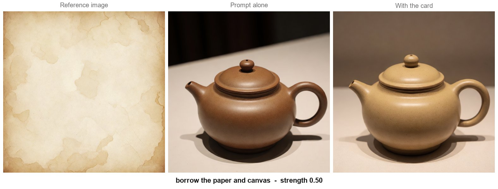

Ref: generated parchment sheet · prompt: plain teapot · strength 0.50

**What you see:** a warm cream substrate tone and soft paper surface settle
over the whole image, as if printed on the reference's stock. **Tips:** a
quiet recipe by design - it changes the ground the image sits on, not the
image. 0.5 is usually enough.

### borrow the metallic accents

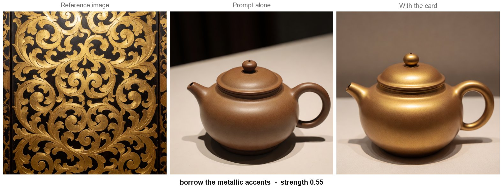

Ref: generated gilding sheet · prompt: plain teapot · strength 0.55

**What you see:** gilt arrives where highlights live - rims, lid, spout
edges pick up metallic sheen and warm reflectivity. **Tips:** sheen is a
coarse cue and transfers reliably; expect accents, not full gold plating.

### borrow the ornament borders

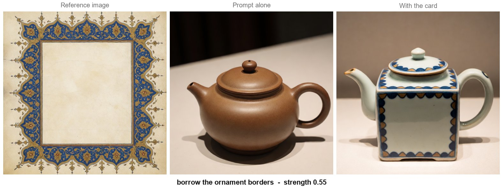

Ref: generated ornamental border page · prompt: plain teapot · strength 0.55

**What you see:** decorative border framing arrives around the composition -
the one recipe family where "arrives as a framed page" is the goal, not the
bug. **Tips:** it keeps the full reference frame on purpose (`Frame this
reference by` is set to keep the whole page). Ornament transfers; any
lettering in the reference should still be cropped away.

### borrow the stained glass look

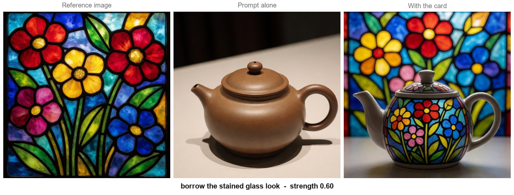

Ref: generated stained-glass floral panel · prompt: plain teapot · strength 0.60

**What you see:** the teapot rendered *as* leaded glass - bold dark lead
lines, jewel-tone fills, translucent glow. **Tips:** with a sparse prompt
the glass will happily fill the backdrop too (as here); describe your
background if you want it kept plain. Lead lines and glass fields are
coarse cues, so this recipe lands consistently.

### style the finish only

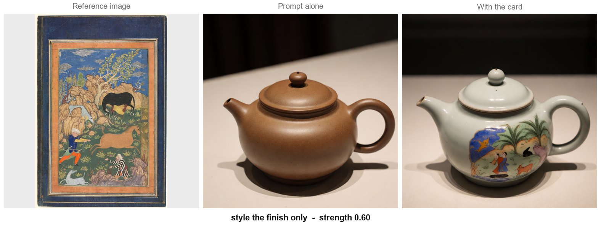

Ref: Persian miniature, Rustam asleep (CMA 1971.305) · prompt: plain teapot · strength 0.60

**What you see:** the prompt's own composition, painted in the miniature's
colors and surface finish at the end of the render - layout untouched,
skin re-dressed. **Tips:** this is a timing tool: the card guides only the
late, detail-writing phase. Because it paints finishes, it can paint
figurative motifs onto surfaces; drop strength if that is unwanted.

### style the layout first

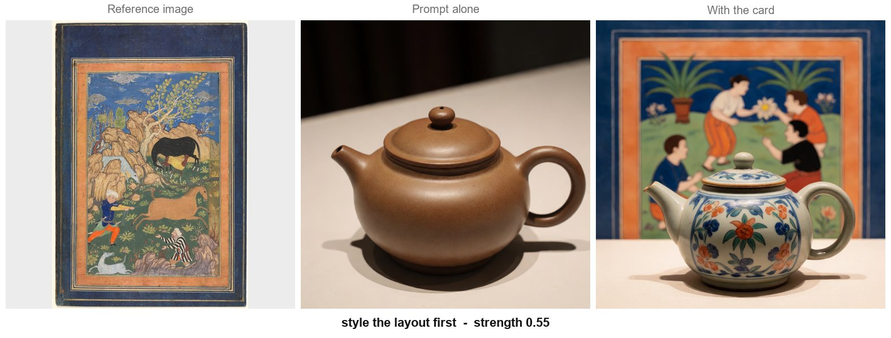

Ref: Persian miniature, Rustam asleep (CMA 1971.305) · prompt: plain teapot · strength 0.55

**What you see:** the mirror of finish-only: the artwork steers the early,
structure-writing phase, so its compositional bones shape the image - and
the painterly look that rides in early tends to stay to the end. **Tips:**
compare this figure with `style the finish only` above (same reference, same
seed): two visibly different regimes from one artwork. Use whichever half of
"style" you actually want.

---

## Edit and composite pack

The five recipes in [`custom_recipes/edit-composite-pack.yaml`](../custom_recipes/edit-composite-pack.yaml),
for matching elements across images when editing or compositing.

### match the scene light

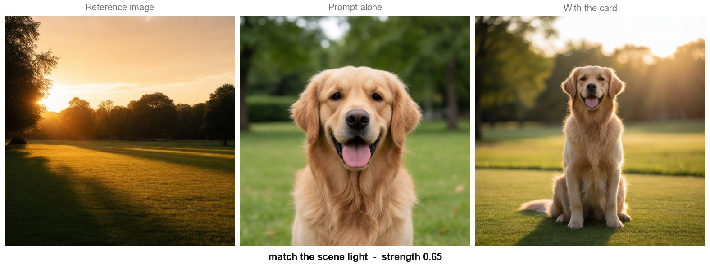

Ref: generated golden-hour park (no people) · prompt: park dog · strength 0.65

**What you see:** the reference's late-afternoon light relights the prompt -
long warm light, glowing grass - so the dog looks shot in the reference's
hour. **Tips:** use a *scene plate* (backdrop, empty set) as the reference.
If the light you want is falling on a person in the reference, the recipe's
person-skip empties it out - photograph the light, not the model.

### match the monochrome look

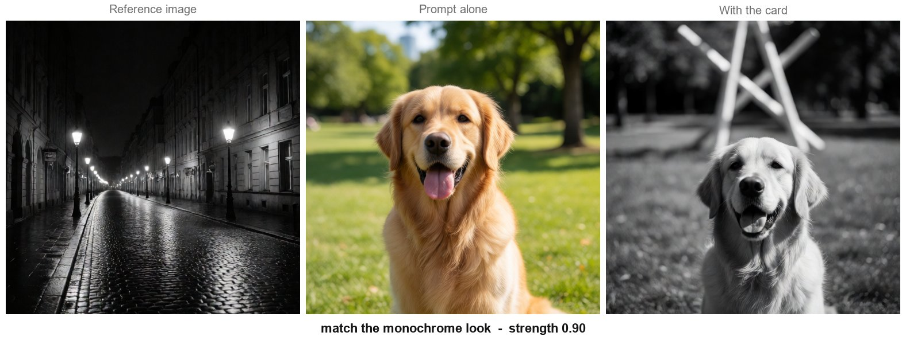

Ref: generated black-and-white street photo · prompt: sunny dog · strength 0.90

**What you see:** full commitment to black and white on a color prompt -
the reference's tonal contrast character, not just desaturation. **Tips:**
this recipe *wants* 0.9; at moderate strengths it stays silent rather than
half-tinting. People-heavy monochrome references can re-stage their people;
prefer texture/street/architecture shots.

### match the atmosphere

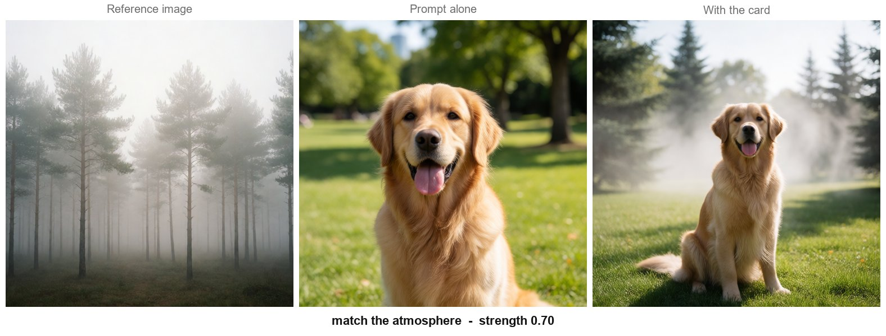

Ref: generated foggy forest · prompt: sunny dog · strength 0.70

**What you see:** fog banks, diffuse light, and distance fade wrap the
park - real atmospheric depth, not a gray filter. **Tips:** atmosphere is a
strong source; expect a little of the reference's vegetation flavor in
distant greenery. Lands from 0.65.

### use the background only

Ref: colonial street houses (LOC) · prompt: plain teapot · strength 0.65

**What you see:** the reference's setting arrives as a clean backdrop
mood - warm colonial brown and cream around the subject - with no houses
pasted into the scene and the teapot untouched. **Tips:** the compositing
sibling of the built-in `use the background/setting`; it mutes the
reference's subject harder so busier references stay usable.

### carry the subject over

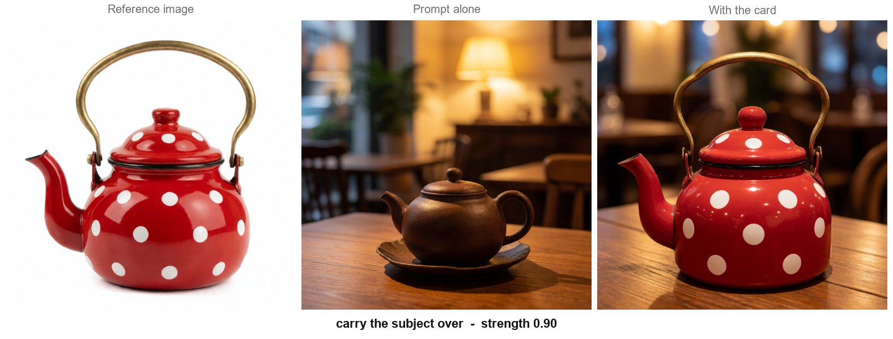

Ref: generated product shot of a red polka-dot kettle · prompt: cafe teapot · strength 0.90

**What you see:** the kettle carried into the cafe scene at full fidelity -
enamel, dots, brass handle - sitting naturally in the prompt's evening
light. **Tips:** the card reads the reference's *context* along with its
subject and re-interprets it (a cluttered workshop reference will re-stage
props around the subject as scene-appropriate objects). A clean
product-style shot on a plain background carries only the subject - that is
the escape hatch, and the reason this figure's reference looks like a
catalog photo.

---

## Reproducing these figures

Each right-hand panel is one V10 guide card feeding one V10 stack encoder,
`Use image for` set to the recipe named in the caption, strength as shown,
every other widget at its default. The [user guide](krea-v10-user-guide.md)
walks through the same setup step by step, and
[example_workflows/](../example_workflows/README.md) has ready-made graphs
to drop a reference into.
