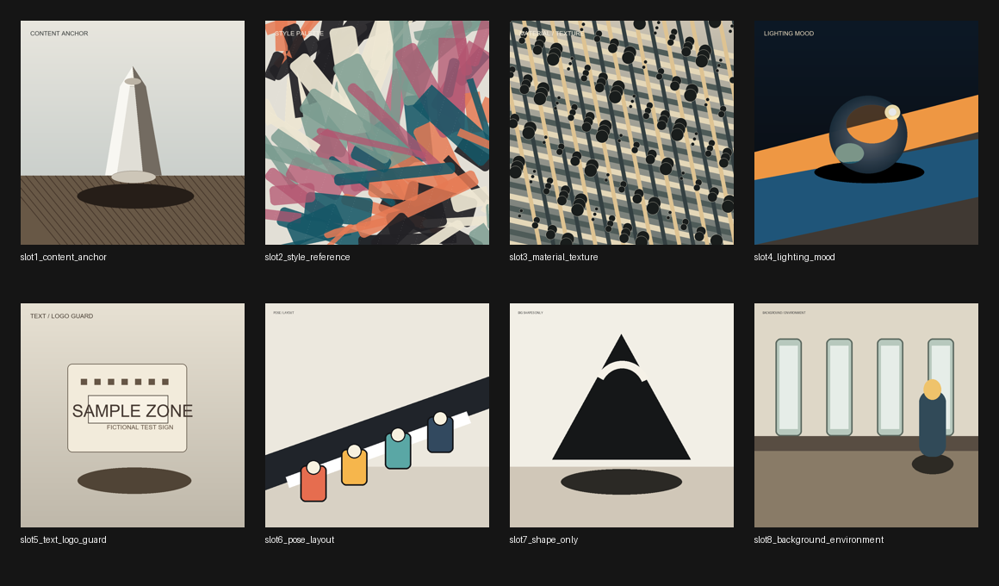
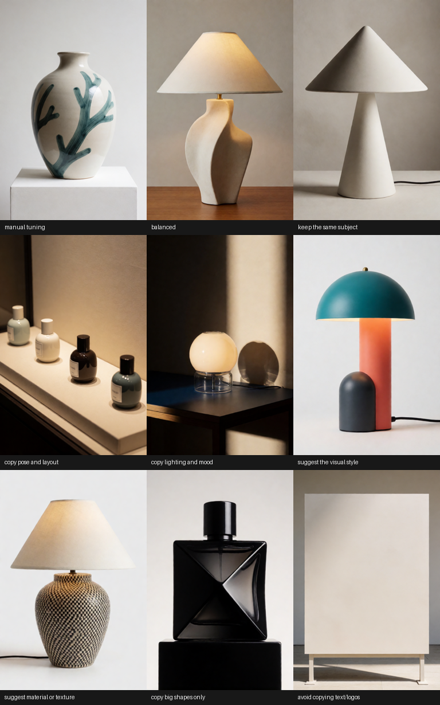

# Example Workflows

This folder contains the Concept Slider, V10, and V9 starter workflows. The Load Image nodes use the included synthetic example filenames; copy `../example_assets/krea-reference-examples/` into your ComfyUI input folder, or replace the Load Image nodes with your own test images before queueing. (The Concept Slider workflow needs no images at all.)

The examples intentionally avoid LoRA and model-enhancer plumbing so the graph stays focused on Krea plus the reference and slider nodes.



## Concept Slider V1 Showcase

File: [krea-slider-v1-showcase-workflow.json](krea-slider-v1-showcase-workflow.json)

Training-free attribute sliders in one graph, with a walkthrough note on the canvas. Six slider cards feed the main stack:

- `brightness` at `+3` and `fog density` at `+2` - auto poles: the stack derives more-vs-less from the attribute name alone.
- `height` at `-4` with custom poles - the render-proven concrete wording for a weak direction.
- `realism` at `0` with custom style poles, ready to drag: negative goes cartoon, positive goes photoreal.
- `age` and `color saturation` parked at `0` - a zero slider is skipped entirely and costs nothing.

Plus the feedback and comparison wiring:

- `slider_report -> Preview Any`: each slider's exact pole sentences, its computed push, and everything skipped and why.
- A second stack on the same prompt and seed with zero cards, so one queue renders the WITH-vs-WITHOUT pair side by side.
- The negative prompt runs through a third slider stack with no cards - a cardless slider stack behaves exactly like CLIP Text Encode.

Queue once, compare the pair, then drag values; with study reuse on, re-runs only re-encode the sliders you changed. The full manual - the dial table, the ten-slider audit, and the slider-writing cookbook - is the [Concept Slider guide](../docs/concept-slider-v1.md).

## V10 Full Showcase

File: [krea-v10-full-showcase-workflow.json](krea-v10-full-showcase-workflow.json)

The best workflow for seeing the V10 controls together. Six cards, plus gentle balance, study reuse, and both feedback outputs wired to preview nodes:

- Content anchor: `keep the same subject`, strength `0.80`.
- Visual style: `suggest the visual style`, strength `0.55`.
- Background/setting (new in V10): `use the background/setting`, strength `0.35`.
- Color palette only (new in V10): `suggest the color palette`, strength `0.40`.
- Camera framing (new in V10): `copy the camera framing`, strength `0.30`, with `When this card guides` set to `early layout only`.
- Text/logo guard: `avoid copying text/logos`, strength `0.03`.

Queue once, read the stack report (Preview Any), check the prepared-references contact sheet (Preview Image), then tweak strengths - with `Reuse image studies` on, re-runs skip every encoder pass.

## V10 Counter-Example

File: [krea-v10-counter-example-workflow.json](krea-v10-counter-example-workflow.json)

Demonstrates the new `Guide direction`. Keep the subject, push a style out:

- Reference 1: `keep the same subject`, `toward this image`, strength `0.80`.
- Reference 2: `suggest the visual style`, `away from this image`, strength `0.25`.

Start away cards low (`0.10` to `0.30`) and always keep something positive - a written prompt or a toward card - saying what you do want.

## V10 Starter Reference Stack

File: [krea-v10-reference-stack-workflow.json](krea-v10-reference-stack-workflow.json)

The compact V10 starter graph:

```text
Load Image -> KG Krea 2 Image Guide Card V10 -> KG Krea 2 Reference Stack Encoder V10 -> sampler positive input
```

Plus the two feedback wires: `stack_report -> Preview Any` and `prepared_references -> Preview Image`.

## V10 Starter Recipe (custom recipes in action)

File: [krea-v10-starter-recipe-workflow.json](krea-v10-starter-recipe-workflow.json)

One card running `cinematic color grade` - one of the three custom recipes
that ship enabled in [custom_recipes/starter-pack.yaml](../custom_recipes/starter-pack.yaml)
(no extra install needed):

- Reference 1: `cinematic color grade`, strength `0.70`, on the style
  reference asset - the scene takes the reference's grade like a film LUT
  while the prompt keeps the subject.

Swap the dropdown to `borrow the weather` or `borrow the clothing style`
(with a suitable reference) to try the other starter recipes, or open the
[Recipe Builder](../web/recipe-builder.html) to make your own - the stack
report names the recipe on its card line either way.

## V9 Full Showcase

File: [krea-v9-full-showcase-workflow.json](krea-v9-full-showcase-workflow.json)

This is the best workflow for seeing the V9 controls together. It uses five cards:

- Content anchor: `keep the same subject`, strength `0.80`.
- Visual style: `suggest the visual style`, strength `0.65`.
- Material/texture: `suggest material or texture`, strength `0.35`.
- Manual lighting/mood: `manual tuning` with `lighting and shadows`, strength `0.45`.
- Text/logo guard: `avoid copying text/logos`, strength `0.03`.



## V9 No-Prompt Style Transfer

File: [krea-v9-no-prompt-style-transfer-workflow.json](krea-v9-no-prompt-style-transfer-workflow.json)

Use this when you want image 2's visual style applied to image 1 without typing a prompt. It starts with:

- Reference 1: `keep the same subject`, strength `0.80`.
- Reference 2: `suggest the visual style`, strength `0.65`.
- `Final image prompt`: blank.
- `Written prompt strength`: `0.0`.
- `When images guide`: `smart per-card timing`.

For product/object content with a person-style reference, lower Reference 2 toward `0.45`.

## V9 Starter Reference Stack

File: [krea-v9-reference-stack-workflow.json](krea-v9-reference-stack-workflow.json)

This workflow demonstrates the V9 Krea reference route:

```text
Load Image -> KG Krea 2 Image Guide Card V9 -> KG Krea 2 Reference Stack Encoder V9 -> sampler positive input
```

## Workflow Dependencies

The workflows require Krea 2 compatible model, CLIP, and VAE files in your ComfyUI model folders.

If your model filenames differ, update the loader widgets in the workflow after loading it.

The V10 workflows additionally use the core `Preview Any` and `Preview Image` nodes for the stack report and prepared-references outputs; both ship with ComfyUI.

## Related Docs

- [Concept Slider V1 guide](../docs/concept-slider-v1.md)
- [Krea 2 V10 visual user guide](../docs/krea-v10-user-guide.html)
- [Krea 2 V10 documentation index](../docs/krea-v10-documentation-index.md)
- [KG Krea 2 Image Guide Card V10](../docs/nodes/kg-krea-2-image-guide-card-v10.md)
- [KG Krea 2 Reference Stack Encoder V10](../docs/nodes/kg-krea-2-reference-stack-encoder-v10.md)
- [Krea 2 V9 visual user guide](../docs/krea-v9-user-guide.html)
- [Krea 2 V9 documentation index](../docs/krea-v9-documentation-index.md)
- [KG Krea 2 Image Guide Card V9](../docs/nodes/kg-krea-2-image-guide-card-v9.md)
- [KG Krea 2 Reference Stack Encoder V9](../docs/nodes/kg-krea-2-reference-stack-encoder-v9.md)
